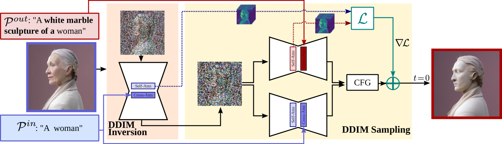
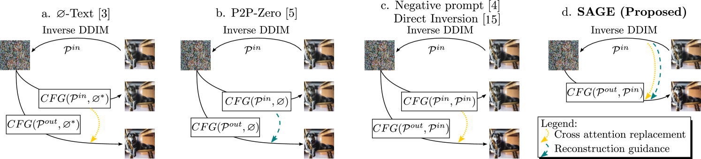
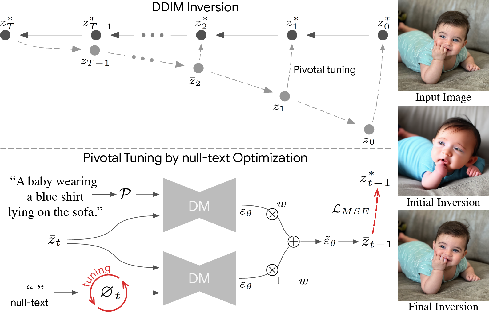
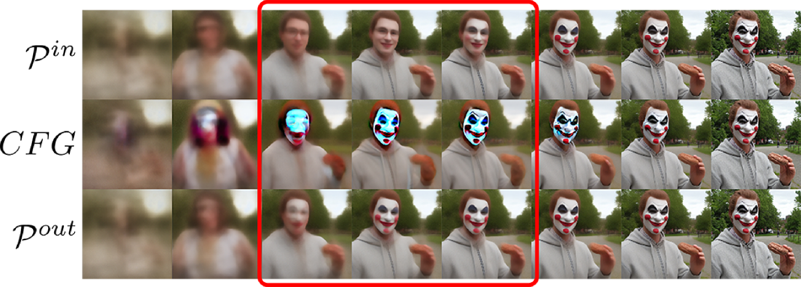
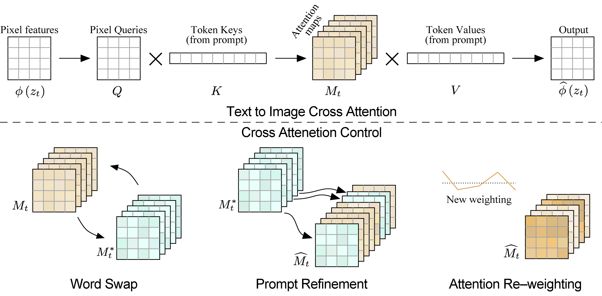
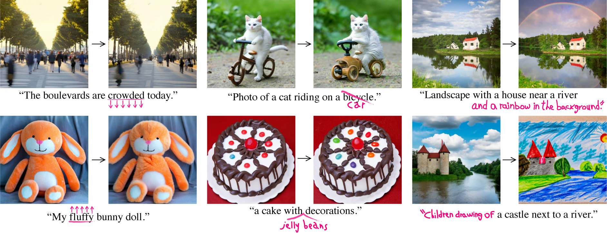

# Đề tài: SwiftEdit — Chỉnh sửa ảnh theo văn bản một bước (One-step Text-guided Image Editing)

**Môn học:** CS2309.CH201 — Chuyên đề nghiên cứu và ứng dụng về Thị giác máy tính\
**Chủ đề:** Chỉnh sửa và thay đổi phong cách ảnh\
**Đề tài:** SwiftEdit\
**Tác giả gốc:** Trong-Tung Nguyen, Quang Nguyen, Khoi Nguyen, Anh Tran, Cuong Pham (Qualcomm AI Research)\
**Paper:** [SwiftEdit: Lightning Fast Text-Guided Image Editing via One-Step Diffusion (CVPR 2025)](https://openaccess.thecvf.com/content/CVPR2025/papers/Nguyen_SwiftEdit_Lightning_Fast_Text-Guided_Image_Editing_via_One-Step_Diffusion_CVPR_2025_paper.pdf)\
**Mã nguồn:** <https://github.com/Qualcomm-AI-research/SwiftEdit>\
**Trang dự án:** <https://swift-edit.github.io/>

**Môi trường thực nghiệm:** **MacBook Air M4, 24GB** (local) + **Google Colab** (GPU CUDA — T4 / A100)

---

## 1. Overview

### 1.1. Giới thiệu tổng quan

**SwiftEdit** là phương pháp chỉnh sửa ảnh theo hướng dẫn văn bản (text-guided image editing) được công bố tại **CVPR 2025**. Phương pháp này giải quyết bài toán chỉnh sửa ảnh tự nhiên bằng prompt tiếng Anh, ví dụ: đổi "basket of apples" thành "basket of puppies", hoặc "mouth closed" thành "mouth opened".

Điểm khác biệt cốt lõi của SwiftEdit so với các phương pháp diffusion truyền thống (Prompt-to-Prompt, Null-text Inversion, MasaCtrl, Plug-and-Play, …) là **cả quá trình inversion và editing đều chỉ cần một bước (one-step)**, đạt thời gian suy luận khoảng **0.23 giây** trên GPU A100 — nhanh hơn ít nhất **50 lần** so với các phương pháp multi-step.

SwiftEdit xây dựng trên mô hình sinh ảnh một bước **SwiftBrushv2 (SBv2)** và gồm hai thành phần chính:

1. **One-step Inversion Framework:** Mạng inversion (F\_\theta) ánh xạ ảnh nguồn về latent noise có thể chỉnh sửa trong một bước, được huấn luyện theo chiến lược **hai giai đoạn** (synthetic data → real data).
2. **Attention Rescaling for Mask-aware Editing (ARaM):** Cơ chế điều chỉnh cross-attention theo vùng mask để chỉnh sửa cục bộ, bảo toàn background, đồng thời cho phép điều khiển cường độ chỉnh sửa qua các hệ số (s\_y), (s\_{edit}), (s\_{non\text{-}edit}).

Một đặc điểm quan trọng là SwiftEdit có thể **tự động trích xuất editing mask** từ sự khác biệt giữa inverted noise của source prompt và edit prompt, không bắt buộc người dùng vẽ mask thủ công.

### 1.2. Kiến trúc và pipeline suy luận

```
Ảnh nguồn + Source prompt + Edit prompt
        │
        ▼
┌─────────────────────────┐
│  One-step Inversion Fθ  │  → Inverted noise ε̂
└─────────────────────────┘
        │
        ▼
┌─────────────────────────┐
│ Self-guided mask M      │  → |ε̂_source − ε̂_edit|
└─────────────────────────┘
        │
        ▼
┌─────────────────────────┐
│ G_IP + ARaM             │  → Edited latent → VAE decode
└─────────────────────────┘
        │
        ▼
    Ảnh đã chỉnh sửa
```

**Các module chính trong repository:**

| Thành phần                        | Vai trò                                   |
| --------------------------------- | ----------------------------------------- |
| `models.py`                       | Mô hình sinh ảnh (SBv2) và mạng inversion |
| `infer.py`                        | Pipeline suy luận chính                   |
| `src/mask_attention_processor.py` | Cross-attention có mask                   |
| `src/mask_ip_controller.py`       | Điều khiển attention rescaling            |
| `swiftedit_weights/`              | Checkpoint đã huấn luyện sẵn              |

### 1.3. Bối cảnh và động lực

Các phương pháp chỉnh sửa ảnh diffusion hiện tại (Prompt-to-Prompt, Null-text Inversion, MasaCtrl, Plug-and-Play, …) thường gồm **hai giai đoạn nặng**:

```
Inversion đa bước (20–50+ steps)  →  Sampling + attention edit đa bước
         ↑                                      ↑
   DDIM / Null-text …                    P2P, MasaCtrl, PnP …
```

- **Giai đoạn 1 — Inversion đa bước** (DDIM, Null-text Inversion): tìm noise ban đầu tương ứng ảnh nguồn.
- **Giai đoạn 2 — Sampling đa bước**: denoise lại kết hợp thao tác attention để áp dụng thay đổi theo edit prompt.

Quy trình này tốn **12–130+ giây** mỗi lần chỉnh sửa, không phù hợp ứng dụng real-time hoặc on-device.

#### 1.3.1. Mỗi step làm gì? (giải thích dễ hiểu)

Hình dung diffusion như **lau dần sương mù trên một bức tranh**: ban đầu chỉ thấy nhiễu loạn xạ; sau mỗi lần lau, tranh **rõ hơn một chút**. **Một step = một lần lau như vậy.**

**Ở mỗi step**, máy tính chạy mạng lớn gọi là **UNet**. UNet nhận vào:

1. **Ảnh hiện tại** (còn nhiễu / mờ)
2. **Prompt** (mô tả bằng chữ, ví dụ *"a black cat"*)
3. **Đang ở bước thứ mấy** (bước 1/50, 2/50, …)

Rồi UNet trả lời: *"Lần này nên bớt nhiễu / làm rõ theo hướng này"*. Ảnh được cập nhật **một chút** → sang step tiếp theo.

> **Một step = một lần UNet chạy** (tốn GPU). 50 step ≈ 50 lần chạy liên tiếp.

**Giai đoạn 1 — Inversion (tìm điểm xuất phát):**

Bạn **đã có ảnh thật** (ví dụ mèo cam), muốn sửa thành mèo đen. Diffusion thường đi **từ nhiễu → ảnh**; inversion làm **ngược lại**: từ ảnh thật, tìm **nhiễu ban đầu** sao cho nếu "lau sương" lại thì ra đúng ảnh gốc.

Mỗi step inversion: thêm / điều chỉnh nhiễu **một lớp nhỏ** để quay về trạng thái "mờ hơn" trước đó. Lặp \~20–50 lần → được **noise khởi đầu** (điểm xuất phát cho chỉnh sửa). Null-text Inversion còn **optimize thêm** embedding cho từng ảnh → chậm hơn nữa.

**Giai đoạn 2 — Editing (lau sương lại, đổi nội dung):**

Từ noise vừa tìm được, máy **lau sương lại** \~20–50 step với **edit prompt** mới. Các method như P2P, MasaCtrl, Plug-and-Play **can thiệp attention** mỗi step: *"ở vùng cần sửa thì nghe prompt mới; vùng nền thì giữ như cũ"* — ví dụ đổi mèo cam → mèo đen mà giữ hàng rào, bầu trời.

#### 1.3.2. Tóm tắt: sinh ảnh mới vs chỉnh sửa ảnh cũ

| <br />                    | Sinh ảnh mới        | Chỉnh sửa ảnh cũ (P2P, Null-text, …)                                |
| ------------------------- | ------------------- | ------------------------------------------------------------------- |
| **Bắt đầu từ**            | Nhiễu ngẫu nhiên    | Ảnh thật → inversion → noise                                        |
| **Mỗi step**              | Lau bớt sương       | Giai đoạn 1: thêm sương ngược / Giai đoạn 2: lau sương + đổi prompt |
| **Kết thúc**              | Ảnh mới khớp prompt | Ảnh đã sửa, background giữ ổn định                                  |
| **Tổng step (ước lượng)** | \~50                | \~50 + \~50 ≈ **\~100**                                             |

| Nhóm phương pháp                        | Steps (inversion + edit) | Thời gian \~ |
| --------------------------------------- | ------------------------ | ------------ |
| Multi-step (DDIM + P2P)                 | 50 + 50                  | \~26s        |
| Multi-step + optimize (Null-text + P2P) | 50 + optimize            | \~134s       |
| Few-step (TurboEdit)                    | 4 + 4                    | \~1.3s       |
| **One-step (SwiftEdit)**                | **1 + 1**                | **\~0.23s**  |

**SwiftEdit** hướng tới **chỉnh sửa tức thì**: thay \~100 lần chạy UNet bằng **one-step inversion** (`F_theta`) + **one-step editing** trên backbone SBv2 — chất lượng cạnh tranh so với multi-step và few-step methods.

#### 1.3.3. Ảnh minh họa pipeline **cũ** (multi-step — tham khảo)

> **Không phải SwiftEdit.** Các ảnh dưới đây minh họa pipeline kinh điển (DDIM / Null-text → P2P / …, 20–50+ step mỗi giai đoạn) — bối cảnh §1.3 để so sánh với SwiftEdit (1 step + 1 step, xem §1.2).\
> Nguồn ảnh công khai từ paper / project page gốc. Khi trích trong báo cáo, ghi rõ tác giả và venue.

**Toàn bộ luồng — Ảnh gốc → Inversion → noise → Sampling + edit → Ảnh sửa**

SAGE (Gomez-Trenado et al., 2025) — Figure 3: DDIM inversion với source prompt, sau đó DDIM sampling với edit prompt.



| <br />         | <br />                                                                                  |
| -------------- | --------------------------------------------------------------------------------------- |
| **File local** | [`assets/pipeline/sage-fig3-pipeline.png`](./assets/pipeline/sage-fig3-pipeline.png)    |
| **Nguồn gốc**  | <https://arxiv.org/html/2505.09571v1/x2.png>                                            |
| **Paper**      | [Don’t Forget your Inverse DDIM for Image Editing](https://arxiv.org/html/2505.09571v1) |

**So sánh các hướng (Null-text, P2P, …)**

SAGE — Figure 2: các cách kết hợp inversion, null-text / CFG và edit prompt.



| <br />         | <br />                                                                                             |
| -------------- | -------------------------------------------------------------------------------------------------- |
| **File local** | [`assets/pipeline/sage-fig2-compare-methods.png`](./assets/pipeline/sage-fig2-compare-methods.png) |
| **Nguồn gốc**  | <https://arxiv.org/html/2505.09571v1/x1.png>                                                       |

**Giai đoạn 1 — Inversion (20–50+ steps)**

Null-text Inversion (Mokady et al., CVPR 2023): trajectory DDIM inversion + null-text optimization từng timestep.



| <br />          | <br />                                                                           |
| --------------- | -------------------------------------------------------------------------------- |
| **File local**  | [`assets/pipeline/nulltext-diagram.png`](./assets/pipeline/nulltext-diagram.png) |
| **Nguồn gốc**   | <https://null-text-inversion.github.io/files/diagram-01.png>                     |
| **Trang dự án** | <https://null-text-inversion.github.io/>                                         |

**“Mỗi step” — ảnh dần rõ qua từng bước denoise**

SAGE — Figure 4: ước lượng latent qua các timestep khi sampling (minh họa trực quan cho “50 step = 50 lần UNet chạy”).



| <br />                 | <br />                                                                                                        |
| ---------------------- | ------------------------------------------------------------------------------------------------------------- |
| **File local**         | [`assets/pipeline/sage-fig4-denoise-steps.png`](./assets/pipeline/sage-fig4-denoise-steps.png)                |
| **Nguồn gốc**          | <https://arxiv.org/html/2505.09571v1/x3.png>                                                                  |
| **Tutorial tương tác** | [Hugging Face — DDIM Inversion](https://huggingface.co/learn/diffusion-course/en/unit4/2) (ví dụ puppy → cat) |

**Giai đoạn 2 — Sampling + attention edit**

Prompt-to-Prompt (Hertz et al., 2022): inject cross-attention map từ source prompt sang edit prompt **mỗi step** diffusion.



| <br />          | <br />                                                                                 |
| --------------- | -------------------------------------------------------------------------------------- |
| **File local**  | [`assets/pipeline/p2p-cross-attention.png`](./assets/pipeline/p2p-cross-attention.png) |
| **Nguồn gốc**   | <https://prompt-to-prompt.github.io/ptp_files/03_ca_diagram.png>                       |
| **Trang dự án** | <https://prompt-to-prompt.github.io/>                                                  |

**Kết quả cuối pipeline (ảnh thật → edit)**

| Minh họa        | Mô tả                           | File local                                                                       |
| --------------- | ------------------------------- | -------------------------------------------------------------------------------- |
| P2P word swap   | Đổi từ trong prompt, giữ bố cục | [`p2p-teaser.png`](./assets/pipeline/p2p-teaser.png)                             |
| Null-text + P2P | Inversion ảnh thật rồi edit     | [`nulltext-editing-results.png`](./assets/pipeline/nulltext-editing-results.png) |




**Bảng tra nhanh — ảnh ↔ vị trí trong pipeline**

| Vị trí                       | File local                                                                                                                             |
| ---------------------------- | -------------------------------------------------------------------------------------------------------------------------------------- |
| Toàn pipeline                | [`sage-fig3-pipeline.png`](./assets/pipeline/sage-fig3-pipeline.png)                                                                   |
| So sánh method               | [`sage-fig2-compare-methods.png`](./assets/pipeline/sage-fig2-compare-methods.png)                                                     |
| Giai đoạn 1 — Inversion      | [`nulltext-diagram.png`](./assets/pipeline/nulltext-diagram.png)                                                                       |
| Mỗi step denoise             | [`sage-fig4-denoise-steps.png`](./assets/pipeline/sage-fig4-denoise-steps.png)                                                         |
| Giai đoạn 2 — Attention edit | [`p2p-cross-attention.png`](./assets/pipeline/p2p-cross-attention.png)                                                                 |
| Kết quả edit                 | [`p2p-teaser.png`](./assets/pipeline/p2p-teaser.png), [`nulltext-editing-results.png`](./assets/pipeline/nulltext-editing-results.png) |

---

## 2. Lý do chọn đề tài

| Tiêu chí                                | Lý do                                                                                                                                            |
| --------------------------------------- | ------------------------------------------------------------------------------------------------------------------------------------------------ |
| **Tính thời sự**                        | Chỉnh sửa ảnh bằng ngôn ngữ tự nhiên là hướng nghiên cứu nóng trong CV và generative AI (2024–2025).                                             |
| **Liên quan trực tiếp môn học**         | Bài toán kết hợp nhiều khái niệm thị giác máy tính: diffusion model, inversion, attention mechanism, segmentation mask, đánh giá chất lượng ảnh. |
| **Có mã nguồn và checkpoint công khai** | Repository chính thức cung cấp inference code và pretrained weights, phù hợp điều kiện **không training nặng**.                                  |
| **Đóng góp khoa học rõ ràng**           | Paper CVPR 2025 có benchmark (PieBench), ablation study và so sánh với nhiều baseline, tạo nền tảng để tái hiện và mở rộng thự nghiệm.           |
| **Phù hợp Mac Air M4 + Colab**          | Mac cho dev/demo; Colab Free (T4) cho CUDA benchmark — **không cần máy GPU riêng**.                                                              |
| **Ứng dụng thực tế**                    | Demo chỉnh sửa ảnh nhanh trên Mac cho người sáng tạo nội dung, thiết kế.                                                                         |
| **Phù hợp nguồn lực sinh viên**         | Tập trung **inference, đánh giá, ablation** — không train lại toàn bộ mô hình.                                                                   |

---

## 3. Input / Output của bài toán

### 3.1. Input

| Input                           | Mô tả                                                                       | Bắt buộc               |
| ------------------------------- | --------------------------------------------------------------------------- | ---------------------- |
| **Source image** (x\_{source})  | Ảnh gốc cần chỉnh sửa (RGB)                                                 | Có                     |
| **Edit prompt** (y\_{edit})     | Mô tả văn bản về nội dung mong muốn sau khi chỉnh sửa                       | Có                     |
| **Source prompt** (y\_{source}) | Mô tả ảnh gốc; giúp reconstruction và trích xuất mask                       | Khuyến nghị            |
| **Editing mask** (M)            | Vùng cần chỉnh sửa (binary/soft mask)                                       | Không (có thể tự sinh) |
| **Hyperparameters**             | (s\_y), (s\_{edit}), (s\_{non\text{-}edit}) — điều khiển cường độ chỉnh sửa | Tùy chọn               |

### 3.2. Output

| Output                          | Mô tả                                                               |
| ------------------------------- | ------------------------------------------------------------------- |
| **Edited image** (x\_{edit})    | Ảnh đã chỉnh sửa theo edit prompt                                   |
| **Editing mask** (tùy chọn)     | Mask tự sinh hoặc mask người dùng cung cấp                          |
| **Metrics** (trong thực nghiệm) | PSNR, MSE (background), CLIP-Whole, CLIP-Edited, thời gian suy luận |

### 3.3. Ví dụ minh họa

```
Input:
  - Ảnh: chú mèo cam ngồi trên hàng rào
  - Source prompt: "An orange cat sitting on top of a fence."
  - Edit prompt: "A black cat sitting on top of a fence."

Output:
  - Ảnh: chú mèo đen ngồi trên hàng rào, background giữ nguyên
  - Thời gian: ~0.23s (A100) / **~3–15s (Mac Air M4, MPS)** — vẫn nhanh hơn nhiều so với multi-step
```

> **Source prompt — có phải tự viết?** Không bắt buộc (code gốc: *"could leave it empty"*), nhưng **nên có** để inversion và mask tự sinh ổn định hơn. Không cần câu dài như ví dụ PieBench trên — demo repo thường dùng prompt ngắn (`"woman"`, `"dog"`). **Edit prompt** mới là phần bạn cần viết rõ thay đổi mong muốn. Có thể dùng model caption (BLIP, …) gợi ý source prompt rồi chỉnh tay; SwiftEdit không tự sinh giúp.

---

## 4. Môi trường thực nghiệm: Mac M4 + Google Colab

> **Chiến lược chính:** Dùng **Mac** cho phát triển, demo và phân tích; dùng **Google Colab** cho workload cần CUDA (benchmark PieBench, so sánh baseline, tái hiện số liệu paper). Hai môi trường **bổ sung cho nhau**, không thay thế hoàn toàn.

### 4.1. MacBook Air M4 (24GB) — Môi trường local

| Thành phần      | MacBook Air M4 (24GB)                                  |
| --------------- | ------------------------------------------------------ |
| CPU             | Apple M4 (10-core)                                     |
| GPU             | GPU tích hợp (Metal / MPS)                             |
| Bộ nhớ          | 24GB **unified memory** (CPU + GPU dùng chung)         |
| Backend PyTorch | **MPS** (Metal Performance Shaders), **không có CUDA** |
| Hệ điều hành    | macOS                                                  |

### Khả năng chạy SwiftEdit trên Mac M4

| Khía cạnh                      | Đánh giá          | Ghi chú                                       |
| ------------------------------ | ----------------- | --------------------------------------------- |
| **Inference (demo, ablation)** | ✅ Khả thi         | 24GB unified memory đủ cho inference 512×512  |
| **Tốc độ**                     | ⚠️ Chậm hơn paper | \~3–15 giây/ảnh (MPS) vs 0.23s (A100)         |
| **PieBench batch lớn**         | ⚠️ Chậm           | 15–25 mẫu OK; batch 50–100 → **chuyển Colab** |
| **Fine-tune**                  | ❌ Không           | Chuyển sang Colab                             |
| **Viết báo cáo, demo Gradio**  | ✅ Tốt             | Làm việc hàng ngày trên Mac                   |

### Cài đặt trên macOS

Hướng dẫn đầy đủ (đã kiểm tra trên Mac M4): **[README.md — Cài đặt và chạy cơ bản](./README.md#cài-đặt-và-chạy-cơ-bản-mac-mps)**.

Tóm tắt:

```bash
cd CS2309.CH201
pyenv local 3.12.10
python -m venv .venv && source .venv/bin/activate
python -m pip install -r requirements-mac.txt

bash scripts/download_swiftedit_weights.sh   # ~9.6 GB → SwiftEdit/swiftedit_weights/
bash scripts/download_hf_models.sh           # sd-turbo, SD2.1 mirror, IP-Adapter encoder
bash scripts/run_swiftedit.sh                # demo → SwiftEdit/result_*.png
```

**Patch trong repo đề tài (không cần sửa tay):**

- `infer.py`: `get_device()` — cuda → mps → cpu
- `models.py`: SD 2.1 mirror `Manojb/stable-diffusion-2-1-base`; `torch.load(..., map_location="cpu")` cho checkpoint IP-Adapter

**Phương án conda** (thay pyenv/venv): `conda create -n SwiftEdit python=3.12` rồi cài PyTorch Mac + cùng phiên bản package như `requirements-mac.txt` (không dùng `cu118`).

**Mẹo giảm RAM trên Mac:**

- Dùng `torch.float16` / `model.half()` nếu code hỗ trợ (giảm \~40% memory).
- Giữ độ phân giải **512×512** như paper; tránh 1024×1024 trên 24GB.
- Đóng Chrome, IDE nặng khi chạy inference.
- Nếu gặp lỗi MPS: thử `PYTORCH_ENABLE_MPS_FALLBACK=1` hoặc fallback `device="cpu"` (chỉ debug).

---

### 4.2. Google Colab — Môi trường GPU CUDA

| Thành phần        | Google Colab (Free / Pro)                         |
| ----------------- | ------------------------------------------------- |
| GPU               | **T4** (Free, \~15GB) hoặc **A100** (Pro, nếu có) |
| Backend           | **CUDA** — tương thích `requirements.txt` gốc     |
| Bộ nhớ            | \~12–15GB VRAM (T4) — đủ inference SwiftEdit      |
| Thời gian session | Free \~12h/session, có thể disconnect             |
| Lưu trữ           | Google Drive mount — lưu weights, kết quả         |
| Dung lượng Drive  | Weights ~9.6 GB + HF ~3–8 GB → **khuyến nghị ≥20–25 GB** trống; **15 GB** chỉ vừa đủ nếu tối thiểu hóa cache HF |

### Khả năng trên Colab

| Khía cạnh                        | Đánh giá      | Ghi chú                                      |
| -------------------------------- | ------------- | -------------------------------------------- |
| **Cài đặt repo gốc (CUDA)**      | ✅ Trực tiếp   | `pip install -r requirements.txt` như README |
| **PieBench 50–100 mẫu**          | ✅ Khuyến nghị | \~5–20 phút trên T4; gần môi trường paper    |
| **So sánh TurboEdit / baseline** | ✅ Khuyến nghị | Multi-step methods cần CUDA                  |
| **Tái hiện runtime \~0.23s**     | ⚠️ Chỉ A100   | T4 chậm hơn A100 nhưng vẫn nhanh hơn Mac MPS |
| **Fine-tune nhẹ**                | ⚠️ Tùy chọn   | T4 có thể OOM; batch size = 1                |
| **Lưu kết quả lâu dài**          | ✅ Drive       | Mount Drive, sync về Mac                     |

### Cài đặt trên Google Colab

**Bước 1 — Tạo notebook mới:** [Google Colab](https://colab.research.google.com/) → Runtime → Change runtime type → **T4 GPU**.

**Bước 2 — Mount Google Drive** (lưu weights + kết quả, tránh tải lại mỗi session):

```python
from google.colab import drive
drive.mount('/content/drive')

WORK_DIR = '/content/drive/MyDrive/CS2309_SwiftEdit'  # thư mục riêng cho đề tài
!mkdir -p {WORK_DIR}
%cd {WORK_DIR}
```

**Bước 3 — Clone repo và cài dependencies (CUDA):**

```python
!git clone https://github.com/Qualcomm-AI-research/SwiftEdit.git
%cd SwiftEdit

# Cài theo requirements.txt gốc (CUDA)
!pip install -r requirements.txt
!pip install numpy==1.26.4

# PieBench metrics (nếu đánh giá)
!pip install lpips scikit-image open-clip-torch
```

**Bước 4 — Tải checkpoint (chỉ lần đầu, lưu trên Drive):**

```python
import os
WEIGHTS_DIR = f'{WORK_DIR}/swiftedit_weights'

if not os.path.exists(f'{WEIGHTS_DIR}/.downloaded'):
    %cd /content/SwiftEdit
    !wget -q https://github.com/Qualcomm-AI-research/SwiftEdit/releases/download/v1.0/swiftedit_weights.tar.gz.part-aa
    !wget -q https://github.com/Qualcomm-AI-research/SwiftEdit/releases/download/v1.0/swiftedit_weights.tar.gz.part-ab
    !wget -q https://github.com/Qualcomm-AI-research/SwiftEdit/releases/download/v1.0/swiftedit_weights.tar.gz.part-ac
    !wget -q https://github.com/Qualcomm-AI-research/SwiftEdit/releases/download/v1.0/swiftedit_weights.tar.gz.part-ad
    !wget -q https://github.com/Qualcomm-AI-research/SwiftEdit/releases/download/v1.0/swiftedit_weights.tar.gz.part-ae
    !cat swiftedit_weights.tar.gz.part-* > swiftedit_weights.tar.gz
    !tar zxf swiftedit_weights.tar.gz -C {WORK_DIR}
    !touch {WEIGHTS_DIR}/.downloaded
else:
    !ln -sf {WEIGHTS_DIR} /content/SwiftEdit/swiftedit_weights
    print("Weights đã có trên Drive, bỏ qua tải.")
```

**Bước 5 — Kiểm tra GPU:**

```python
import torch
print(f"CUDA available: {torch.cuda.is_available()}")
print(f"GPU: {torch.cuda.get_device_name(0) if torch.cuda.is_available() else 'None'}")
device = "cuda"  # Colab luôn dùng cuda
```

**Bước 6 — Tải PieBench (Colab):**

```bash
# Dataset chính thức tải qua Google Form của PnP Inversion / PIE-Bench.
# Sau khi tải zip, upload lên Colab hoặc Drive rồi giải nén:
bash scripts/download_piebench.sh /path/to/PIE-Bench.zip

# Test nhanh khi chưa có dataset đầy đủ:
python scripts/create_piebench_smoke.py
python scripts/run_piebench_eval.py --piebench-dir data/PIE-Bench-smoke --max-samples 2
```

**Mẹo Colab:**

- **Lưu weights trên Drive** — file checkpoint vài GB, không tải lại mỗi session.
- **Lưu kết quả CSV/ảnh về Drive** — sync về Mac để viết báo cáo.
- Session disconnect → chạy lại cell mount + symlink weights (nhanh, không cần tải lại).
- Colab Free có giới hạn GPU — chạy batch lớn vào ban đêm hoặc chia nhiều session.
- Nếu OOM trên T4: dùng `torch.float16`, batch size = 1, giảm số mẫu/session.

---

### 4.3. Phân công công việc Mac ↔ Colab

| Công việc                          | Mac M4    | Google Colab     | Ghi chú                                    |
| ---------------------------------- | --------- | ---------------- | ------------------------------------------ |
| Đọc paper, viết báo cáo            | ✅ Chính   | —                | <br />                                     |
| Clone repo, hiểu code              | ✅         | ✅                | Mac tiện hơn khi dev                       |
| Chạy demo lần đầu                  | ✅         | ✅                | Mac xác nhận pipeline; Colab xác nhận CUDA |
| Ablation hyperparameter (5–10 ảnh) | ✅ Chính   | Tùy chọn         | Mac đủ, lưu grid ảnh                       |
| PieBench metrics (50–100 mẫu)      | 15–25 mẫu | ✅ **Chính**      | Colab nhanh + CUDA                         |
| So sánh TurboEdit / baseline       | —         | ✅ **Chính**      | Cần CUDA                                   |
| Self-guided mask vs GT mask        | ✅         | ✅                | Colab cho batch; Mac cho visualize         |
| Bộ ảnh tự thu thập (VN)            | ✅ Chính   | Tùy chọn         | Thu ảnh trên Mac, batch eval trên Colab    |
| Demo Gradio / Streamlit            | ✅ Chính   | —                | Chạy local trên Mac                        |
| Fine-tune nhẹ (tùy chọn)           | ❌         | ✅                | Chỉ Colab                                  |
| Đo runtime so sánh paper           | M4 (MPS)  | ✅ T4/A100 (CUDA) | Báo cáo **cả hai** + paper                 |

### 4.4. Luồng làm việc Mac + Colab (workflow)

```
  ┌──────────────────────────────────────────────────────────┐
  │  MAC AIR M4                                              │
  │  ① Clone repo, đọc infer.py / models.py                  │
  │  ② Cài MPS, chạy demo assets/imgs_demo                   │
  │  ③ Ablation s_y, s_edit, s_non-edit (5–10 ảnh)           │
  │  ④ Thu thập ảnh VN + viết báo cáo                        │
  │  ⑤ (Tùy chọn) Demo Gradio local                          │
  └────────────────────────┬─────────────────────────────────┘
                           │ Upload ảnh VN / subset PieBench
                           │ Download kết quả CSV + ảnh từ Drive
                           ▼
  ┌──────────────────────────────────────────────────────────┐
  │  GOOGLE COLAB (T4 GPU)                                   │
  │  ⑥ Setup notebook + mount Drive + symlink weights        │
  │  ⑦ Chạy PieBench 50–100 mẫu → PSNR, CLIP, MSE, runtime  │
  │  ⑧ So sánh SwiftEdit vs TurboEdit (20 mẫu chung)         │
  │  ⑨ Lưu metrics.csv + edited_images/ → Google Drive       │
  └────────────────────────┬─────────────────────────────────┘
                           │
                           ▼
  ┌──────────────────────────────────────────────────────────┐
  │  MAC — TỔNG HỢP BÁO CÁO                                  │
  │  ⑩ Gộp bảng metrics Colab + ảnh ablation Mac             │
  │  ⑪ So sánh runtime: Mac MPS vs Colab T4 vs Paper A100    │
  │  ⑫ Viết Kết luận                                         │
  └──────────────────────────────────────────────────────────┘
```

> **Ghi chú cho báo cáo:** Ghi rõ nguồn từng số liệu:
>
> - *Mac M4 (MPS)* — demo, ablation, runtime local
> - *Colab T4/A100 (CUDA)* — PieBench batch, baseline comparison
> - *Paper (A100)* — reference từ Table 1, không tự đo

---

## 5. Những vấn đề cần nghiên cứu

> Phần này xác định các câu hỏi nghiên cứu phù hợp phạm vi đề tài môn học, ưu tiên **tái hiện, phân tích và mở rộng thự nghiệm** thay vì huấn luyện mô hình từ đầu.

### 5.1. Vấn đề cốt lõi (theo bài gốc)

1. **Làm sao invert ảnh thực về editable noise trong một bước?**
   - Inversion đa bước (DDIM, Null-text) không phù hợp mô hình one-step.
   - SwiftEdit học mạng encoder-based (F\_\theta), huấn luyện 2 stage với synthetic + real data.
2. **Làm sao chỉnh sửa cục bộ mà không phá background?**
   - Dùng self-guided mask từ sự khác biệt inverted noise.
   - ARaM tách riêng attention cho vùng edit và non-edit.
3. **Cân bằng giữa tốc độ, chất lượng chỉnh sửa và bảo toàn background?**
   - So sánh PSNR/MSE vs CLIP score vs runtime trên PieBench.

### 5.2. Vấn đề mở rộng (phù hợp đề tài sinh viên)

4. **SwiftEdit hoạt động thế nào trên dữ liệu Việt Nam / ảnh tự thu thập?**
   - PieBench dùng prompt tiếng Anh; cần kiểm tra độ ổn định trên ảnh thực tế (chân dung, phong cảnh, sản phẩm, …).
5. **Ảnh hưởng của hyperparameter ARaM đến chất lượng chỉnh sửa?**
   - (s\_y): cường độ alignment với edit prompt trong vùng mask.
   - (s\_{edit}), (s\_{non\text{-}edit}): trade-off giữa sửa vùng mục tiêu và giữ vùng nền.
6. **Self-guided mask vs ground-truth mask — mức chênh lệch bao nhiêu?**
   - Paper báo cáo kết quả gần tương đương GT mask; cần xác minh trên subset PieBench hoặc bộ ảnh riêng.
7. **SwiftEdit so với baseline multi-step / few-step trên cùng phần cứng?**
   - So sánh trực quan và định lượng với TurboEdit, ReNoise, hoặc phương pháp multi-step đơn giản hơn (nếu tài nguyên cho phép).
8. **Giới hạn khi áp dụng cho "thay đổi phong cách ảnh" (style transfer)?**
   - SwiftEdit tập trung semantic/local editing (đổi đối tượng, thuộc tính); cần khảo sát riêng các edit **global attribute/style** như ngày↔đêm, mùa xuân/hạ/thu/đông, mưa/nắng vì mask và background-preservation metric không còn phù hợp.
9. **SwiftEdit có dùng được cho xóa vật thể khỏi ảnh không?**
   - Đây là bài toán local edit/inpainting: mask vẫn có ý nghĩa, nhưng cần đánh giá thêm khả năng lấp nền phía sau object và loại bỏ hoàn toàn dấu vết vật thể.
10. **Phân công Mac vs Colab có hiệu quả không?**
   - Task nào nên chạy local, task nào cần CUDA? Runtime Colab T4 so với Mac MPS?
11. **SwiftEdit chạy thế nào trên Mac Apple Silicon (M4, unified memory)?**
    - Repo gốc target CUDA; cần port sang MPS cho local dev.
12. **Yêu cầu tài nguyên và khả năng triển khai on-device?**
    - Mac M4 là case study gần on-device; Colab T4 mô phỏng server-side GPU.

### 5.3. Hướng thay thế / tối ưu module pipeline sau khảo sát 2025–2026

Một số nhóm khác mở rộng bài toán bằng cách **thay một khối trong pipeline gốc**. Với SwiftEdit, cần ưu tiên hướng không phá lợi thế realtime. Vì vậy các hướng thêm model nặng như SAM 3 chỉ phù hợp phân tích phụ, còn hướng chính nên giảm latency của pipeline hiện có.

| Hướng thay / tối ưu module | Vị trí trong pipeline SwiftEdit | Khả thi | Giá trị báo cáo | Kết luận |
|---|---|---:|---:|---|
| **SwiftEdit-RT profiling + inference acceleration** | Toàn bộ đường inference `edit_image()` | Cao | Rất cao | **Chọn làm hướng đào sâu chính** |
| Bỏ decode `noise_image` không dùng | `IPSBV2Model.gen_img()` sau generation UNet | Cao | Cao | **Chốt làm trước**; giảm VAE decode thừa |
| Vectorized self-guided mask trên GPU | Bước `mask12 = |eps_source - eps_edit|` | Cao | Cao | Làm tiếp theo; không đổi chất lượng kỳ vọng |
| Cache latent / image embedding / prompt embedding | Demo tương tác cùng ảnh nhiều prompt | Cao | Rất cao | Rất hợp realtime app |
| `fp16`, `channels_last`, `torch.compile` | CUDA inference kernels | Trung bình | Cao | Thử trên Colab T4/A100 |
| TinyVAE / TAESD | VAE encode/decode | Trung bình | Cao | Ablation tốc độ/chất lượng |
| **Global attribute/style application** | Dùng SwiftEdit cho ngày/đêm, mùa, mưa/nắng | Cao | Cao | Hướng ứng dụng/phân tích khả thi; không dùng mask metric |
| **Object removal / inpainting application** | Xóa vật thể bằng prompt + self/user mask | Cao | Cao | Hướng ứng dụng rất hợp pipeline mask-aware; cần so với LaMa |
| SAM 3 concept-guided mask | Thêm segmentation trước ARaM | Cao | Trung bình | **Không chọn làm hướng chính** vì tăng latency end-to-end |
| Florence-2 / Qwen2.5-VL source prompt | Tự sinh `source prompt` từ ảnh | Cao | Trung bình | Optional; có thể thêm latency |
| FLUX.1 Kontext / Qwen-Image-Edit / Step1X-Edit | Baseline hiện đại ngoài SwiftEdit | Trung bình thấp | Cao | So sánh định tính nếu còn thời gian |

### 5.4. Hướng chọn đào sâu: SwiftEdit-RT

**Tên hướng:** *SwiftEdit-RT: Realtime-Oriented Inference Acceleration*

**Ý tưởng:** SwiftEdit đã giảm số bước diffusion xuống 1 inversion + 1 editing. Khi số UNet step đã rất ít, bottleneck có thể chuyển sang các phần phụ như VAE encode/decode, text encoder, CLIP image encoder, CPU-GPU sync hoặc thao tác không cần thiết. Hướng mở rộng này không thêm model mới, mà đo và tối ưu latency của chính pipeline SwiftEdit.

```text
Source image + source/edit prompt
        │
        ├── Profile baseline:
        │     VAE encode → text encoder → inverse UNet → mask
        │     → CLIP image encoder/IP-Adapter → generation UNet → VAE decode
        │
        └── SwiftEdit-RT:
              GPU mask threshold
              + skip unused noise decode
              + cache latent/embeddings cho interactive editing
              + fp16/channels_last/torch.compile trên CUDA
              + TinyVAE/TAESD ablation
```

**Lý do chọn SwiftEdit-RT thay vì SAM 3:**

- SwiftEdit được công bố như một phương pháp **lightning fast / instant editing**; mọi hướng đào sâu nên bảo vệ luận điểm này.
- SAM 3 có thể cải thiện mask trong vài trường hợp nhưng phải thêm segmentation model, tăng VRAM/RAM và runtime end-to-end.
- Một pipeline chậm hơn nhiều sẽ khó thuyết phục vì có thể bị so sánh với các editor chất lượng cao hơn ở cùng mức latency.
- Tối ưu inference tạo câu chuyện rõ: *sau khi one-step diffusion giải quyết số bước denoising, bottleneck hệ thống còn nằm ở đâu và có thể giảm tiếp không?*
- Hướng này vừa sức đề tài: có thể bắt đầu bằng profiling + patch code nhỏ, không cần train lại model.

**Phạm vi SwiftEdit-RT:**

- Thực hiện trên checkpoint pretrained; không train lại `F_theta`, SBv2 hoặc IP-Adapter.
- Đo riêng **cold start** (load model) và **warm inference** (model đã load).
- Ưu tiên Colab CUDA cho số liệu chính; Mac MPS dùng làm case study on-device/local.
- SAM 3 vẫn có thể đặt trong phần hướng không chọn hoặc optional mask quality analysis, không tính vào pipeline realtime.

**Thứ tự ưu tiên triển khai (không train, ưu tiên không giảm chất lượng):**

| Ưu tiên | Hướng | Độ đơn giản | Benefit tốc độ | Rủi ro chất lượng | Ghi chú |
|---:|---|---:|---:|---:|---|
| 0 | **Bỏ decode `noise_image` không dùng** | Rất cao | Trung bình-cao nếu VAE decode tốn thời gian | Không | Đã chốt làm trước; output edited chính không đổi |
| 1 | **Vectorized self-guided mask trên GPU** | Rất cao | Nhỏ-trung bình; tránh CPU sync | Không | Thay `.cpu().apply_()` bằng tensor threshold |
| 2 | **Latency profiler theo module** | Cao | Không tăng tốc trực tiếp | Không | Bắt buộc để chứng minh bottleneck/speedup |
| 3 | **Cache latent + CLIP image embedding cho cùng ảnh** | Trung bình | Cao trong demo nhiều prompt/cùng ảnh | Không nếu cache invalidation đúng | Rất hợp realtime interaction |
| 4 | **Cache text/source prompt embedding** | Trung bình | Nhỏ-trung bình | Không | Có ích khi source prompt/ảnh giữ nguyên |
| 5 | **`channels_last` trên CUDA** | Cao | Nhỏ-trung bình | Rất thấp | Nên thử chung với benchmark Colab |
| 6 | **`fp16`/`bf16` inference trên CUDA** | Trung bình | Trung bình-cao, giảm VRAM | Thấp | Cần so PSNR/CLIP/ảnh để xác nhận không lệch |
| 7 | **`torch.compile` cho UNet/VAE** | Trung bình | Trung bình-cao sau warmup | Thấp | Có compile overhead; hợp chạy batch/repeated |
| 8 | **TinyVAE/TAESD** | Trung bình | Có thể cao ở VAE encode/decode | Trung bình | Chỉ là ablation vì có thể đổi chất lượng |
| 9 | **TensorRT/Core ML/quantization** | Thấp-trung bình | Có thể rất cao | Thấp-trung bình | Hướng dài hơn, nhiều công tích hợp |

**Không ưu tiên cho hướng tốc độ:** SAM 3, VLM auto-caption/source prompt, baseline editor mới. Các hướng này có giá trị phân tích hoặc so sánh, nhưng thêm model/bước xử lý nên không hợp mục tiêu giảm latency của SwiftEdit.

### 5.5. Hướng ứng dụng: global attribute / style transfer

**Tên hướng:** *SwiftEdit for Global Scene Attribute Editing*

**Bài toán:** dùng SwiftEdit để chỉnh các thuộc tính bao phủ toàn ảnh, ví dụ:

- Ngày → đêm / đêm → ngày.
- Mùa: xuân ↔ hạ ↔ thu ↔ đông.
- Thời tiết: nắng ↔ mưa, trời quang ↔ u ám, có tuyết.
- Phong cách tổng quan: warm/cold tone, cinematic, overcast, golden hour.

**Khác với PieBench/local editing:** với global edit, gần như toàn bộ ảnh được phép thay đổi. Vì vậy:

- IoU/Dice mask không còn ý nghĩa.
- PSNR/MSE trên background `(1 - mask)` không phù hợp vì không có vùng nền "không sửa".
- Nếu dùng mask, nên xem **full-image mask** như một cấu hình ablation, không phải ground truth chuẩn.

**Đánh giá độ khả thi của SwiftEdit:**

| Tiêu chí | Đánh giá | Lý do |
|---|---:|---|
| Chạy được bằng checkpoint hiện tại | Cao | Chỉ cần đổi prompt, không train lại |
| Ngày↔đêm nhẹ, sunny↔overcast, tone/mood | Trung bình-cao | Đây là thay đổi màu/ánh sáng toàn cục, có thể nằm trong khả năng prompt của SBv2 |
| Mùa rõ rệt, đặc biệt winter/snow | Trung bình | Có thể cần thêm chi tiết mới như tuyết, lá rụng; dễ đổi không đều |
| Mưa lớn, đêm có đèn/phản chiếu | Trung bình-thấp | Cần hallucinate hạt mưa, bóng đổ, phản xạ, nguồn sáng; one-step có thể thiếu ổn định |
| Bảo toàn geometry/layout | Trung bình | SwiftEdit có IP-Adapter + inversion giữ scene, nhưng global prompt mạnh có thể làm lệch texture/chi tiết |
| Làm hướng chính thay cho SwiftEdit-RT | Không khuyến nghị | Rủi ro chất lượng cao hơn; hợp làm hướng ứng dụng/phân tích giới hạn |

**Kết luận khả thi:** hướng này **khả thi ở mức trung bình** và đáng làm như một nhánh ứng dụng/failure analysis. Nó có giá trị báo cáo vì trả lời câu hỏi: *SwiftEdit realtime có mở rộng tốt từ local semantic editing sang global scene/style editing không?* Tuy nhiên không nên đặt kỳ vọng chắc chắn tốt như bài toán đổi object/attribute cục bộ.

**Cấu hình thí nghiệm đề xuất:**

| Cấu hình | Ý nghĩa |
|---|---|
| SwiftEdit-SG | Dùng self-guided mask gốc; xem mask tự sinh có bao phủ global edit không |
| SwiftEdit-FullMask | Dùng mask toàn ảnh nếu patch external mask; ép ARaM xem toàn ảnh là vùng edit |
| SwiftEdit-WeakPrompt | Prompt nhẹ: `"same scene, at night"`, `"same scene, in autumn"` |
| SwiftEdit-StrongPrompt | Prompt mạnh: `"a rainy nighttime street scene with wet reflections"` |

**Bộ prompt mẫu:**

```text
source: "a daytime street photo"
edit:   "the same street at night, realistic lighting"

source: "a sunny landscape photo"
edit:   "the same landscape in winter with snow"

source: "a city street on a clear day"
edit:   "the same city street on a rainy day, wet road, overcast sky"

source: "a park in summer"
edit:   "the same park in autumn, orange leaves, realistic photo"
```

**Metric đề xuất cho global edit:**

| Nhóm metric | Độ đo | Cách dùng | Kỳ vọng |
|---|---|---|---|
| Target/style fidelity | CLIPScore với target prompt | `CLIP(image_edit, edit_prompt)` hoặc zero-shot label `{day, night, spring, summer, autumn, winter, sunny, rainy}` | Cao |
| Directional change | ΔCLIP target | `CLIP(edit, target) - CLIP(source, target)` và/hoặc target-vs-source label margin | Cao |
| Content preservation | DINO similarity / CLIP image-image similarity | So feature ảnh source vs edited để xem layout/semantic còn giữ không | Cao vừa phải |
| Perceptual distance | LPIPS / SSIM toàn ảnh | Chỉ dùng phụ; global edit cần đổi màu/ánh sáng nên không đòi quá thấp | LPIPS không quá cao, SSIM không quá thấp |
| Realism/artifact | MUSIQ / NIQE / human rating | Đánh giá ảnh có tự nhiên, ít artifact không | Cao |
| Domain realism nếu có dataset | FID/KID với tập target domain | So edited set với ảnh thật ban đêm/mùa đông/mưa; cần nhiều ảnh | Thấp hơn là tốt |
| Runtime | `runtime_s` | Vẫn đo để giữ luận điểm SwiftEdit realtime | Thấp |

**Đề xuất thực tế cho môn học:** chạy 20–40 ảnh outdoor/street/landscape, 4 nhóm edit (day-night, season, rain/sun, tone), mỗi nhóm 5–10 ảnh. Báo cáo cả ảnh thành công và thất bại, kèm bảng metric và human rating 1–5 cho ba tiêu chí: đúng style, giữ content, tự nhiên.

### 5.6. Hướng ứng dụng: object removal / inpainting

**Tên hướng:** *SwiftEdit for Object Removal*

**Bài toán:** xóa một vật thể không mong muốn khỏi ảnh, ví dụ:

- Xóa xe khỏi đường.
- Xóa người khỏi ảnh phong cảnh.
- Xóa vật nhỏ trên bàn.
- Xóa biển báo/cột điện/rác khỏi ảnh đường phố.

**Vì sao hướng này đáng thử với SwiftEdit:**

- Khác global style, đây là **local editing** nên self-guided mask/ARaM vẫn có đất diễn.
- Prompt có thể viết theo dạng source có object, edit prompt không còn object: `"a street with a red car"` → `"an empty street"`.
- SwiftEdit có thể tự sinh mask từ chênh lệch inverted noise; nếu có user/GT mask thì có thể ép vùng xóa rõ hơn.
- Đây là ứng dụng thực tế dễ trình bày trong demo.

**Đánh giá độ khả thi của SwiftEdit:**

| Tiêu chí | Đánh giá | Lý do |
|---|---:|---|
| Chạy bằng checkpoint hiện tại | Cao | Chỉ cần prompt remove/delete, không train lại |
| Object nhỏ/vừa, background đơn giản | Trung bình-cao | Mask dễ định vị, vùng cần inpaint không quá lớn |
| Object lớn che nhiều nền | Trung bình-thấp | Cần hallucinate nền bị che; SwiftEdit không phải model inpainting chuyên dụng |
| Nhiều object / object sát người / biên phức tạp | Trung bình-thấp | Dễ còn ghosting, viền artifact hoặc xóa nhầm |
| So với LaMa/inpainting chuyên dụng | Rủi ro | LaMa được thiết kế riêng cho large-mask inpainting nên có thể lấp nền tốt hơn |
| Giá trị báo cáo/demo | Cao | Có bài toán rõ, ảnh before/after dễ hiểu, metric local rõ hơn global style |

**Kết luận khả thi:** hướng này **khả thi trung bình-cao** nếu giới hạn vào object nhỏ/vừa và có mask tốt. Nó phù hợp với SwiftEdit hơn global style vì vẫn là chỉnh sửa cục bộ. Điểm yếu chính là khả năng **inpaint nền phía sau object**; SwiftEdit có thể xóa được object nhưng để lại bóng/viền/texture lạ.

**Cấu hình thí nghiệm đề xuất:**

| Cấu hình | Ý nghĩa |
|---|---|
| SwiftEdit-SG | Dùng self-guided mask gốc, không cần mask ngoài |
| SwiftEdit-UserMask / GTMask | Dùng mask object từ COCO/PIE-Bench/user vẽ để ép vùng xóa |
| SwiftEdit-SG+Dilate | Nới rộng self-guided mask một chút để xóa viền/ghosting |
| LaMa baseline | Baseline inpainting chuyên dụng, dùng cùng object mask |

**Bộ prompt mẫu:**

```text
source: "a street with a red car"
edit:   "an empty street, no car"

source: "a landscape photo with a person standing in the middle"
edit:   "the same landscape without the person"

source: "a table with a bottle on it"
edit:   "the same table, remove the bottle"

source: "a sidewalk with a trash bin"
edit:   "the same sidewalk without the trash bin"
```

**Metric đề xuất cho object removal:**

| Nhóm metric | Độ đo | Cách dùng | Kỳ vọng |
|---|---|---|---|
| Removal success | Detector confidence drop | Chạy detector/zero-shot detector cho object trước và sau edit; confidence object cần giảm mạnh | Thấp sau edit |
| Prompt fidelity | CLIPScore / CLIP margin | `CLIP(edit, "no car / empty street")` cao hơn `CLIP(edit, "street with car")` | Margin cao |
| Background preservation | PSNR/MSE/SSIM/LPIPS ngoài mask | Đo vùng `(1 - object_mask)` giữa source và edited | PSNR/SSIM cao, LPIPS thấp |
| Inpaint realism | LPIPS/FID/KID hoặc MUSIQ/NIQE | Nếu có target/reference thì dùng LPIPS/FID; nếu không có thì dùng IQA/human rating | Ảnh tự nhiên |
| Boundary artifact | Human rating / local crop review | Zoom vùng biên mask, chấm ghosting/viền/méo texture | Ít artifact |
| Mask quality | IoU/Dice self-guided mask vs object mask | Nếu có mask COCO/GT/user | Cao |
| Runtime | `runtime_s` | So SwiftEdit-SG, SwiftEdit-GTMask, LaMa | Thấp |

**Dataset / mẫu thử đề xuất:**

- 20–40 ảnh tự thu thập: đường phố, phong cảnh, bàn làm việc, ảnh du lịch.
- Nếu cần mask chuẩn: dùng ảnh có segmentation mask từ COCO hoặc subset PieBench có edit dạng remove/delete object.
- Chia object theo kích thước: nhỏ, vừa, lớn; và background: đơn giản/phức tạp.

**Lưu ý khi báo cáo:** object removal là nơi SwiftEdit có thể bị baseline chuyên dụng vượt qua. Nếu LaMa lấp nền tốt hơn, vẫn có câu chuyện hay: *SwiftEdit nhanh và text-guided, nhưng object removal thuần túy vẫn cần inpainting model chuyên dụng khi vùng xóa lớn hoặc nền phức tạp.*

### 5.7. Câu hỏi nghiên cứu đề xuất (Research Questions)

- **RQ1:** SwiftEdit có tái hiện được kết quả định lượng trên PieBench (PSNR, CLIP) khi chỉ dùng checkpoint pretrained không?
- **RQ2:** Tham số ARaM ảnh hưởng thế nào đến trade-off giữa editing semantics và background preservation?
- **RQ3:** Self-guided mask đạt độ chính xác (IoU/Dice so với GT mask) ở mức nào trên các loại chỉnh sửa khác nhau?
- **RQ4:** So với phương pháp few-step (TurboEdit) hoặc multi-step (P2P + DDIM), SwiftEdit đánh đổi bao nhiêu chất lượng để đạt tốc độ one-step?
- **RQ5:** Trên Mac M4 (MPS) và Colab T4 (CUDA), runtime và memory peak của SwiftEdit khác nhau thế nào so với paper (A100)?
- **RQ6:** Colab có giúp tái hiện metrics PieBench (PSNR, CLIP) gần với Table 1 paper hơn Mac MPS không?
- **RQ7:** (Tùy chọn — Colab) Fine-tune nhẹ Stage 2 trên Colab có cải thiện reconstruction trên domain-specific không?
- **RQ8:** Với SwiftEdit one-step, bottleneck runtime thực tế nằm ở module nào: VAE, text encoder, inverse UNet, mask, CLIP image encoder hay generation UNet?
- **RQ9:** Các tối ưu không đổi thuật toán như vectorized mask và bỏ decode thừa giúp giảm latency bao nhiêu mà không làm đổi output?
- **RQ10:** Cache latent/embedding trong kịch bản cùng ảnh nhiều prompt có đưa SwiftEdit gần hơn tới trải nghiệm realtime tương tác không?
- **RQ11:** TinyVAE/TAESD và mixed precision tạo trade-off tốc độ/chất lượng ra sao trên PSNR/MSE/CLIP và ảnh trực quan?
- **RQ12:** SwiftEdit có phù hợp với global attribute/style editing như ngày↔đêm, mùa, mưa/nắng không, khi mask và background-preservation metric không còn ý nghĩa?
- **RQ13:** Với global edit, cấu hình self-guided mask gốc hay full-image mask giữ scene tốt hơn?
- **RQ14:** SwiftEdit có xóa vật thể tốt ở mức nào so với baseline inpainting như LaMa, đặc biệt khi object lớn hoặc background phức tạp?
- **RQ15:** Với object removal, self-guided mask có đủ chính xác không, hay cần user/GT mask và mask dilation để tránh ghosting?

---

## 6. Những đóng góp có thể thực hiện

> Định hướng phù hợp sinh viên: **inference-first**, train nhẹ (nếu có), tập trung đánh giá và phân tích.

### 6.1. Đóng góp bắt buộc / cốt lõi

| #  | Đóng góp                                                                                                                          | Mức độ                                                                             | Training |
| -- | --------------------------------------------------------------------------------------------------------------------------------- | ---------------------------------------------------------------------------------- | -------- |
| C1 | **Cài đặt và chạy SwiftEdit** từ repository chính thức, tải checkpoint, chạy demo trên `assets/imgs_demo`                         | Bắt buộc                                                                           | Không    |
| C2 | **Phân tích pipeline** inversion → mask extraction → ARaM editing; mô tả luồng xử lý và vai trò từng module                       | Bắt buộc                                                                           | Không    |
| C3 | **Thực nghiệm ablation hyperparameter** trên tập ảnh mẫu: thay đổi (s\_y), (s\_{edit}), (s\_{non\text{-}edit}), so sánh trực quan | Bắt buộc                                                                           | Không    |
| C4 | **Đánh giá định lượng PieBench**                                                                                                  | **Colab:** 50–100 mẫu (PSNR, CLIP, runtime CUDA). **Mac:** 10–15 mẫu xác nhận chéo | Không    |

### 6.2. Đóng góp mở rộng (chọn 1–2)

| #   | Đóng góp                                | Mô tả                                                               | Training |
| --- | --------------------------------------- | ------------------------------------------------------------------- | -------- |
| C5  | **So sánh với baseline trên Colab**     | TurboEdit hoặc DDIM+P2P trên 20 mẫu chung; bảng metrics + ảnh       | Colab    |
| C6  | **Bộ ảnh tự xây dựng**                  | Thu thập trên Mac; chạy inference Mac + Colab                       | Không    |
| C7  | **Phân tích self-guided mask**          | IoU/Dice trên PieBench — **Colab batch**, visualize trên Mac        | Colab    |
| C8  | **Global attribute/style editing**      | Ngày↔đêm, mùa, mưa/nắng; đánh giá bằng CLIP/DINO/LPIPS/IQA/human rating thay vì mask | Không    |
| C9  | **Demo ứng dụng**                       | Gradio trên Mac local                                               | Không    |
| C10 | **Benchmark đa nền tảng**               | Runtime: Mac MPS vs Colab T4 vs Paper A100                          | Không    |
| C11 | **Colab notebook tái sử dụng**          | Notebook setup + eval script lưu trên Drive, dùng lại nhiều session | Không    |
| C12 | **Fine-tune nhẹ trên Colab (tùy chọn)** | Stage 2 vài nghìn iter; **không train trên Mac**                    | Colab    |
| C13 | **SwiftEdit-RT inference acceleration** | Profile bottleneck, bỏ overhead, cache latent/embedding, thử CUDA/TinyVAE optimization | Mac + Colab |
| C14 | **SAM 3 mask analysis (optional)**      | Chạy SAM 3 offline để phân tích mask; không tính là pipeline realtime | Colab    |
| C15 | **Object removal application**          | Xóa object bằng SwiftEdit-SG/UserMask, đo detector drop + background preservation, so LaMa nếu kịp | Mac + Colab |

### 6.3. Hướng mở rộng được chọn

Hướng chính được chọn để đào sâu là **C13 — SwiftEdit-RT: Realtime-Oriented Inference Acceleration**.

| Lý do | Giải thích |
|---|---|
| Đúng tinh thần SwiftEdit | Paper nhấn mạnh tốc độ/instant editing; hướng này tiếp tục giảm latency thay vì thêm model mới |
| Có định lượng rõ | Đo latency breakdown, speedup, peak memory, PSNR/MSE/CLIP trước-sau tối ưu |
| Vừa sức đề tài | Bắt đầu bằng profiling và patch nhỏ; không cần train lại toàn bộ model |
| Có giá trị kỹ thuật | Chỉ ra bottleneck sau khi số diffusion step đã giảm xuống 1+1 |
| Dễ trình bày | Có bảng module time, biểu đồ speedup, ablation chất lượng/tốc độ |

### 6.4. Phạm vi không thực hiện (để giới hạn đề tài)

- Huấn luyện lại toàn bộ inversion network từ đầu (Stage 1: 100k iter + Stage 2: 180k iter).
- Xây dựng mô hình one-step generation mới thay SBv2.
- Huấn luyện diffusion model đa bước làm baseline từ scratch.
- Thay VAE encoder, SBv2 backbone hoặc IP-Adapter image encoder bằng VLM/LLM nếu không có training tương ứng.
- Thêm SAM 3 hoặc segmentation model nặng vào đường realtime chính; chỉ dùng offline nếu cần phân tích mask.

---

## 7. Kế hoạch nghiên cứu / thực nghiệm

### 7.1. Giai đoạn 1 — Tìm hiểu lý thuyết (Tuần 1–2)

- [ ] Đọc paper SwiftEdit (Abstract, Sec. 3–5).
- [ ] Tìm hiểu nền tảng: diffusion one-step (SwiftBrushv2), DDIM inversion, IP-Adapter, PieBench benchmark.
- [ ] Tổng hợp sơ đồ pipeline và bảng so sánh với related work (P2P, NT-Inv, TurboEdit, ICD, ReNoise).

**Deliverable:** Phần Overview + Related Work trong báo cáo.

### 7.2. Giai đoạn 2a — Cài đặt trên Mac M4 (Tuần 2)

- [ ] Clone repository trên Mac.
- [ ] Cài PyTorch Mac (MPS) — xem Mục 4.1.
- [ ] Tải checkpoint (hoặc tải 1 lần trên Colab → lưu Drive → sync về Mac).
- [ ] Chạy demo `assets/imgs_demo`; ghi thời gian + RAM peak.
- [ ] Đọc và ghi chú `infer.py`, `models.py`.

**Deliverable:** Demo Mac chạy OK, ảnh kết quả đầu tiên.

### 7.3. Giai đoạn 2b — Setup Google Colab (Tuần 2–3)

- [ ] Tạo notebook `CS2309_SwiftEdit.ipynb` trên Colab (xem Phụ lục C).
- [ ] Tạo thư mục `MyDrive/CS2309_SwiftEdit/` trên Google Drive.
- [ ] Mount Drive, clone repo, cài `requirements.txt` (CUDA).
- [ ] Tải checkpoint lên Drive (chỉ lần đầu — xem Mục 4.2).
- [ ] Chạy demo cùng ảnh với Mac → **so sánh kết quả** (phải giống nhau nếu setup đúng).
- [ ] Ghi GPU name (T4/A100), thời gian/ảnh Colab.

**Deliverable:** Notebook Colab tái sử dụng được, weights trên Drive, demo CUDA OK.

### 7.4. Giai đoạn 3 — Thực nghiệm cơ bản (Tuần 3–5)

#### 3a. Ablation hyperparameter ARaM — **Mac**

- [ ] Chọn 5–10 ảnh đại diện.
- [ ] Thay đổi (s\_y), (s\_{edit}), (s\_{non\text{-}edit}) (0.5, 1.0, 1.5).
- [ ] Lưu grid ảnh trên Mac, đưa vào báo cáo.

#### 3b. Self-guided mask vs GT mask — **Colab**

- [ ] Tải subset PieBench có GT mask lên Colab.
- [ ] Chạy SwiftEdit self-guided mask và SwiftEdit với GT mask; tính IoU/Dice (batch trên Colab).
- [ ] Download ảnh mask visualization về Mac.

#### 3c. Đánh giá PieBench — **Colab (chính) + Mac (xác nhận)**

- [ ] **Colab:** 50–100 mẫu PieBench → PSNR, MSE, CLIP-Whole, CLIP-Edited, runtime.
- [ ] **Mac:** 10–15 mẫu trùng subset → xác nhận metrics gần khớp Colab.
- [ ] Lưu `metrics.csv` + `edited_images/` lên Google Drive.
- [ ] So sánh với Table 1 paper (reference A100).

**Deliverable:** `metrics.csv` (Colab), grid ablation (Mac), biểu đồ trade-off.

### 7.5. Giai đoạn 4 — So sánh và mở rộng (Tuần 5–7)

#### 4a. So sánh với phương pháp khác (chọn ít nhất 1)

| Phương pháp   | Loại                      | Runtime (paper) | Ghi chú                    |
| ------------- | ------------------------- | --------------- | -------------------------- |
| DDIM + P2P    | Multi-step (50 steps)     | \~26s           | Baseline kinh điển         |
| NT-Inv + P2P  | Multi-step + optimization | \~134s          | PSNR cao, rất chậm         |
| TurboEdit     | Few-step (4 steps)        | \~1.32s         | Đối thủ gần nhất về tốc độ |
| ICD (SD 1.5)  | Few-step                  | \~1.62s         | PSNR tốt, CLIP thấp hơn    |
| **SwiftEdit** | **One-step**              | **\~0.23s**     | **Đề tài chính**           |

- [ ] **Colab:** Chạy TurboEdit (hoặc 1 multi-step method) trên **20 mẫu chung** với SwiftEdit.
- [ ] **Mac:** So sánh định tính 5 mẫu đã chạy trên Colab (xem ảnh side-by-side).
- [ ] Lập bảng: SwiftEdit vs baseline vs paper (Table 1).
- [ ] Phân tích runtime: Mac MPS / Colab T4 / Paper A100 (3 cột riêng).

#### 4b. Bộ ảnh tự thu thập — **Mac thu + Colab eval**

- [ ] Xây dựng 20–30 cặp (ảnh, prompt) phù hợp bối cảnh Việt Nam.
- [ ] Phân loại kết quả: thành công / một phần / thất bại.
- [ ] Ghi nhận failure cases (prompt mơ hồ, chỉnh sửa toàn cục, domain lạ).
- [ ] Thu 20–30 cặp (ảnh, prompt) trên Mac.
- [ ] Upload lên Colab Drive folder `custom_vn/`; chạy batch inference.
- [ ] Download kết quả; phân loại success / partial / fail trên Mac.

#### 4c. Style editing (tùy chọn) — **Mac hoặc Colab**

- [ ] Tập trung global scene/style: ngày↔đêm, mùa xuân/hạ/thu/đông, mưa↔nắng, cloudy/overcast/golden hour.
- [ ] Chọn 20–40 ảnh outdoor/street/landscape; tránh ảnh object-centric quá gần.
- [ ] Chạy SwiftEdit-SG với prompt nhẹ và prompt mạnh.
- [ ] Nếu patch external/full mask: chạy thêm SwiftEdit-FullMask để xem global edit có đều hơn không.
- [ ] Đánh giá bằng CLIP target prompt, zero-shot CLIP label, DINO/CLIP image similarity, LPIPS/SSIM phụ, IQA/human rating và runtime.
- [ ] Phân tích failure cases: under-edit, đổi không đều, mất layout, artifact ánh sáng/mưa/tuyết.

#### 4d. Object removal / inpainting (tùy chọn, khuyến nghị)

- [ ] Chọn 20–40 ảnh có object cần xóa: người, xe, chai/lon, biển báo, rác, vật trên bàn.
- [ ] Chuẩn bị prompt source/edit dạng `"a scene with [object]"` → `"the same scene without [object]"`.
- [ ] Chạy SwiftEdit-SG trước để kiểm tra self-guided mask có tìm đúng object không.
- [ ] Nếu có mask object: chạy SwiftEdit-UserMask/GTMask và SwiftEdit-SG+Dilate.
- [ ] Nếu đủ thời gian: chạy LaMa baseline với cùng mask để so inpainting chuyên dụng.
- [ ] Đánh giá removal success bằng detector confidence drop hoặc CLIP margin; background preservation bằng PSNR/SSIM/LPIPS ngoài mask; realism bằng crop review/human rating/IQA; runtime.
- [ ] Ghi failure cases: còn ghost object, viền artifact, nền bị méo, xóa nhầm object khác.

#### 4e. Hướng đào sâu — SwiftEdit-RT: realtime inference acceleration

**Mục tiêu:** giảm latency của pipeline SwiftEdit mà không thêm model nặng mới vào đường realtime, sau đó đánh giá speedup, memory và mức giữ chất lượng ảnh.

**Thiết kế thí nghiệm:**

| Cấu hình | Thay đổi | Kỳ vọng |
|---|---|---|
| SwiftEdit-base | Code hiện tại trước tối ưu | Baseline runtime/chất lượng |
| SwiftEdit-no-noise-decode | Tắt decode `noise_image` không dùng | Giảm VAE decode thừa; hướng chốt đầu tiên |
| SwiftEdit-GPU-mask | Threshold self-guided mask vectorized trên GPU | Giảm CPU-GPU sync, output gần như không đổi |
| SwiftEdit-cache | Cache latent ảnh nguồn, image embedding, source prompt embedding | Tăng tốc kịch bản cùng ảnh nhiều prompt |
| SwiftEdit-CUDA-opt | `fp16`, `channels_last`, `torch.compile` trên CUDA | Tăng tốc Colab/A100 nếu kernel hỗ trợ |
| SwiftEdit-TinyVAE | Thử AutoencoderTiny/TAESD thay VAE encode/decode | Trade-off tốc độ/chất lượng |

**Quy trình thực hiện:**

1. Profile baseline với model đã load: đo riêng `vae_encode_s`, `text_encoder_s`, `inverse_unet_s`, `mask_s`, `clip_image_encoder_s`, `generation_unet_s`, `vae_decode_s`, `runtime_total_s`.
2. Patch mask tự sinh để threshold hoàn toàn trên GPU thay vì `.cpu().apply_()` từng pixel.
3. Patch `IPSBV2Model.gen_img()` thêm cờ `return_noise_image=False`; mặc định không decode ảnh nhiễu nếu caller không dùng.
4. Tạo chế độ interactive cache cho cùng ảnh nguồn: cache latent, CLIP image embedding và source prompt embedding; chạy nhiều `edit_p` khác nhau.
5. Trên Colab CUDA, thử `fp16`, `channels_last`, `torch.compile` và ghi rõ cấu hình nào ổn/không ổn.
6. Thử TinyVAE/TAESD như ablation nếu dependency tương thích; so sánh ảnh output với baseline.
7. Chạy subset 20–50 mẫu PieBench hoặc custom; báo cáo speedup, memory peak và PSNR/MSE/CLIP.

**Deliverable riêng cho hướng SwiftEdit-RT:**

- `metrics_rt.csv` gồm các cột: `sample_id`, `config`, `device`, `vae_encode_s`, `text_encoder_s`, `inverse_unet_s`, `mask_s`, `clip_image_encoder_s`, `generation_unet_s`, `vae_decode_s`, `runtime_total_s`, `peak_memory_mb`, `psnr_unedit`, `mse_unedit`, `clip_whole`, `clip_edited`.
- Bảng speedup theo cấu hình: base / GPU-mask / no-noise-decode / cache / CUDA-opt / TinyVAE.
- Biểu đồ latency breakdown trước-sau tối ưu.
- Grid ảnh so sánh baseline vs optimized để chứng minh chất lượng không bị lệch đáng kể.

**SAM 3 sau khi đổi hướng:** chỉ giữ làm optional quality analysis. Nếu dùng, phải ghi rõ đây là preprocessing/offline mask analysis, không phải pipeline realtime của SwiftEdit.

**Deliverable chung giai đoạn 4:** Bảng so sánh model, phân tích failure cases, kết quả SwiftEdit-RT, (nếu có) demo web.

### 7.6. Giai đoạn 5 — (Tùy chọn) Fine-tune nhẹ trên Colab

> **Không thực hiện trên MacBook Air M4** — training diffusion quá chậm và dễ OOM. Chỉ dùng Google Colab (GPU T4/A100) nếu thực sự cần.

- [ ] Chuẩn bị \~200–500 ảnh + caption trên Colab.
- [ ] Tiếp tục Stage 2 vài nghìn iterations (không train lại Stage 1).
- [ ] So sánh reconstruction (PSNR, LPIPS) trước/sau trên domain target.

**Deliverable:** Bảng ablation fine-tune (Colab), 5–10 ảnh so sánh. *Bỏ qua giai đoạn này vẫn đủ cho đề tài môn học.*

### 7.7. Giai đoạn 6 — Tổng hợp báo cáo (Tuần 7–8)

- [ ] Gộp kết quả Mac (ablation, demo) + Colab (`metrics.csv`, baseline).
- [ ] Viết bảng runtime 3 cột: Mac MPS | Colab T4 | Paper A100.
- [ ] Viết Kết luận và hướng phát triển.
- [ ] Chuẩn bị slide trình bày: pipeline, kết quả định lượng, demo trực quan.

---

## 8. Quá trình nghiên cứu / thực nghiệm

> **Phần này sẽ được cập nhật trong quá trình thực hiện.** Ghi chép theo từng giai đoạn trong Kế hoạch (Mục 7).

### 8.1. Nhật ký thực nghiệm

| Ngày       | Giai đoạn           | Công việc                                                | Kết quả / Ghi chú                                                        |
|---|---|---|---|
| 2026-06-17 | 4e | Benchmark precision fp32/fp16/fp8/fp4 (200×3×4, Colab T4) | fp16+cache khuyến nghị: 1.70×/1.82×, VRAM −42.1%, PSNR 48.6dB; fp8 1.92× nhưng PSNR 6.0dB (hỏng); fp4 VRAM −48.5%, PSNR 21.7dB; experimental_data/quality_speed_bench_2026-06-17/ (Colab Tesla T4; torch 2.11; git 1a6706c) |
| 2026-06-14 | 4e | Benchmark tốc độ + VRAM + chất lượng quy mô lớn (fp32 vs fp16+cache) | 200 ảnh × 3 prompt = 600 edit/config trên Tesla T4: fp16+cache nhanh 1.70× (overall)/1.82× (cache-hit), giảm 42.1% VRAM (14.6→8.5GB), PSNR 48.5dB / SSIM 0.998 / LPIPS 0.0008 vs fp32 → tăng tốc + tiết kiệm bộ nhớ gần như không mất chất lượng; experimental_data/quality_speed_bench_2026-06-14/ (Colab Tesla T4 (CUDA); torch 2.11) |
| 2026-06-14 | 4d | Xóa vật thể bằng khoanh vùng (`user_mask` + tab "Xóa vật thể") | `user_mask` ghi đè self-guided mask trong `edit_image`; UI `gr.ImageEditor` vẽ cọ; xóa OK headphones (vật nhỏ/vừa, ~6s), kiểm chứng mask đúng vùng; vật rất lớn (xe đạp ~39% khung) còn sót — SwiftEdit không phải inpainting chuyên dụng; lưu experimental_data/object_removal_2026-06-14/ (Mac M4 (MPS); .venv) |
| 2026-06-14 | 4f | Demo UI Gradio (`app_gradio.py`) tích hợp fp16 + channels_last + EditCache | Self-test OK (ảnh edit đúng, ~7.8s edit đầu gồm compile); hiện runtime + dtype + trạng thái cache; chạy local 127.0.0.1:7860 (Mac M4 (MPS); .venv; gradio 5.50) |
| 2026-06-14 | 4a | fp16 + channels_last (VAE giữ fp32) cho SwiftEdit | fp16 nhanh ~3.3× (máy nguội) → ~7× (chạy liên tục, fp32 throttle); PSNR ~45dB vs fp32, không NaN/đen; tác động end-to-end lớn nhất (Mac M4 (MPS); .venv) |
| 2026-06-14 | 4a | Cache latent + CLIP image embed + source prompt embed (EditCache + embed_cache) | Tiết kiệm ~9.93s/edit ở stage phụ thuộc ảnh/source (gen_image_embeds −11.5s, vae_encode −0.95s); embed deterministic (allclose); callers cũ không đổi (Mac M4 (MPS); .venv) |
| 2026-06-14 | 4d | Vectorized self-guided mask trên GPU (bỏ .cpu().apply_) | mask_estimate 12.2ms→4.6ms (~2.6×, tiết kiệm ~7.6ms/ảnh); mask giống hệt baseline; chỉ ~0.02% tổng pipeline (~72s/ảnh) nên runtime end-to-end ~không đổi (Mac M4 (MPS); .venv) |
| 2026-06-14 | 3c | Đo timing từng công đoạn (StageTimer) + eval PIE-Bench subset 20 mẫu | 20 mẫu/Apple M4 MPS: TB 69.0s/ảnh (steady 73.6s); UNet x2 ~43%, IP embeds ~24%, VAE decode ~23%; CLIP-Whole 23.02, CLIP-Edited 21.46, PSNR nền 14.01 (9/20); lưu experimental_data/piebench_subset20_2026-06-14/ (Mac M4 (MPS); .venv; torch 2.12.0) |
| 2026-06-05 | 4d | Đề xuất hướng ứng dụng xóa vật thể / inpainting | Cập nhật đề tài/README/Overview/QA: dùng SwiftEdit để xóa object bằng prompt + self/user mask; đánh giá khả thi trung bình-cao với object nhỏ/vừa; metric detector confidence drop, CLIP margin, PSNR/SSIM/LPIPS ngoài mask, realism/human rating; so LaMa nếu kịp. (Mac M4; tài liệu) |
| 2026-06-05 | 4c | Đề xuất hướng ứng dụng global style/weather edit | Cập nhật đề tài/README/Overview/QA: dùng SwiftEdit cho ngày↔đêm, mùa, mưa↔nắng; đánh giá khả thi trung bình; bỏ mask metric, dùng CLIP target, zero-shot CLIP label, DINO/CLIP image similarity, LPIPS/SSIM phụ, IQA/human rating, FID/KID nếu có target domain. (Mac M4; tài liệu) |
| 2026-06-05 | 4d | Chốt hướng SwiftEdit-RT đầu tiên: bỏ decode `noise_image` | Patch `IPSBV2Model.gen_img()` thêm `return_noise_image=False`, mặc định không decode ảnh nhiễu không dùng; cập nhật README/QA/đề tài với ranking ưu tiên các hướng tăng tốc không train. (Mac M4; code + tài liệu) |
| 2026-06-05 | 4d | Đổi hướng đào sâu sang SwiftEdit-RT realtime inference acceleration | Cập nhật đề tài/README/Overview/QA: loại SAM 3 khỏi pipeline chính vì tăng latency; chọn hướng profile bottleneck, GPU mask threshold, bỏ decode thừa, cache latent/embedding, thử fp16/channels_last/torch.compile và TinyVAE/TAESD. (Mac M4; tài liệu) |
| 2026-06-05 | 4d | Khảo sát ban đầu: SwiftEdit + SAM 3 concept-guided mask replacement | Đã từng cân nhắc SAM 3 để thay self-guided mask; sau phản biện realtime, hướng này chuyển thành optional/offline mask analysis thay vì hướng chính. (Mac M4; tài liệu) |
| 2026-06-05 | 3c | Chuẩn hóa tài liệu đánh giá SwiftEdit/PieBench và sửa `CLIP-Whole` trong metric code | Ghi rõ PSNR/MSE vùng nền, CLIP-Whole/Edited theo edit prompt, runtime; nguồn: PIE-Bench/PnP Inversion ICLR 2024, SwiftEdit CVPR 2025, CLIP/CLIPScore. `piebench_metrics.py` đã sửa `clip_whole` dùng `edit_prompt`; compileall OK. (Mac M4 (MPS); .venv) |
| 2026-06-05 | 3c | Viết scripts đánh giá PIE-Bench (`piebench_utils.py`, `piebench_metrics.py`, `run_piebench_eval.py`) | Smoke eval 1 mẫu chạy OK trên Mac MPS (~50s/ảnh, CLIP-Whole=18.76, CLIP-Edited=22.64); `metrics.csv` sinh đúng; PIE-Bench đầy đủ tải qua form PnP Inversion. (Mac M4 (MPS); .venv; torchmetrics 1.9.0) |
| 2026-06-05 | 2a. Mac | Chạy preset 02.jpg dog→dog with mouth opened trên Mac MPS (cùng prompt Colab T4) | edit_image 30.1s; results/notebook/nb_dog_dog_to_dog_with_mouth_opened.png; T4 1.3s cùng preset → Mac ~23× chậm hơn T4; (Mac M4 (MPS); pyenv 3.12.10; .venv) |
| 2026-06-04 | 2b. Colab | Chạy notebook CS2309_SwiftEdit_test trên Colab T4 (extension): preset dog→dog wi | edit_image 1.3s; output results/notebook/nb_dog_dog_to_dog_with_mouth_opened.png; so với Mac MPS ~91s (woman) và paper A (Google Colab — Tesla T4 (Colab extension)) |
| 2026-06-04 | 2b. Colab | Patch notebook + requirements (GPU T4, HF stack mới, upload path) | Sẵn sàng chạy Colab extension; fix EncoderDecoderCache/numpy/upload; chưa log runtime T4 OK (Colab extension + Colab web) |
| 2026-06-04 | 2a. Mac | Notebook notebooks/CS2309_SwiftEdit_test.ipynb (preset, upload ipywidgets 8, inf | Notebook chạy OK trên Mac (.venv); upload widget sửa tuple ipywidgets 8 (Mac M4 (MPS); Jupyter .venv) |
| 2026-06-04 | 2a. Mac | Clone SwiftEdit; pyenv 3.12.10 + .venv + requirements-mac.txt (PyTorch MPS) | Demo woman→Taylor Swift OK; output SwiftEdit/result_woman->Taylor Swift.png; ~91s/ảnh trên MPS (Mac M4 (MPS); pyenv 3.12.10; .venv) |
| 2026-06-01 | 0. Khởi tạo project | Tạo README, đề tài chi tiết, skill Cursor hỗ trợ nhật ký | Repo CS2309.CH201 sẵn sàng; skill sync README + NHAT_KY + §8.1 (Mac M4) |

### 8.2. Kết quả trung gian

#### 8.2.1. Demo — Mac vs Colab

| Môi trường   | Backend | GPU/RAM      | Thời gian/ảnh |
| ------------ | ------- | ------------ | ------------- |
| Mac Air M4   | MPS     | 24GB unified | ~91 giây (demo `woman`→`Taylor Swift`, 512×512) |
| Google Colab | CUDA    | T4 ~15GB VRAM | Chưa đo (dự kiến nhanh hơn Mac MPS; chưa chạy session Colab) |
| Paper (ref)  | CUDA    | A100 40GB    | 0.23s         |

```
(Chèn ảnh cùng input — output giống nhau trên Mac và Colab)
```

#### 8.2.2. Bảng metrics PieBench (Colab)

| Metric        | Colab (tái hiện) | Mac (subset) | Paper (A100) |
| ------------- | ---------------- | ------------ | ------------ |
| PSNR ↑        | <br />           | <br />       | 23.33        |
| MSE ×10⁴ ↓    | <br />           | <br />       | 6.60         |
| CLIP-Whole ↑  | <br />           | <br />       | 25.16        |
| CLIP-Edited ↑ | <br />           | <br />       | 21.25        |
| Runtime (s) ↓ | <br />           | <br />       | 0.23         |

Ghi chú: `CLIP-Whole` đo toàn ảnh edited với `edit_prompt`; `CLIP-Edited` đo vùng edit mask của ảnh edited với `edit_prompt`. PSNR/MSE đo trên vùng background `(1 - mask)`.

#### 8.2.3. Ablation hyperparameter

```
(Chèn grid ảnh: thay đổi s_y, s_edit, s_non-edit)
```

#### 8.2.4. So sánh với baseline

```
(Chèn bảng + ảnh so sánh SwiftEdit vs TurboEdit / P2P)
```

### 8.3. Khó khăn gặp phải và cách xử lý

| Vấn đề                      | Cách xử lý                                                                    |
| --------------------------- | ----------------------------------------------------------------------------- |
| Mac chậm (~90s/ảnh) vs paper 0.23s (A100) | Ghi 3 cột runtime Mac MPS / Colab T4 / Paper; không đổi thuật toán — do MPS + fp32 + load nhiều model |
| HF `stable-diffusion-2-1-base` 401 | Dùng mirror `Manojb/stable-diffusion-2-1-base` trong `models.py` |
| `ip_adapter.bin` lỗi CUDA trên Mac | `torch.load(..., map_location="cpu")` |
| Drive/ổ đĩa chỉ ~15 GB trống | Weights ~9.6 GB + HF tối thiểu; tránh snapshot full SD2.1; xóa `.tar.gz.part-*` sau giải nén |
| Colab T4 VRAM ~15 GB | Đủ inference 512×512; PieBench batch=1 |
| Colab disconnect giữa chừng | Lưu weights + checkpoint progress trên Drive; chia batch nhỏ (20 mẫu/session) |
| OOM trên Colab T4           | `float16`, batch=1, giảm resolution                                           |
| Mac MPS lỗi operator        | `PYTORCH_ENABLE_MPS_FALLBACK=1`; chạy mẫu đó trên Colab                       |
| Metrics Mac ≠ Colab         | Kiểm tra cùng seed, cùng hyperparameter, cùng dtype                           |

---

## 9. So sánh dataset và phương pháp

### 9.1. Dataset sử dụng

| Dataset                     | Mô tả                                                   | Mục đích trong đề tài           |
| --------------------------- | ------------------------------------------------------- | ------------------------------- |
| **PieBench**                | 700 mẫu, 10 loại editing, có GT mask và metrics chuẩn   | Đánh giá định lượng chính       |
| **assets/imgs\_demo**       | Ảnh demo trong repo SwiftEdit                           | Kiểm tra cài đặt, demo nhanh    |
| **Bộ ảnh tự thu thập**      | 20–50 ảnh + prompt tự đặt                               | Đánh giá định tính, bối cảnh VN |
| **CommonCanvas** (tùy chọn) | 5k ảnh thực + caption (dùng trong Stage 2 training gốc) | Fine-tune nhẹ nếu có            |

### 9.2. Phân loại 10 loại editing trong PieBench

1. Random editing
2. Change object
3. Add object
4. Delete object
5. Change attribute (color, material, …)
6. Change background
7. Change texture
8. Change style
9. Change action/pose
10. Change counting

→ **Gợi ý phân tích:** Nhóm loại 2, 5, 8 liên quan trực tiếp chủ đề "chỉnh sửa và thay đổi phong cách ảnh".

### 9.3. Metrics đánh giá

Đánh giá chính dùng protocol của **PIE-Bench**: mỗi mẫu có ảnh nguồn, source prompt, edit prompt và GT mask. Mục tiêu là cân bằng hai phía: **sửa đúng yêu cầu** nhưng **không phá vùng nền**.

| Metric                      | Đo cái gì / đo như thế nào                                      | Hướng tốt            |
| --------------------------- | --------------------------------------------------------------- | -------------------- |
| **PSNR-unedit**             | PSNR giữa ảnh nguồn và ảnh edited trên vùng background `(1 - mask)` | Cao ↑                |
| **MSE-unedit**              | Sai số pixel giữa ảnh nguồn và ảnh edited trên vùng background `(1 - mask)` | Thấp ↓               |
| **CLIP-Whole**              | CLIPScore giữa toàn ảnh edited và `edit_prompt`                 | Cao ↑                |
| **CLIP-Edited**             | CLIPScore giữa vùng edit mask của ảnh edited và `edit_prompt`   | Cao ↑                |
| **Runtime**                 | Thời gian một lần gọi `edit_image()` sau khi model đã load      | Thấp ↓               |
| **IoU / Dice** (mask)       | Độ trùng mask tự sinh vs GT mask của PIE-Bench                  | Cao ↑                |
| **LPIPS / SSIM** (tùy chọn) | Chất lượng cảm nhận / cấu trúc, thường đo ở vùng nền hoặc toàn ảnh tùy thí nghiệm | LPIPS thấp, SSIM cao |

**Quy trình đo trong repo:**

1. Đọc `mapping_file.json` của PIE-Bench, lấy `image_path`, `original_prompt`, `editing_prompt`, `mask`.
2. Decode mask RLE về ảnh nhị phân 512×512.
3. Chạy SwiftEdit để sinh ảnh edited.
4. Tính PSNR/MSE trên vùng `1 - mask`; tính CLIP-Whole và CLIP-Edited với `editing_prompt`.
5. Ghi `sample_id`, prompt, runtime và metric vào `results/piebench/metrics.csv`.

Code hiện thực: [`scripts/piebench_utils.py`](./scripts/piebench_utils.py), [`scripts/piebench_metrics.py`](./scripts/piebench_metrics.py), [`scripts/run_piebench_eval.py`](./scripts/run_piebench_eval.py).

**Nguồn công bố / công nhận:**

- PIE-Bench được giới thiệu trong PnP Inversion / Direct Inversion, ICLR 2024: 700 ảnh, 10 loại edit, có source/edit prompt và editing mask.
- SwiftEdit CVPR 2025 dùng các metric từ PIE-Bench trong Table 1: PSNR, MSE, CLIP-Whole, CLIP-Edited và Time.
- CLIPScore dựa trên CLIP; CLIP được công bố tại ICML 2021, CLIPScore tại EMNLP 2021.

### 9.4. Bảng so sánh phương pháp (tham khảo từ paper)

| Nhóm         | Phương pháp   | Steps   | Runtime \~ | PSNR      | CLIP-Whole | Phù hợp so sánh          |
| ------------ | ------------- | ------- | ---------- | --------- | ---------- | ------------------------ |
| Multi-step   | DDIM + P2P    | 50+50   | 26s        | 17.87     | 25.01      | Baseline chậm            |
| Multi-step   | NT-Inv + P2P  | 50+opt  | 134s       | 27.03     | 24.75      | Chất lượng cao, rất chậm |
| Few-step     | TurboEdit     | 4+4     | 1.32s      | 22.43     | 25.49      | Đối thủ tốc độ           |
| Few-step     | ICD (SD 1.5)  | 3–4     | 1.62s      | 26.93     | 22.42      | PSNR cao                 |
| **One-step** | **SwiftEdit** | **1+1** | **0.23s**  | **23.33** | **25.16**  | **Đề tài chính**         |

---

## 10. Kết luận

> **Phần này sẽ được viết sau khi hoàn thành các thực nghiệm.**

### 10.1. Tóm tắt kết quả đạt được

- [ ] Đã tái hiện trên **Mac M4** (demo, ablation) và **Colab** (PieBench metrics)
- [ ] Metrics trên PieBench subset: …
- [ ] Phát hiện chính về hyperparameter / mask / so sánh baseline: …
- [ ] Hướng mở rộng SwiftEdit-RT: latency breakdown, speedup và kiểm tra chất lượng sau tối ưu

### 10.2. Đánh giá mức độ đáp ứng mục tiêu

| Mục tiêu                                 | Đạt / Chưa | Ghi chú |
| ---------------------------------------- | ---------- | ------- |
| Hiểu và mô tả pipeline SwiftEdit         | <br />     | <br />  |
| Chạy inference với checkpoint pretrained | <br />     | <br />  |
| Ablation hyperparameter ARaM             | <br />     | <br />  |
| Đánh giá định lượng trên PieBench        | <br />     | <br />  |
| So sánh với ít nhất 1 baseline           | <br />     | <br />  |
| Đào sâu hướng SwiftEdit-RT               | <br />     | <br />  |

### 10.3. Hạn chế

- Phụ thuộc chất lượng SBv2 và checkpoint pretrained.
- Prompt tiếng Anh; chưa tối ưu cho tiếng Việt.
- Repo gốc target CUDA; Mac cần port MPS — **Colab là môi trường chính cho benchmark**.
- Colab Free: session giới hạn, GPU không ổn định 100% thời gian.
- Style transfer phức tạp có thể kém hơn semantic editing.

### 10.4. Hướng phát triển

- **Đã chọn đào sâu:** **SwiftEdit-RT** — profile bottleneck, bỏ overhead không cần thiết, cache latent/embedding và thử tối ưu CUDA/TinyVAE để giảm latency.
- SAM 3 concept-guided mask: giữ như hướng optional/offline để phân tích chất lượng mask, không dùng làm pipeline realtime chính.
- Tự động trích concept/source prompt bằng Florence-2 hoặc Qwen2.5-VL, giảm phụ thuộc vào prompt viết tay; chỉ nên làm nếu chấp nhận thêm latency hoặc chạy offline.
- Bổ sung grounded evaluation kiểu GIE-Bench để kiểm tra functional correctness thay vì chỉ CLIPScore.
- So sánh định tính với baseline hiện đại như FLUX.1 Kontext, Qwen-Image-Edit hoặc Step1X-Edit nếu đủ tài nguyên/API.
- Thử nghiệm trên one-step generator mới hơn (thay SBv2) — chỉ nên xem là hướng dài hạn.
- Tích hợp prompt tiếng Việt (dịch hoặc multilingual CLIP).
- Tối ưu inference cho Apple Silicon (Core ML, quantization) — nối tiếp trực tiếp hướng SwiftEdit-RT/on-device.
- Kết hợp ControlNet / reference image cho style editing mạnh hơn.

---

## 11. Tài liệu tham khảo

1. Nguyen, T.-T., Nguyen, Q., Nguyen, K., Tran, A., & Pham, C. (2025). **SwiftEdit: Lightning Fast Text-Guided Image Editing via One-Step Diffusion.** CVPR 2025. [Paper PDF](https://openaccess.thecvf.com/content/CVPR2025/papers/Nguyen_SwiftEdit_Lightning_Fast_Text-Guided_Image_Editing_via_One-Step_Diffusion_CVPR_2025_paper.pdf)
2. Repository: [Qualcomm-AI-research/SwiftEdit](https://github.com/Qualcomm-AI-research/SwiftEdit)
3. Project page: [swift-edit.github.io](https://swift-edit.github.io/)
4. Dao, T., et al. (2025). **SwiftBrush v2.** ECCV 2025. (One-step T2I backbone)
5. Ju, X., Zeng, A., Bian, Y., Liu, S., & Xu, Q. (2024). **PnP Inversion / Direct Inversion and PIE-Bench.** ICLR 2024. [Repo](https://github.com/cure-lab/PnPInversion) · [Project page](https://cure-lab.github.io/PnPInversion/)
6. Mokady, R., et al. (2023). **Null-text Inversion.** CVPR 2023.
7. Deutch, G., et al. (2024). **TurboEdit.** SIGGRAPH Asia 2024.
8. Ye, H., et al. (2023). **IP-Adapter.** (Image prompt adapter)
9. Radford, A., et al. (2021). **Learning Transferable Visual Models From Natural Language Supervision (CLIP).** ICML 2021. [PMLR](https://proceedings.mlr.press/v139/radford21a)
10. Hessel, J., et al. (2021). **CLIPScore: A Reference-free Evaluation Metric for Image Captioning.** EMNLP 2021. [arXiv](https://arxiv.org/abs/2104.08718)
11. Carion, N., et al. (2025). **SAM 3: Segment Anything with Concepts.** [Paper](https://ai.meta.com/research/publications/sam-3-segment-anything-with-concepts/) · [arXiv](https://arxiv.org/abs/2511.16719) · [Code](https://github.com/facebookresearch/sam3)
12. Xiao, B., et al. (2024). **Florence-2: Advancing a Unified Representation for a Variety of Vision Tasks.** CVPR 2024. [Microsoft Research](https://www.microsoft.com/en-us/research/publication/florence-2-advancing-a-unified-representation-for-a-variety-of-vision-tasks/)
13. Bai, S., et al. (2025). **Qwen2.5-VL Technical Report.** [arXiv](https://arxiv.org/abs/2502.13923)
14. Black Forest Labs, et al. (2025). **FLUX.1 Kontext: Flow Matching for In-Context Image Generation and Editing in Latent Space.** [arXiv](https://arxiv.org/abs/2506.15742)
15. Liu, Y., et al. (2025). **Step1X-Edit: A Practical Framework for General Image Editing.** [arXiv](https://arxiv.org/abs/2504.17761)
16. Qwen Team. (2025). **Qwen-Image-Edit.** [Blog](https://qwenlm.github.io/zh/blog/qwen-image-edit/) · [Technical Report](https://arxiv.org/abs/2508.02324)
17. Hugging Face Diffusers. **AutoencoderTiny / TAESD.** [Docs](https://huggingface.co/docs/diffusers/en/api/models/autoencoder_tiny)
18. Hugging Face Diffusers. **Optimize inference.** [Docs](https://huggingface.co/docs/diffusers/main/optimization/fp16)
19. PyTorch. **`torch.compile` and Diffusers.** [Developer note](https://docs.pytorch.org/devlogs/inductor/2026-05-11-torch-compile-and-diffusers/)
20. NVIDIA. **TensorRT accelerates Stable Diffusion with 8-bit post-training quantization.** [Blog](https://developer.nvidia.com/blog/tensorrt-accelerates-stable-diffusion-nearly-2x-faster-with-8-bit-post-training-quantization/)
21. Caron, M., et al. (2021). **Emerging Properties in Self-Supervised Vision Transformers (DINO).** ICCV 2021. [OpenAccess](https://openaccess.thecvf.com/content/ICCV2021/html/Caron_Emerging_Properties_in_Self-Supervised_Vision_Transformers_ICCV_2021_paper)
22. Zhang, R., et al. (2018). **The Unreasonable Effectiveness of Deep Features as a Perceptual Metric (LPIPS).** CVPR 2018. [Paper](https://openaccess.thecvf.com/content_cvpr_2018/CameraReady/0299.pdf)
23. Ke, J., et al. (2021). **MUSIQ: Multi-Scale Image Quality Transformer.** ICCV 2021. [Paper](https://mlanthology.org/iccv/2021/ke2021iccv-musiq/)
24. Heusel, M., et al. (2017). **GANs Trained by a Two Time-Scale Update Rule...** NeurIPS 2017. [Paper](https://papers.nips.cc/paper/7240-gans-trained-by-a-two-time-scale-update-rule-converge-to-a-local-nash-equilibrium)
25. Zhu, J.-Y., et al. (2017). **Unpaired Image-to-Image Translation using Cycle-Consistent Adversarial Networks.** [Project](https://junyanz.github.io/CycleGAN/)
26. Suvorov, R., et al. (2022). **Resolution-Robust Large Mask Inpainting with Fourier Convolutions (LaMa).** WACV 2022. [OpenAccess](https://openaccess.thecvf.com/content/WACV2022/html/Suvorov_Resolution-Robust_Large_Mask_Inpainting_With_Fourier_Convolutions_WACV_2022_paper.html)
27. Zhang, et al. (2024). **ReMOVE: A Reference-free Metric for Object Erasure.** [arXiv](https://arxiv.org/abs/2409.00707)

---

## Phụ lục A — Cấu trúc báo cáo đề xuất

```
1. Giới thiệu / Lý do chọn đề tài
2. Tổng quan SwiftEdit (Overview)
3. Cơ sở lý thuyết
4. Input / Output bài toán
5. Vấn đề nghiên cứu
6. Phương pháp và pipeline
7. Kế hoạch thực nghiệm
8. Quá trình nghiên cứu / Kết quả thực nghiệm
9. So sánh dataset / model
10. Kết luận và hướng phát triển
11. Tài liệu tham khảo
12. Phụ lục (ảnh kết quả, code snippet, log)
```

## Phụ lục B — Checklist nhanh trước khi nộp

- [ ] Mac: chạy được `infer.py` (MPS), có ≥5 ảnh ablation
- [ ] Colab: notebook tái sử dụng, weights trên Drive
- [ ] Colab: `metrics.csv` PieBench ≥50 mẫu
- [ ] So sánh runtime Mac / Colab / Paper (3 cột)
- [ ] Có so sánh baseline (Colab) HOẶC phân tích failure cases chi tiết
- [ ] Kết luận phản ánh đúng kết quả thực nghiệm

## Phụ lục C — Cấu trúc notebook Colab đề xuất

File: `CS2309_SwiftEdit.ipynb` — lưu trên Google Drive + Colab

| Cell | Nội dung                                            |
| ---- | --------------------------------------------------- |
| 1    | Mount Drive, set `WORK_DIR`                         |
| 2    | Clone SwiftEdit (skip nếu đã có trên Drive)         |
| 3    | `pip install -r requirements.txt`                   |
| 4    | Symlink / tải weights từ Drive                      |
| 5    | Check CUDA + GPU name                               |
| 6    | **Demo:** 1 ảnh từ `assets/imgs_demo`               |
| 7    | **Eval loop:** PieBench subset → save `metrics.csv` |
| 8    | **Baseline:** TurboEdit trên 20 mẫu (tùy chọn)      |
| 9    | Download kết quả: zip `edited_images/` → Drive      |
| 10   | (Tùy chọn) Fine-tune Stage 2                        |

> Mỗi session Colab mới: chỉ cần chạy lại Cell 1, 4, 5 — bỏ qua tải weights.
