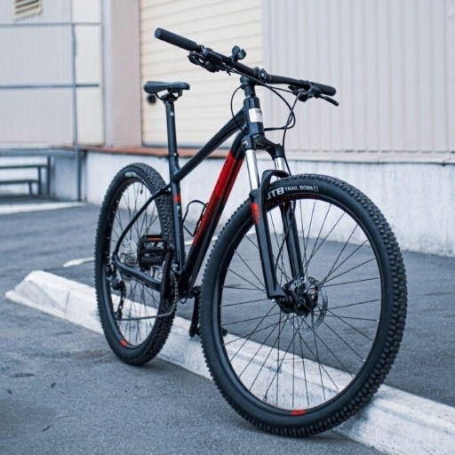
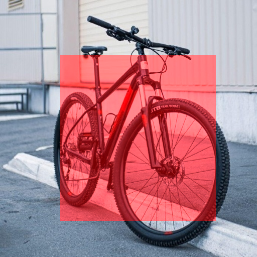
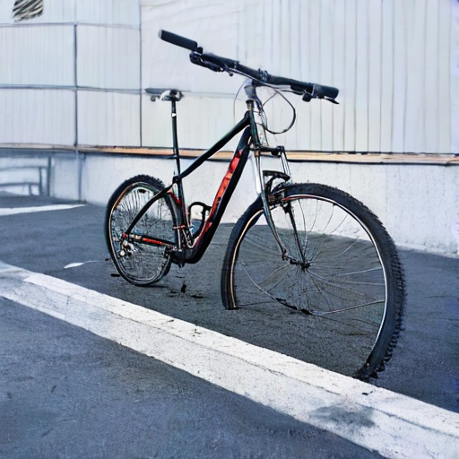

# Xóa vật thể bằng khoanh vùng — SwiftEdit-RT (2026-06-14)

Tính năng ứng dụng: người dùng **tô (khoanh) vùng vật thể cần xóa** trên ảnh, hệ thống
dùng mask đó làm vùng chỉnh sửa và tái sinh nền theo edit prompt. Đây là biến thể
mask do người dùng cấp, **ghi đè self-guided mask** mặc định của SwiftEdit.

## Môi trường

| Mục | Giá trị |
|-----|---------|
| Thiết bị | Apple M4 (Mac), MPS backend |
| dtype | fp16 + channels_last (VAE giữ fp32) |
| Python | 3.12 (.venv) |
| Model | SwiftEdit (inverse-120k, sbv2_0.5, ip_adapter-90k) |
| Code | `SwiftEdit/infer.py` (`user_mask`), `scripts/app_gradio.py` (tab "Xóa vật thể") |

## Cách hoạt động

1. UI `gr.ImageEditor` cho phép tô cọ lên vật thể → lấy alpha các layer thành mask nhị phân.
2. `edit_image(..., user_mask=mask)`: mask được resize về độ phân giải latent (64×64) và
   **thay cho self-guided mask** trong stage `mask_estimate`.
3. `MaskController` dùng mask để: vùng tô = vùng tái sinh theo edit prompt (`scale_edit`
   nhỏ ~0 để bỏ giữ vật thể gốc), ngoài vùng = giữ nền (`scale_non_edit`).

Vùng tô (giá trị > `mask_threshold`) = 1 = vật thể cần xóa.

## Kết quả

| Ca | Mask (% khung) | Thời gian | Kết quả |
|----|----------------|-----------|---------|
| Xóa headphones khỏi mèo (vật nhỏ/vừa) | 17.7% | ~6.1s | Xóa tốt — earcup 2 bên + vành trên biến mất, còn ít vệt xám |
| Xóa xe đạp (vật rất lớn) | 39.0% | ~4.9s | Còn sót — vật quá lớn, thiếu ngữ cảnh nền để tái sinh |

### Ca thành công — xóa headphones

Nguồn → vùng khoanh (đỏ) → kết quả:


### Kiểm chứng mask khoanh đúng vùng

Tô **nửa trái** + edit "a brick wall": chỉ nửa trái đổi thành tường gạch, nửa phải giữ
nguyên → mask người dùng định vị tác động chính xác (xem `sample_images/` ca dưới).

### Ca giới hạn — xóa xe đạp





## Nhận xét & giới hạn

- Tính năng vận hành đúng: mask người dùng định vị vùng chỉnh sửa chính xác, tốc độ
  giữ nguyên mức fp16 (~5–6s/lần trên MPS).
- SwiftEdit là **editor ngữ nghĩa one-step, không phải mô hình inpainting chuyên dụng**:
  xóa tốt vật **nhỏ/vừa**; vật **rất lớn** (chiếm phần lớn khung) thường còn sót vì latent
  đảo ngược vẫn mã hóa vật thể và thiếu ngữ cảnh nền xung quanh để tái sinh.
- Mẹo cải thiện: đặt `scale_edit≈0`, `scale_non_edit≈1.2`, mô tả rõ **nền thay thế** ở
  edit prompt (vd "empty asphalt road"), và nới mask phủ trọn rìa vật thể + bóng đổ.

## Cách chạy & chứng minh (tái lập)

UI (mở server, dùng tab "Xóa vật thể (khoanh vùng)"):

```bash
cd /Users/nguyenkz/Documents/code/CS2309.CH201
source .venv/bin/activate
python scripts/app_gradio.py        # mở http://127.0.0.1:7860
```

Self-test không cần mở server (mask chữ nhật giữa, lưu `results/app_removal_selftest.png`):

```bash
python scripts/app_gradio.py --selftest-removal \
  data/PIE-Bench-subset20/annotation_images/0_random_140/000000000000.jpg
```

Tạo lại bộ ảnh mẫu trong thư mục này: chạy lại đoạn sinh mẫu (source/mask/result) như mô tả
ở phần Kết quả với hai ảnh `3_delete_object_80/311000000001.jpg` (headphones) và
`0_random_140/000000000000.jpg` (xe đạp).

## File trong thư mục

| File | Nội dung |
|------|----------|
| `report.md` | Báo cáo này |
| `sample_images/headphones_{source,mask,result}.png` | Ca xóa thành công |
| `sample_images/bicycle_{source,mask,result}.png` | Ca giới hạn (vật lớn) |

## Code liên quan

- `SwiftEdit/infer.py`: `prepare_user_mask()`, tham số `user_mask` của `edit_image`.
- `scripts/app_gradio.py`: tab "Xóa vật thể", `extract_editor_mask()`, `run_removal()`,
  chế độ `--selftest-removal`.
