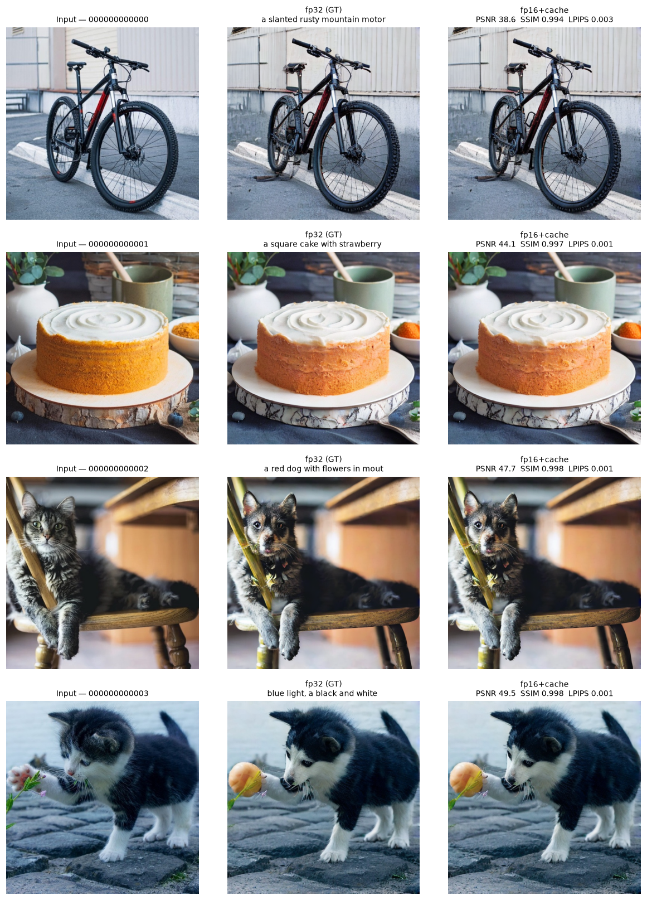

# Benchmark Tốc độ & Chất lượng — bản gốc (fp32) vs cải thiện (fp16 + cache)

> **TL;DR:** Trên **Tesla T4 (Colab)**, 200 ảnh × 3 prompt (600 edit/config), bản cải thiện
> **fp16 + cache** nhanh hơn **1.70×** (overall) / **1.82×** (cache-hit), **giảm 42.1% VRAM**
> (14.6GB → 8.5GB), trong khi chất lượng so với fp32 đạt **PSNR 48.5dB / SSIM 0.998 / LPIPS 0.0008**
> trên cả 600 ảnh ⇒ **tăng tốc + tiết kiệm bộ nhớ mà gần như không mất chất lượng**.
>
> Dữ liệu đầy đủ (1200 ảnh output + 200 ảnh nguồn, ~503MB) ở `results/quality_speed_bench_2026-06-14_20260614-1644-fa0711/`
> (không commit vì nặng). Thư mục này giữ bản **nhẹ**: report + metadata + CSV + grid + 4 ảnh mẫu.

- **Ngày:** 2026-06-14
- **RUN_ID:** `20260614-1644-fa0711`
- **Thiết bị:** `cuda` (Tesla T4, Colab) | torch 2.11.0+cu128 | Linux-6.6.122+-x86_64-with-glibc2.35
- **Lib:** diffusers 0.35.2 · transformers 4.57.6 · torchmetrics 1.9.0 · Python 3.12.13 · git `6549980`
- **Dataset:** PIE-Bench-auto200 (trích từ HuggingFace PIE_Bench_pp)
- **Quy mô:** 200 ảnh × 3 prompt = 600 edit/config (warmup 2 edit/config, không tính giờ)
- **Ground truth:** `baseline_fp32` (ảnh do bản gốc tạo ra) — đã kiểm chứng tương đương SwiftEdit gốc, xem [`fp32_baseline_verification.md`](./fp32_baseline_verification.md) + [`upstream_diff.md`](./upstream_diff.md)

## 1. Tốc độ (wall-clock / edit)

| Config | Mean (s) | Median (s) | Cache-miss (s) | Cache-hit (s) | Speedup (overall) | Speedup (cache-hit) |
|--------|---------:|-----------:|---------------:|--------------:|------------------:|--------------------:|
| baseline_fp32 | 2.54 | 2.54 | — | — | 1.00× | —× |
| improved_fp16_cache | 1.50 | 1.40 | 1.69 | 1.40 | 1.70× | 1.82× |

### 1b. Tách riêng đóng góp của fp16 vs cache

Hai tối ưu được **xếp tầng**, không độc lập:

1. **fp32 → fp16** (`channels_last`): bước tối ưu đầu tiên — so với bản gốc fp32.
2. **Cache**: bước thứ hai, **phụ thuộc** vào bước 1 — pipeline đã chạy fp16 rồi mới bật cache.

⇒ **Lợi ích của cache phải đánh giá trên nền fp16 đã optimize** (cache-miss vs cache-hit), **không** so thẳng cache với fp32 gốc. Con số 1.21× của cache là *cộng thêm trên fp16*, không phải thay thế cho 1.50× của fp16.

Để tách hai tầng, dùng ngay 200 mẫu này: với mỗi ảnh, **prompt đầu tiên luôn là cache-miss**
(chưa có gì trong cache) ⇒ chính là *fp16 không cache*; 2 prompt sau là cache-hit
(tái dùng latent + image embed + source-prompt embed).

| So sánh | Latency/edit | Speedup vs fp32 | Speedup vs fp16 (no cache) | Ý nghĩa | N |
|---------|-------------:|----------------:|---------------------------:|---------|--:|
| fp32 (gốc) | 2.54 s | 1.00× | — | mốc tham chiếu | 600 |
| **fp16 không cache** (cache-miss, prompt đầu) | **1.69 s** | **1.50×** | 1.00× | lợi ích **tầng 1**: fp32→fp16 + `channels_last` | 200 |
| fp16 + cache (cache-hit) | 1.40 s | 1.82× | **1.21×** | lợi ích **tầng 2**: cache trên nền fp16 | 400 |

- **Tầng 1 — fp16:** **1.50×** (2.54s → 1.69s) — do tính nửa độ chính xác + `channels_last`, áp dụng cho **mọi** edit kể cả ảnh mới.
- **Tầng 2 — cache (phụ thuộc fp16):** **1.21× so với fp16 không cache** (1.69s → 1.40s, **−17.3%**, tiết kiệm **0.29s/edit**) — chỉ phát huy khi **cùng ảnh + cùng source prompt**, đổi edit prompt (kịch bản demo nhiều biến thể). Cache không tồn tại trên pipeline fp32 trong benchmark này.
- **Gộp hai tầng:** 1.50× × 1.21× ≈ **1.82×** vs fp32 khi cache-hit. ⇒ Tăng tốc chủ yếu đến từ **fp16**; cache là phần thưởng cộng thêm *trên phiên bản đã giảm xuống fp16*.

## 2. VRAM per-edit (bộ nhớ GPU, MB)

Đo peak VRAM cho **từng edit** (reset trước mỗi lần) rồi tổng hợp.

| Config | Max | Min | Mean | Model (nạp) | Giảm Max vs baseline_fp32 |
|--------|----:|----:|-----:|------------:|----:|
| baseline_fp32 | 14606 | 14606 | 14606 | 12987 | 0.0% |
| improved_fp16_cache | 8455 | 8455 | 8455 | 10360 | 42.1% |

> **Max/Min/Mean** = thống kê peak VRAM qua các edit; **Model (nạp)** = VRAM sau khi nạp trọng số (trước inference). fp16 lưu trọng số nửa kích thước nên giảm bộ nhớ. CUDA dùng `max_memory_allocated` (chính xác, reset mỗi edit); MPS dùng `driver_allocated_memory` (xấp xỉ, không reset được nên Min≈Max).

## 3. Chất lượng so với ground truth (fp32)

Ảnh bản cải thiện được chấm so với ảnh bản gốc (cùng ảnh + cùng prompt).

| Config | PSNR↑ mean | PSNR min | SSIM↑ mean | SSIM min | LPIPS↓ mean | LPIPS max | MSE↓ mean | N |
|--------|---:|---:|---:|---:|---:|---:|---:|---:|
| improved_fp16_cache | 48.53 | 34.25 | 0.9976 | 0.9870 | 0.0008 | 0.0099 | 0.00002 | 600 |

## 4. Diễn giải

- **PSNR** (dB, ↑): > 30 dB ⇒ khác biệt rất nhỏ, mắt thường khó nhận ra; > 40 dB ⇒ gần như trùng.
- **SSIM** (0–1, ↑): > 0.95 ⇒ giữ gần như nguyên cấu trúc.
- **LPIPS** (↓): < 0.1 ⇒ rất giống về cảm nhận (perceptual).
- **MSE** (↓): càng nhỏ càng giống.
- **VRAM** (↓): fp16 lưu trọng số nửa kích thước ⇒ giảm bộ nhớ, chạy được trên GPU yếu / batch lớn hơn.

**Kết luận sơ bộ:** bản cải thiện `improved_fp16_cache` nhanh hơn **1.70×** (overall) / **1.82×** (khi cache-hit), **giảm ~42.1% VRAM** (max 8455MB vs 14606MB), trong khi so với ground truth đạt PSNR **48.53 dB**, SSIM **0.9976**, LPIPS **0.0008**. ⇒ tốc độ tăng mạnh + tiết kiệm VRAM mà chất lượng gần như không đổi.

**Tách đóng góp (2 tầng):** tầng 1 — fp16 đơn thuần **1.50×** vs fp32 (áp dụng mọi edit); tầng 2 — cache **1.21× vs fp16 không cache** (phụ thuộc tầng 1, −17.3%, 0.29s/edit) ⇒ gộp **1.82×** vs fp32 khi cache-hit.

> Cache là **lossless** (tái dùng latent/embedding y hệt) nên khác biệt chất lượng (nếu có) đến từ **fp16**, không phải cache. Wall-clock có thể nhiễu do thermal throttling trên Mac; per-image median ổn định hơn.

## So sánh trực quan (4 ảnh mẫu)

Cột: **Input | fp32 (ground truth) | fp16+cache** — gần như không phân biệt được bằng mắt.



Ảnh mẫu gốc + output từng config trong `sample_source/` và `sample_edits/` (4 ảnh × 3 prompt).

## Tài liệu metric
- **PSNR/MSE:** chuẩn image fidelity.
- **SSIM:** Wang et al. 2004, *Image Quality Assessment: From Error Visibility to Structural Similarity*, IEEE TIP.
- **LPIPS:** Zhang et al. 2018, *The Unreasonable Effectiveness of Deep Features as a Perceptual Metric*, CVPR.

## Tái lập
```bash
# Mac hoặc Colab: mở notebook và chạy tuần tự các cell
jupyter lab notebooks/CS2309_SwiftEdit_quality_speed_bench.ipynb
```
Chỉnh `N_IMAGES`, `PROMPTS_PER_IMAGE`, `EDIT_TEMPLATES`, `CONFIGS` ở cell cấu hình (③).

## File trong thư mục (bản nhẹ, đã commit)
| File | Nội dung |
|------|----------|
| `report.md` | Báo cáo này |
| `run_meta.json` | Bằng chứng môi trường: GPU Tesla T4, version lib, git commit, cấu hình, kết quả tóm tắt |
| `timing_raw.csv` | Thời gian + VRAM **từng edit** (600×2 = 1200 dòng) |
| `quality_raw.csv` | PSNR/SSIM/LPIPS/MSE **từng cặp ảnh** (600 dòng) |
| `images/comparison_grid.png` | Lưới so sánh Input / fp32 / fp16+cache (4 ảnh) |
| `sample_source/` | 4 ảnh đầu vào mẫu |
| `sample_edits/baseline_fp32/`, `sample_edits/improved_fp16_cache/` | 4 ảnh × 3 prompt output mỗi config |

> **Dữ liệu đầy đủ (không commit, ~503MB):** `results/quality_speed_bench_2026-06-14_20260614-1644-fa0711/`
> — gồm `source_images/` (200), `edited_images/` (1200 PNG), `notebook_run.ipynb` (bản đã chạy giữ output).
