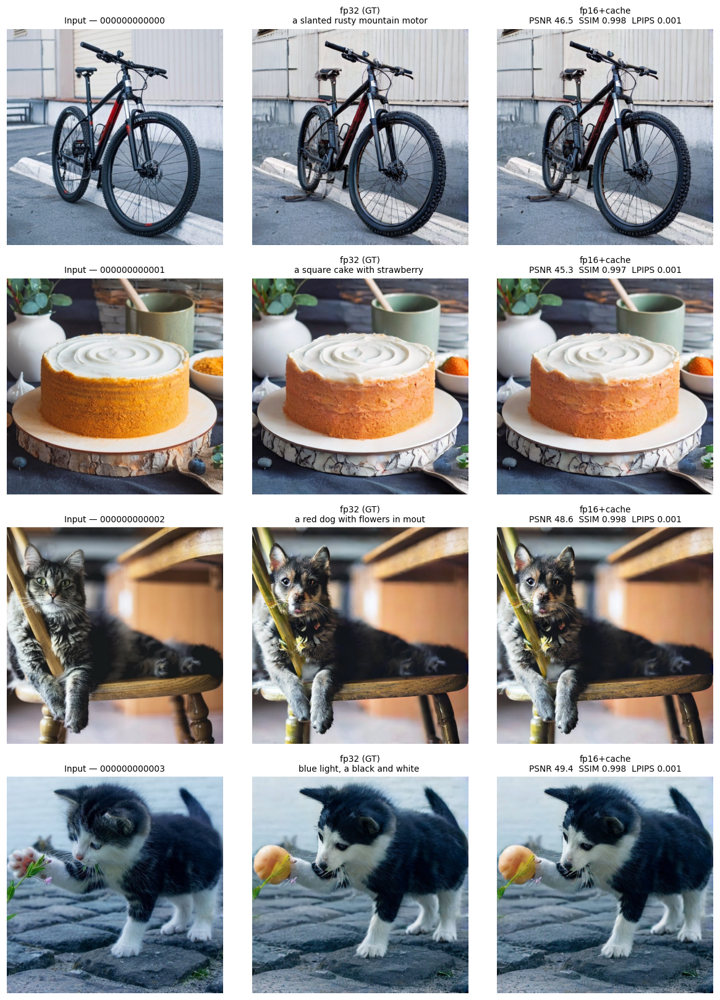

# Benchmark Tốc độ & Chất lượng — so sánh precision (fp32 / fp16 / fp8 / fp4)

> **TL;DR:** Trên **Tesla T4 (Colab)**, 200 ảnh × 3 prompt (600 edit/config), **fp16 + cache**
> là cấu hình **khuyến nghị**: nhanh **1.70×** (overall) / **1.82×** (cache-hit), **giảm 42.1% VRAM**
> (14.6GB → 8.5GB), chất lượng vs fp32 đạt **PSNR 48.6dB / SSIM 0.998 / LPIPS 0.0008**.
>
> **fp8** (benchmark only): wall-clock **1.92×** nhưng **600/600 ảnh output đen** (PSNR 6.0 dB) —
> **không dùng được**; số liệu fp8 chỉ mang tính **tham chiếu benchmark**, không phải khuyến nghị triển khai.
> **fp4** tiết kiệm VRAM nhất (−48.5%) nhưng chất lượng giảm mạnh (PSNR 21.7 dB).
>
> Dữ liệu đầy đủ (~503MB) ở `results/quality_speed_bench_2026-06-17_20260617-0336-bb4785/`
> (không commit vì nặng). Thư mục này giữ bản **nhẹ**: report + metadata + CSV + grid + ảnh mẫu.

- **Ngày:** 2026-06-17
- **RUN_ID:** `20260617-0336-bb4785`
- **Thiết bị:** `cuda` (Tesla T4, Colab) | torch 2.11.0+cu128 | Linux-6.6.122+-x86_64-with-glibc2.35
- **Lib:** diffusers 0.35.2 · transformers 4.57.6 · torchmetrics 1.9.0 · Python 3.12.13 · git `1a6706c`
- **Dataset:** PIE-Bench-auto200 (trích từ HuggingFace PIE_Bench_pp)
- **Quy mô:** 200 ảnh × 3 prompt = 600 edit/config (warmup 2 edit/config, không tính giờ)
- **Ground truth:** `baseline_fp32` (ảnh do bản gốc tạo ra)
- **Config chạy được:** `baseline_fp32`, `improved_fp16_cache`, `improved_fp8_cache`, `improved_fp4_cache` (4/4)

> **Lưu ý precision thấp (fp8/fp4):** đây là *weight-only quantization* (nén trọng số Linear của UNet).
> Trên GPU Turing/T4 không có tensor core fp8/fp4 nên các mức này chủ yếu **giảm VRAM**;
> tốc độ wall-clock có thể thay đổi do overhead giải nén. VAE luôn giữ fp32.

## 1. Tốc độ (wall-clock / edit)

| Config | Mean (s) | Median (s) | Cache-miss (s) | Cache-hit (s) | Speedup (overall) | Speedup (cache-hit) |
|--------|---------:|-----------:|---------------:|--------------:|------------------:|--------------------:|
| baseline_fp32 | 2.91 | 2.92 | — | — | 1.00× | —× |
| improved_fp16_cache | 1.71 | 1.61 | 1.93 | 1.60 | 1.70× | 1.82× |
| improved_fp8_cache | 1.52 | 1.42 | 1.74 | 1.41 | 1.92× | 2.06× |
| improved_fp4_cache | 1.74 | 1.64 | 1.95 | 1.63 | 1.68× | 1.79× |

### 1b. Tách riêng đóng góp fp16 vs cache (config `improved_fp16_cache`)

Hai tối ưu **xếp tầng**, không độc lập: fp32→fp16 trước, cache sau (phụ thuộc fp16).

Với mỗi ảnh, **prompt đầu tiên = cache-miss** (fp16 không cache); 2 prompt sau = cache-hit.

| So sánh | Latency/edit | Speedup vs fp32 | Speedup vs fp16 (no cache) | Ý nghĩa | N |
|---------|-------------:|----------------:|---------------------------:|---------|--:|
| fp32 (gốc) | 2.91 s | 1.00× | — | mốc tham chiếu | 600 |
| **fp16 không cache** (cache-miss) | **1.93 s** | **1.51×** | 1.00× | tầng 1: fp32→fp16 + `channels_last` | 200 |
| fp16 + cache (cache-hit) | 1.60 s | 1.82× | **1.21×** | tầng 2: cache trên nền fp16 | 400 |

- **Tầng 1 — fp16:** **1.51×** (2.91s → 1.93s).
- **Tầng 2 — cache:** **1.21× vs fp16 không cache** (1.93s → 1.60s, −17.1%, tiết kiệm 0.33s/edit).
- **Gộp:** 1.51× × 1.21× ≈ **1.82×** vs fp32 khi cache-hit.

## 2. VRAM per-edit (bộ nhớ GPU, MB)

Đo peak VRAM cho **từng edit** (reset trước mỗi lần) rồi tổng hợp.

| Config | Max | Min | Mean | Model (nạp) | Giảm Max vs baseline_fp32 |
|--------|----:|----:|-----:|------------:|----:|
| baseline_fp32 | 14596 | 14596 | 14596 | 12967 | 0.0% |
| improved_fp16_cache | 8446 | 8445 | 8445 | 10350 | 42.1% |
| improved_fp8_cache | 7819 | 7818 | 7818 | 10050 | 46.4% |
| improved_fp4_cache | 7515 | 7514 | 7514 | 9904 | 48.5% |

> **Max/Min/Mean** = thống kê peak VRAM qua các edit; **Model (nạp)** = VRAM sau khi nạp trọng số (trước inference).

## 3. Chất lượng so với ground truth (fp32)

Ảnh bản cải thiện được chấm so với ảnh bản gốc (cùng ảnh + cùng prompt).

| Config | PSNR↑ mean | PSNR min | SSIM↑ mean | SSIM min | LPIPS↓ mean | LPIPS max | MSE↓ mean | N |
|--------|---:|---:|---:|---:|---:|---:|---:|---:|
| improved_fp16_cache | 48.56 | 34.97 | 0.9976 | 0.9889 | 0.0008 | 0.0063 | 0.00002 | 600 |
| improved_fp8_cache | 6.01 | 0.33 | 0.0195 | 0.0001 | 0.9681 | 1.2017 | 0.30045 | 600 |
| improved_fp4_cache | 21.67 | 16.59 | 0.7757 | 0.4763 | 0.1504 | 0.3057 | 0.00764 | 600 |

**Đọc nhanh chất lượng:**

| Config | PSNR | Đánh giá |
|---|---|---|
| fp16 + cache | 48.6 dB | Gần như trùng fp32 (>40 dB) |
| fp8 + cache | 6.0 dB | **Failure mode** — 600/600 ảnh đen; PSNR chỉ để benchmark |
| fp4 + cache | 21.7 dB | Giảm mạnh — có nội dung nhưng artifact rõ (<30 dB) |

## 4. Diễn giải

- **PSNR** (dB, ↑): > 30 dB ⇒ khác biệt nhỏ; > 40 dB ⇒ gần như trùng.
- **SSIM** (0–1, ↑): > 0.95 ⇒ giữ gần nguyên cấu trúc.
- **LPIPS** (↓): < 0.1 ⇒ rất giống về cảm nhận.
- **VRAM** (↓): precision thấp ⇒ trọng số nhỏ hơn ⇒ chạy được trên GPU yếu.

> Cache là **lossless** — khác biệt chất lượng đến từ **precision/quant**, không phải cache.

**fp4:** giảm VRAM nhiều nhất (−48.5%) nhưng PSNR 21.7 dB — trade-off chấp nhận được chỉ khi **bắt buộc** chạy trên GPU bộ nhớ rất thấp và chấp nhận giảm chất lượng.

### 4b. fp8 — nguyên nhân, giải thích số liệu (benchmark reference)

> **Phạm vi:** Mục này giải thích vì sao fp8 **tệ hơn fp4** trong lần chạy này. Số liệu fp8
> được giữ trong báo cáo vì mục đích **so sánh benchmark** (tốc độ / VRAM / failure mode),
> **không** coi là cấu hình production hay kết luận “fp8 luôn kém fp4 trên mọi GPU”.

#### Hiện tượng quan sát được

| Kiểm tra | fp8 | fp4 |
|---|---|---|
| Ảnh output (600 mẫu) | **600/600 all-black** (pixel max = 0) | Có nội dung, artifact/méo |
| PSNR mean vs fp32 | 6.0 dB | 21.7 dB |
| Wall-clock | 1.92× (nhanh nhất) | 1.68× |
| VRAM | −46.4% | −48.5% |

⇒ fp8 **không phải** “precision thấp hơn fp4 một chút” mà là **pipeline inference sụp** (latent/VAE decode ≈ 0).

#### Nguyên nhân khả dĩ (chưa kiểm chứng thêm)

1. **Cơ chế quant khác nhau**
   - **fp8:** `torchao` `Float8WeightOnlyConfig` + `quantize_(unet, …)` — chỉ lượng tử hóa `nn.Linear` trong UNet (Conv2d giữ nguyên).
   - **fp4:** `bitsandbytes` `Linear4bit` — cùng phạm vi Linear, nhưng stack mature trên CUDA, giải nén về fp16 khi matmul.
   - UNet diffusion chủ yếu là **Conv2d**; chỉ một phần nhỏ là Linear (time embedding, projection…). Lỗi ở **vài Linear then chốt** có thể làm toàn bộ forward collapse.

2. **T4 (Turing) không có tensor core fp8**
   - fp8 native chỉ có trên GPU đời mới (Ada/Hopper/Blackwell).
   - Trên T4, torchao phải **dequant fp8 → fp16/fp32** bằng software path; có thể không ổn với weight one-step diffusion đã fine-tune (outlier, scale per-channel).

3. **Không calibration / không quant theo layer**
   - Áp `Float8WeightOnlyConfig` **đồng loạt** sau khi nạp weight + ép fp16, **không** có bước calibrate activation/weight trên subset PIE-Bench.
   - fp4 (bnb) có quy trình nén 4-bit đã được dùng rộng rãi hơn cho inference LLM/diffusion trên GPU cũ.

4. **Vì sao PSNR mean ≈ 6 dB mà không phải 0? (artifact metric)**
   - Output fp8 **luôn đen**, nhưng ground truth fp32 với prompt **“at night, dark lighting”** (prompt_idx=1) cũng **rất tối**.
   - Đen vs đen/ảnh tối → MSE nhỏ hơn → PSNR cao hơn vài dB (max ~16 dB trên subset đêm).
   - 39/50 mẫu PSNR > 10 đều là prompt_idx=1. **Không** có nghĩa một phần ảnh fp8 còn đẹp.

5. **Vì sao wall-clock fp8 vẫn nhanh?**
   - Model vẫn chạy đủ forward (không crash); weight fp8 nhỏ hơn → ít bandwidth hơn.
   - Output vô dụng **không làm** đo thời gian invalid — chỉ làm **speedup không có ý nghĩa ứng dụng**.

#### Cách đọc số liệu fp8 trong báo cáo này

| Cột báo cáo | Cách hiểu |
|---|---|
| Speedup 1.92× | Chỉ benchmark wall-clock trên T4; **không** khuyến nghị dùng |
| VRAM −46.4% | Có giảm footprint model; nhưng output hỏng |
| PSNR 6.0 dB | Hậu quả failure (ảnh đen), không phải trade-off precision hợp lệ |
| So với fp4 | fp4 **khả dụng hơn** trên T4 cho mục tiêu giảm VRAM (dù chất lượng vẫn kém fp16) |

**Kết luận fp8 (benchmark):** trên T4 + torchao weight-only hiện tại, fp8 là **negative result** có giá trị ghi nhận — “quant fp8 không tự động tốt hơn fp4; có thể fail catastrophically trên GPU không hỗ trợ fp8”.

#### Cải thiện có khả năng thực hiện (chưa làm — xem TODO §6)

| Hướng | Mô tả | Khả năng / effort |
|---|---|---|
| Bỏ fp8 trên T4 | Notebook tự skip `improved_fp8_cache` khi GPU không có fp8 TC; ghi “N/A” thay vì số liệu hỏng | Thấp — engineering |
| Sanity check sau quant | Reject config nếu ảnh warmup mean ≈ 0 hoặc PSNR < ngưỡng (vd 20 dB) | Thấp |
| GPU fp8-native | Chạy lại benchmark trên L4 / RTX 4090 / A100 H100 | TB — cần Colab Pro |
| Calibration | Dùng subset PIE-Bench calibrate scale trước khi `quantize_` | TB |
| Quant có chọn lọc | Chỉ quant Linear ít nhạy cảm; giữ full precision ở `proj_out`, time embed | TB–cao |
| fp8 dynamic (activation + weight) | `Float8DynamicActivationFloat8WeightConfig` thay weight-only | TB — cần GPU + torchao mới |
| Thư viện khác | `bitsandbytes` fp8 / TensorRT / `optimum-quanto` | TB — tích hợp pipeline IP-adapter |
| Không quant UNet inverse | Chỉ quant generation UNet; inverse giữ fp16 | Thấp–TB |

## 5. Kết luận: precision nào tốt nhất?

| Precision | Speedup overall | VRAM max (MB) | Giảm VRAM | PSNR↑ | SSIM↑ | LPIPS↓ | Ghi chú |
|-----------|----------------:|--------------:|----------:|------:|------:|-------:|---------|
| baseline_fp32 | 1.00× | 14596 | 0.0% | — | — | — | ground truth; chậm + tốn VRAM |
| **improved_fp16_cache** | **1.70×** | **8446** | **42.1%** | **48.56** | **0.9976** | **0.0008** | **khuyến nghị — cân bằng tốt nhất** |
| improved_fp8_cache | 1.92× | 7819 | 46.4% | 6.01 | 0.0195 | 0.9681 | **benchmark only** — ảnh đen, speedup không usable |
| improved_fp4_cache | 1.68× | 7515 | 48.5% | 21.67 | 0.7757 | 0.1504 | VRAM thấp nhất; chất lượng giảm nhiều |

**Tốt nhất theo từng tiêu chí:**

- **Nhanh nhất (wall-clock):** `improved_fp8_cache` — 1.92× — **chỉ benchmark**; output đen, không usable.
- **Tiết kiệm VRAM nhất:** `improved_fp4_cache` — 7515 MB (−48.5%).
- **Chất lượng cao nhất:** `baseline_fp32` (ground truth).
- **Khuyến nghị tổng thể:** **`improved_fp16_cache`** — 1.70×, PSNR 48.56 dB, VRAM 8446 MB. Đây là precision duy nhất vừa nhanh, vừa tiết kiệm VRAM đáng kể, vừa giữ chất lượng gần fp32.

**Kết luận nghiên cứu (trung thực):** Trên T4, **fp16 + cache** là sweet spot cho SwiftEdit-RT. **fp8** (lần chạy này) ghi nhận **failure mode** cho báo cáo benchmark — không triển khai. **fp4** chỉ khi VRAM là ràng buộc cứng và chấp nhận output kém hơn rõ rệt so với fp16.

## 6. TODO tùy chọn (fp8 / quant — khi có thời gian)

- [ ] Notebook: auto-skip `improved_fp8_cache` trên GPU không có fp8 tensor core (T4) + log lý do
- [ ] Sanity check sau quant: warmup edit — reject nếu output mean pixel < ngưỡng hoặc toàn đen
- [ ] Benchmark lại fp8 trên GPU fp8-native (L4 / 4090 / H100) — xem failure có phải do T4 không
- [ ] Thử calibration torchao trên subset PIE-Bench trước `quantize_`
- [ ] Ablation quant có chọn lọc: chỉ một phần Linear; giữ fp16 ở layer nhạy (proj_out, time embed)
- [ ] Thử `Float8DynamicActivationFloat8WeightConfig` (activation + weight) thay weight-only
- [ ] Chỉ quant generation UNet; inverse UNet giữ fp16 — xem fp8 có còn đen không
- [ ] So sánh thư viện khác: bnb fp8, TensorRT, optimum-quanto (effort cao)
- [ ] Cập nhật paper/luận văn: đoạn “negative result fp8 on Turing” + bảng failure mode

## So sánh trực quan (4 ảnh mẫu)

Cột: **Input | fp32 (ground truth) | fp16+cache** — gần như không phân biệt được bằng mắt.



Ảnh mẫu gốc + output từng config trong `sample_source/` và `sample_edits/` (4 ảnh × 3 prompt × 4 config).

## Tài liệu metric

- **PSNR/MSE:** chuẩn image fidelity.
- **SSIM:** Wang et al. 2004, IEEE TIP.
- **LPIPS:** Zhang et al. 2018, CVPR.

## Tái lập

```bash
jupyter lab notebooks/CS2309_SwiftEdit_quality_speed_bench.ipynb
```

Chỉnh `N_IMAGES`, `PROMPTS_PER_IMAGE`, `CONFIGS` ở cell cấu hình (③).

## File trong thư mục (bản nhẹ, đã commit)

| File | Nội dung |
|------|----------|
| `report.md` | Báo cáo này |
| `run_meta.json` | Môi trường, cấu hình, kết quả tóm tắt |
| `timing_raw.csv` | Thời gian + VRAM từng edit (2400 dòng = 600×4 config) |
| `quality_raw.csv` | PSNR/SSIM/LPIPS/MSE từng cặp ảnh (1800 dòng = 600×3 improved) |
| `images/comparison_grid.png` | Lưới Input / fp32 / fp16+cache |
| `sample_source/` | 4 ảnh đầu vào mẫu |
| `sample_edits/*/` | 4 ảnh × 3 prompt mỗi config |

> **Dữ liệu đầy đủ (không commit):** `results/quality_speed_bench_2026-06-17_20260617-0336-bb4785/`
> — gồm `source_images/` (200), `edited_images/` (2400 PNG), `notebook_run.ipynb`.
