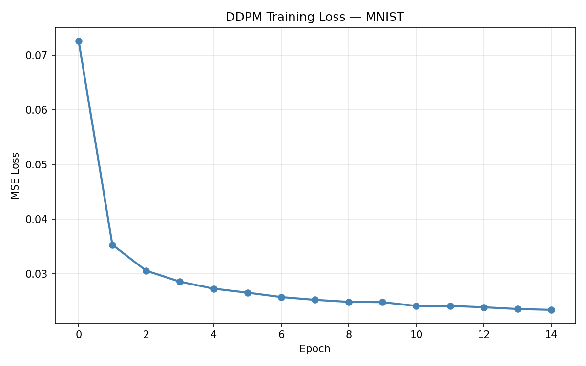
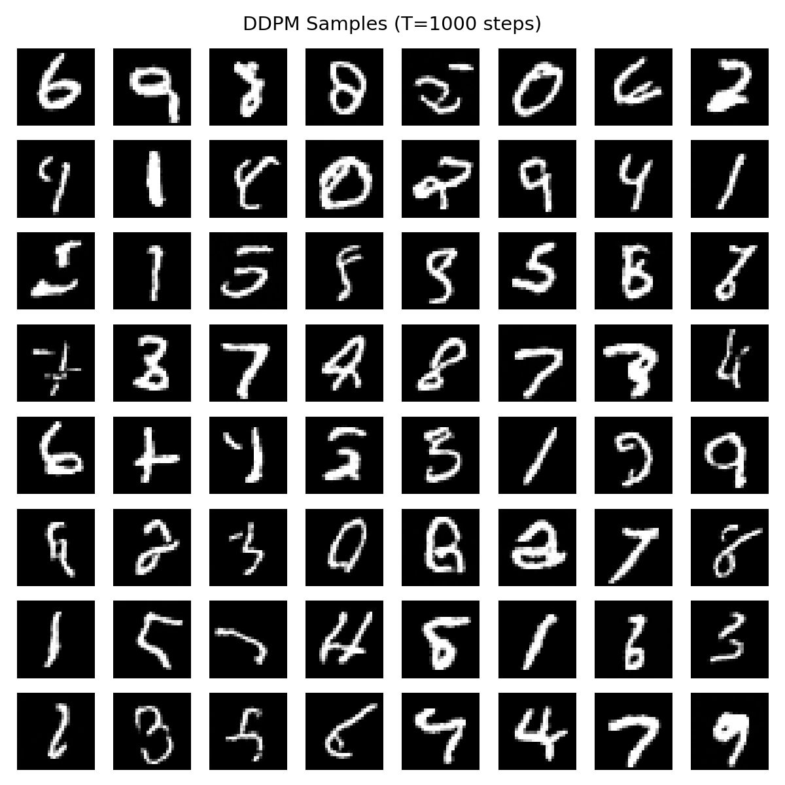
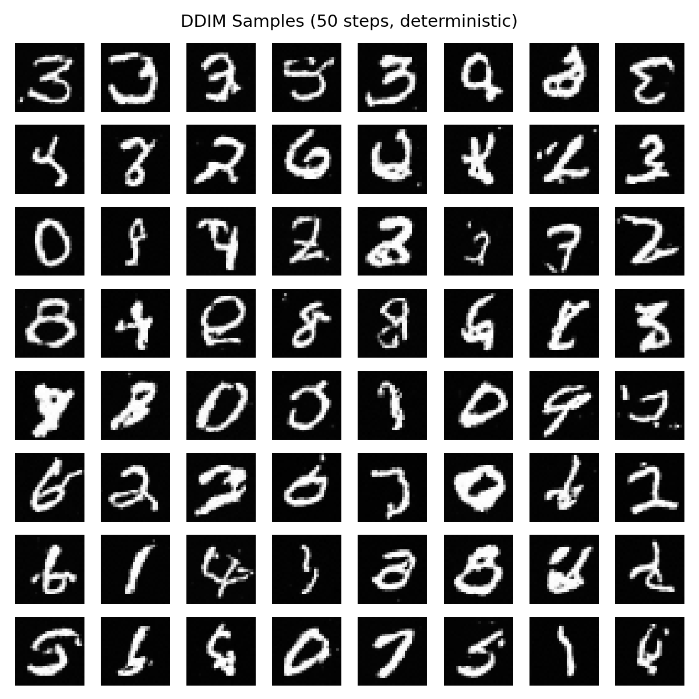
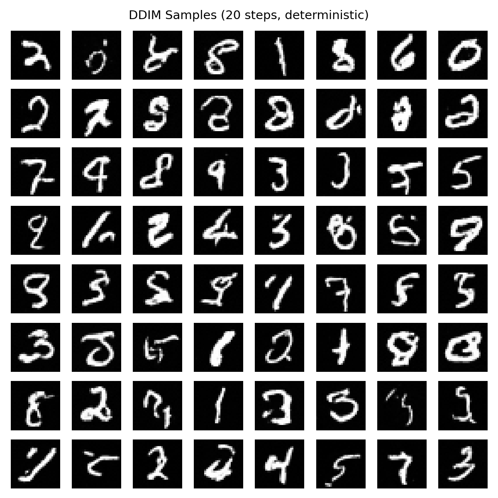
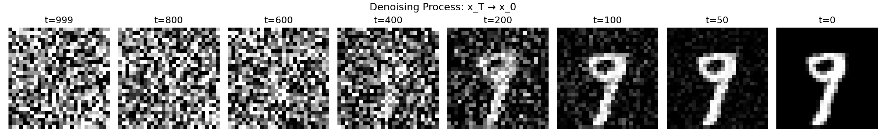
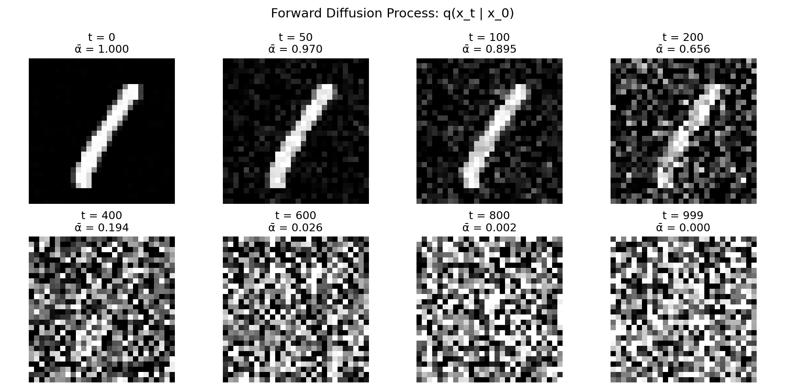
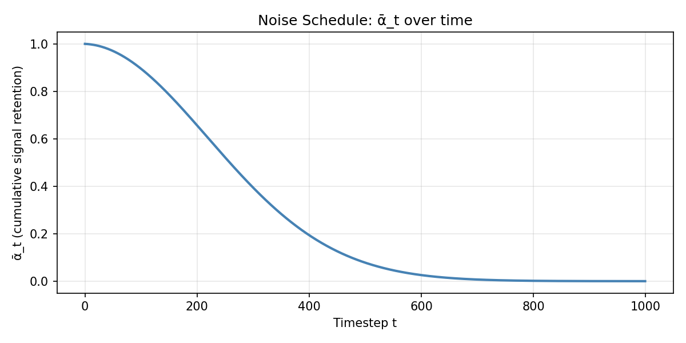

# diffusion-from-scratch

Minimal DDPM and DDIM implementation in PyTorch — train a diffusion model on MNIST from scratch in ~200 lines of core code.

## Results

### Training Loss


### DDPM Samples (1000 steps)


### DDIM Samples (50 steps, deterministic)


### DDIM Samples (20 steps, deterministic)


### Denoising Process Visualization


### Forward Diffusion Process


### Noise Schedule


## What's Inside

| File | Description |
|------|-------------|
| `diffusion/schedule.py` | Linear beta schedule, forward process q(x_t\|x_0), DDPM & DDIM reverse sampling |
| `diffusion/unet.py` | U-Net with sinusoidal time embeddings, residual blocks, self-attention |
| `01_forward_process.py` | Visualize how noise is progressively added |
| `01_forward_process.ipynb` | Notebook giải thích forward process |
| `02_train_ddpm.py` | Train the denoising model on MNIST (15 epochs, ~45 min on MPS) |
| `02_train_ddpm.ipynb` | Notebook giải thích training loop DDPM |
| `03_sample_ddpm.py` | Generate images with full 1000-step DDPM sampling |
| `03_sample_ddpm.ipynb` | Notebook giải thích reverse sampling DDPM |
| `04_sample_ddim.py` | Fast sampling with DDIM (50 and 20 steps) |
| `04_sample_ddim.ipynb` | Notebook giải thích DDIM sampling |
| `train_all.py` | Run the entire pipeline end-to-end |

## Key Concepts

**DDPM (Denoising Diffusion Probabilistic Models)**
- Forward process: gradually add Gaussian noise over T=1000 steps
- Reverse process: learn to denoise step by step
- Training: predict the noise added at each timestep (simple MSE loss)

**DDIM (Denoising Diffusion Implicit Models)**
- Same trained model, different sampling procedure
- Skip timesteps for 20x faster generation (1000 → 50 steps)
- Deterministic sampling when eta=0

**Architecture**
- U-Net with encoder-decoder structure and skip connections
- Sinusoidal positional embeddings for timestep conditioning
- Self-attention at the bottleneck (7x7 resolution)
- GroupNorm + SiLU activations throughout
- ~1.4M parameters

---

## Công thức forward `q_sample` từ đâu ra?

> Nhiều tutorial nhảy thẳng vào công thức dưới đây mà không giải thích nguồn gốc. Phần này suy ra công thức đó từ định nghĩa DDPM — thêm noise **từng bước**.

$$
x_t = \sqrt{\bar{\alpha}_t}\, x_0 + \sqrt{1 - \bar{\alpha}_t}\, \epsilon
$$

Liên quan code: [`01_forward_process.py`](01_forward_process.py) · [`diffusion/schedule.py`](diffusion/schedule.py) · notebook [`01_forward_process.ipynb`](01_forward_process.ipynb)

### Bắt đầu từ định nghĩa DDPM

DDPM định nghĩa quá trình phá hủy ảnh:

$$
q(x_t \mid x_{t-1}) = \mathcal{N}\!\left(\sqrt{\alpha_t}\, x_{t-1},\; (1 - \alpha_t)\, \mathbf{I}\right)
$$

Trong code thường viết:

```python
alpha_t = 1 - beta_t
```

Từ ảnh ở bước trước $x_{t-1}$, ta tạo $x_t$ bằng cách:

$$
x_t = \sqrt{\alpha_t}\, x_{t-1} + \sqrt{1 - \alpha_t}\, \epsilon_t
$$

**Ví dụ:** $\alpha_t = 0.99$ → giữ ~99% tín hiệu cũ + thêm noise mới (vì $\sqrt{0.01} = 0.1$).

### Khai triển từng bước

**Bước 1:**

$$
x_1 = \sqrt{\alpha_1}\, x_0 + \sqrt{1 - \alpha_1}\, \epsilon_1
$$

**Bước 2:**

$$
x_2 = \sqrt{\alpha_2}\, x_1 + \sqrt{1 - \alpha_2}\, \epsilon_2
$$

Thay $x_1$ vào và khai triển:

$$
x_2 = \sqrt{\alpha_1 \alpha_2}\, x_0 + \sqrt{\alpha_2(1 - \alpha_1)}\, \epsilon_1 + \sqrt{1 - \alpha_2}\, \epsilon_2
$$

Bắt đầu thấy tích $\alpha_1 \alpha_2$. Làm tiếp bước 3 sẽ xuất hiện $\alpha_1 \alpha_2 \alpha_3$.

### Tổng quát sau *t* bước

$$
x_t = \sqrt{\alpha_1 \alpha_2 \cdots \alpha_t}\; x_0 \;+\; \cdots
$$

Phần $+\cdots$ là **tổng có trọng số** của nhiều noise $\epsilon_1, \epsilon_2, \ldots, \epsilon_t$.

Người ta đặt:

$$
\bar{\alpha}_t = \alpha_1 \alpha_2 \cdots \alpha_t = \prod_{s=1}^{t} \alpha_s
$$

(trong code: `schedule.alpha_bar`).

### Gộp nhiều Gaussian thành một

Ta có $\epsilon_1, \epsilon_2, \ldots, \epsilon_t$ đều là Gaussian độc lập. **Định lý:** tổng có trọng số của nhiều Gaussian độc lập vẫn là một Gaussian.

Ví dụ ở bước 2, hai noise có thể gộp thành $\sqrt{1 - \alpha_1 \alpha_2}\, \epsilon$ với $\epsilon \sim \mathcal{N}(0, \mathbf{I})$.

Tương tự cho mọi bước → **kết quả cuối:**

$$
x_t = \sqrt{\bar{\alpha}_t}\, x_0 + \sqrt{1 - \bar{\alpha}_t}\, \epsilon
$$

### Nhảy thẳng $x_0 \to x_t$ (không cần loop 1000 bước)

Ban đầu: $x_0 \to x_1 \to x_2 \to \cdots \to x_t$. Sau khi suy ra công thức đóng, train chỉ cần:

```python
x_t, noise = schedule.q_sample(x_0, t, noise)
# ≡ sqrt(alpha_bar[t]) * x_0 + sqrt(1 - alpha_bar[t]) * noise
```

| Khái niệm | Ý nghĩa |
|-----------|---------|
| $\alpha_t$ | Mỗi bước giữ lại bao nhiêu tín hiệu cũ ($1 - \beta_t$) |
| $\bar{\alpha}_t$ | Tích tất cả $\alpha$ từ bước 1 đến $t$ |
| Công thức đóng | Khai triển từng bước + gộp Gaussian |
| Train nhanh | Lấy trực tiếp $x_t$ từ $x_0$ + random $t$ |

**Liên hệ SwiftEdit:** forward phá ảnh → noise; inversion (method cũ) đi ngược bằng nhiều bước DDIM; SwiftEdit dùng $F_\theta$ thay chuỗi inversion bằng một forward pass.

---

```bash
pip install -r requirements.txt

# Visualize forward process
python 01_forward_process.py

# Train DDPM on MNIST
python 02_train_ddpm.py

# Generate samples
python 03_sample_ddpm.py   # DDPM (1000 steps)
python 04_sample_ddim.py   # DDIM (50 & 20 steps)

# Or run everything at once
python train_all.py
```

## Requirements

- Python 3.8+
- PyTorch 2.0+
- torchvision, matplotlib, numpy, tqdm

## References

- [Denoising Diffusion Probabilistic Models](https://arxiv.org/abs/2006.11239) (Ho et al., 2020)
- [Denoising Diffusion Implicit Models](https://arxiv.org/abs/2010.02502) (Song et al., 2020)

## Related

- Blog post: [Diffusion Models from Scratch: DDPM Training in PyTorch](https://tildalice.io/diffusion-models-from-scratch-ddpm-pytorch/) on TildAlice
