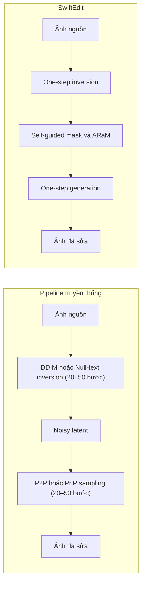
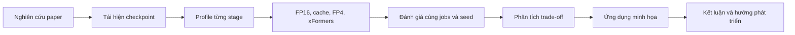
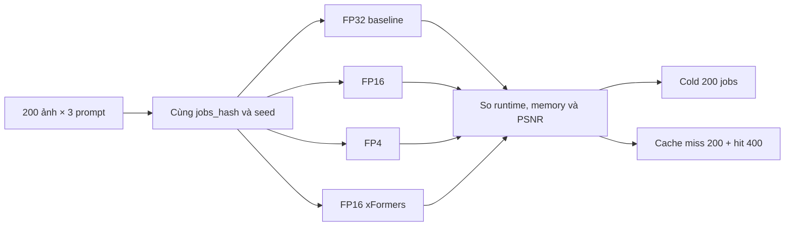
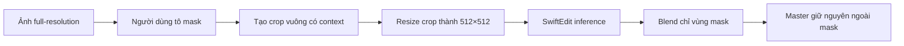

# Báo cáo chuyên đề — SwiftEdit-RT

> Tối ưu suy luận SwiftEdit trên phần cứng phổ thông, tái hiện one-step text-guided image editing và minh họa ứng dụng chỉnh sửa tương tác.

| | |
|---|---|
| **Môn học** | CS2309.CH201 — Chuyên đề nghiên cứu và ứng dụng về Thị giác máy tính |
| **Bài báo chính** | [SwiftEdit: Lightning Fast Text-Guided Image Editing via One-Step Diffusion](https://openaccess.thecvf.com/content/CVPR2025/papers/Nguyen_SwiftEdit_Lightning_Fast_Text-Guided_Image_Editing_via_One-Step_Diffusion_CVPR_2025_paper.pdf) (CVPR 2025) |
| **Tác giả** | Trong-Tung Nguyen, Quang Nguyen, Khoi Nguyen, Anh Tran, Cuong Pham |
| **Code gốc** | [Qualcomm-AI-research/SwiftEdit](https://github.com/Qualcomm-AI-research/SwiftEdit) |
| **Môi trường đề tài** | MacBook Air M4 24GB (MPS) + Google Colab Tesla T4 16GB |

---

## 1. Mở đầu và lý do chọn đề tài

Chỉnh sửa ảnh theo văn bản (text-guided image editing) đang trở thành nhu cầu phổ biến: người dùng muốn đổi màu, đổi đối tượng, xóa vật thể hoặc thay đổi nền chỉ bằng vài câu mô tả. Các phương pháp diffusion đa bước như Prompt-to-Prompt, Null-text Inversion, MasaCtrl hay Plug-and-Play thường cho kết quả tốt, nhưng chậm vì phải chạy hàng chục bước inversion và hàng chục bước sampling. Thời gian thường rơi vào khoảng 12–130+ giây mỗi ảnh — khó dùng cho ứng dụng tương tác.

SwiftEdit (CVPR 2025) đề xuất một hướng khác: **một bước inversion + một bước generation/editing**. Trên NVIDIA A100 40GB, paper công bố khoảng **0.23 giây/ảnh**, nhanh hơn ít nhất **50 lần** so với nhiều pipeline multi-step trong khi chất lượng vẫn cạnh tranh trên PIE-Bench.

Hai lý do chính để chọn bài báo này:

1. **Hứng thú và tính đột phá.** Đây là điểm khởi đầu phù hợp để nghiên cứu AI image editing vì paper giải bài toán tốc độ một cách rõ ràng, có code và checkpoint công khai.
2. **Khoảng trống triển khai thực tế.** Paper chạy trên A100 40GB và repository khuyến nghị tối thiểu khoảng 24GB VRAM. Đề tài muốn trả lời: trên GPU phổ thông như Colab T4 16GB hoặc máy Mac M4, SwiftEdit còn chạy được không, tốc độ thế nào, và có tối ưu được tốc độ/bộ nhớ/dung lượng checkpoint mà không làm kết quả lệch nhiều so với FP32 hay không.

**Phạm vi đề tài:** không train lại mô hình. Tập trung tái hiện inference, profiling bottleneck, mixed precision, cache, checkpoint FP16 trên disk, đánh giá công bằng và xây demo ứng dụng minh họa.

### 1.1. Câu hỏi nghiên cứu (Research Questions)

Câu hỏi trung tâm của báo cáo:

> SwiftEdit đạt chỉnh sửa ảnh gần tức thời trên A100 bằng cách nào, và có thể tối ưu checkpoint công khai để chạy hiệu quả trên GPU phổ thông mà không làm thay đổi đáng kể kết quả hay không?

Các RQ cụ thể mà đề tài trả lời bằng thực nghiệm:

| RQ | Nội dung | Trả lời trong |
|---|---|---|
| RQ5 | Runtime / memory trên Mac M4 và Colab T4 so với paper A100 | §6.1–6.3 |
| RQ8 | Bottleneck runtime thật sự nằm ở đâu | §6.1 |
| RQ9 | Tối ưu không đổi thuật toán (mask, bỏ decode thừa) giúp bao nhiêu | §6.1 |
| RQ10 | EditCache có đưa trải nghiệm gần realtime hơn không | §6.2.3, §6.4 |
| RQ11 | Mixed precision (FP16/FP4) trade-off tốc độ–chất lượng thế nào | §6.2, §6.3, §6.5 |
| RQ14–RQ15 | Object removal và vai trò mask (định tính) | §7.1 |

RQ1–RQ4, RQ6–RQ7, RQ12–RQ13 nằm ngoài phạm vi đã hoàn thành hoặc chỉ đề xuất hướng tiếp theo (§9).

---

## 2. Bài báo tham khảo và bài toán

### 2.1. Metadata

| Mục | Nội dung |
|---|---|
| **Tên bài báo** | SwiftEdit: Lightning Fast Text-Guided Image Editing via One-Step Diffusion |
| **Tác giả** | Trong-Tung Nguyen, Quang Nguyen, Khoi Nguyen, Anh Tran, Cuong Pham |
| **Nơi / năm công bố** | CVPR 2025, trang 21492–21501 |
| **Đơn vị** | Qualcomm AI Research |

### 2.2. Bài toán của bài báo gốc: Input / Output

> **Lưu ý:** Mục này mô tả **bài toán và giao diện suy luận của paper SwiftEdit (CVPR 2025)**, không phải bài toán hay input do đề tài tự định nghĩa. Đề tài chỉ tái hiện và tối ưu inference trên checkpoint công khai; không thay đổi định nghĩa I/O của paper.

**Input** (paper):

| Thành phần | Bắt buộc | Kiểu / ý nghĩa |
|---|---|---|
| Ảnh nguồn | Có | **Ảnh số** (digital image) cần chỉnh sửa — thường đưa vào pipeline ở độ phân giải 512×512 |
| Source prompt | Khuyến nghị | **Một chuỗi mô tả** ảnh gốc (tiếng Anh); hỗ trợ inversion/reconstruction và sinh self-guided mask. Có thể để trống |
| Edit prompt | Có | **Một chuỗi mô tả** nội dung mong muốn sau khi sửa (tiếng Anh) |
| Editing mask | Không | Bản đồ vùng cần sửa (xem bên dưới) |
| Hệ số ARaM | Không | Ba hệ số rescale attention: `s_y`, `s_edit`, `s_non-edit` (xem bên dưới) |

**Editing mask là gì?**

Editing mask là bản đồ không gian cùng kích thước với vùng latent/ảnh, cho biết **vị trí nào được phép thay đổi** và **vị trí nào cần giữ nguyên**:

- Giá trị cao / gần 1 → vùng **edit** (áp dụng edit prompt mạnh hơn).
- Giá trị thấp / gần 0 → vùng **non-edit** (bảo toàn nền / phần không liên quan).

Trong paper, mask có hai nguồn:

1. **Self-guided mask** (mặc định): tự sinh từ độ lệch inverted noise khi điều kiện bằng source prompt so với edit prompt — `M = normalize(|eps_hat_source − eps_hat_edit|)`.
2. **User / GT mask** (tùy chọn): người dùng hoặc dataset cung cấp sẵn vùng cần sửa.

**Hệ số ARaM (`s_y`, `s_edit`, `s_non-edit`) là gì?**

ARaM (*Attention Rescaling for Mask-aware Editing*) dùng mask để **nhân/rescaling** tín hiệu attention khác nhau giữa vùng edit và vùng nền. Ba hệ số (số thực không âm) điều khiển mức độ chỉnh sửa:

| Hệ số | Trong code (`infer.py`) | Vai trò | Giá trị mặc định | Khoảng dùng thực tế |
|---|---|---|---:|---|
| `s_y` | `scale_ta` | Cường độ alignment với **edit prompt** (text) trong vùng sửa | **1.0** | Thường thử khoảng **0.5 – 1.5** |
| `s_edit` | `scale_edit` | Ảnh hưởng **image condition** (IP-Adapter) trong vùng edit | **0.2** | Thường thử khoảng **0.2 – 1.5** |
| `s_non-edit` | `scale_non_edit` | Giữ / bảo toàn vùng **nền** (ngoài mask) | **1.0** | Thường thử khoảng **0.5 – 1.5** |

Paper và code **không khóa một khoảng cứng bắt buộc**; các hệ số là hệ số nhân attention, nên về nguyên tắc `≥ 0`. Trong thực hành (demo repo và kế hoạch ablation của đề tài) người dùng chỉnh quanh các giá trị mặc định ở trên. Tăng `s_y` thường làm edit “mạnh” hơn theo prompt; tăng `s_non-edit` / giảm ảnh hưởng vùng edit giúp giữ nền ổn định hơn.

**Output** (paper): ảnh số đã chỉnh sửa theo edit prompt, đồng thời bảo toàn vùng không liên quan (vùng ngoài mask).

### 2.3. Thách thức tập trung giải quyết

Báo cáo không liệt kê mọi thách thức của image editing, mà tập trung hai nhóm:

1. **Thách thức của paper:** inversion/sampling đa bước quá chậm; local edit dễ phá nền.
2. **Thách thức của đề tài:** đưa checkpoint công khai xuống phần cứng phổ thông (T4 16GB, Mac M4), giảm latency/VRAM/disk mà vẫn giữ chất lượng gần FP32.

Ba yêu cầu của bài toán chỉnh sửa: đúng ngữ nghĩa, giữ background, đủ nhanh cho tương tác.

---

## 3. Pipeline cũ và ý tưởng SwiftEdit

Phần này chỉ trình bày kiến thức cần thiết để hiểu đóng góp của đề tài.

### 3.1. Pipeline chỉnh sửa ảnh diffusion truyền thống

Latent diffusion thường gồm: VAE mã hóa ảnh thành latent, text encoder tạo điều kiện văn bản, UNet dự đoán nhiễu qua nhiều bước denoising, rồi VAE giải mã lại ảnh.

Pipeline chỉnh sửa kinh điển:

```
Ảnh nguồn
  → DDIM / Null-text inversion (20–50 bước)
  → Noisy latent
  → P2P / MasaCtrl / PnP sampling (20–50 bước) với edit prompt
  → Ảnh đã sửa
```

Nguyên nhân chậm: mỗi bước là một forward pass UNet lớn. Null-text Inversion còn tối ưu embedding riêng cho từng ảnh, làm thời gian tăng thêm.

| Nhóm | Ví dụ | Steps (inv + edit) | Runtime tham chiếu |
|---|---|---|---|
| Multi-step | DDIM + P2P | 50 + 50 | khoảng 26 s |
| Multi-step + optimize | Null-text + P2P | 50 + optimize | khoảng 134 s |
| Few-step | TurboEdit | 4 + 4 | khoảng 1.3 s |
| One-step | **SwiftEdit** | **1 + 1** | **khoảng 0.23 s (A100)** |

### 3.2. Giải pháp của SwiftEdit

SwiftEdit dựa trên SwiftBrushv2 (SBv2) — mô hình text-to-image one-step — và có ba ý tưởng chính:

1. **One-step inversion (`F_theta`)** — dự đoán inverted noise từ latent ảnh và prompt trong một forward pass, thay cho chuỗi DDIM.
2. **One-step generation/editing** — đưa inverted noise vào generator có IP-Adapter để sinh ảnh đã sửa trong một bước.
3. **Self-guided mask + ARaM** — so sánh inverted noise khi điều kiện bằng source prompt và edit prompt để ước lượng vùng cần sửa; attention rescaling giữ nền và điều khiển cường độ chỉnh sửa.

**Hộp thông tin training (paper):**

| Stage | Dữ liệu | Quy mô | Iteration |
|---|---|---|---|
| Stage 1 | Synthetic từ SBv2 + caption JourneyDB | khoảng 40.000 caption | 100.000 |
| Stage 2 | Ảnh thật CommonCanvas | khoảng 5.000 ảnh | 180.000 |
| Phần cứng | NVIDIA A100 40GB | — | — |

Đề tài **chỉ dùng pretrained checkpoint**; không tái hiện training.

### Flowchart 1 — Multi-step so với SwiftEdit



---

## 4. Phương pháp nghiên cứu của đề tài

### 4.1. Quy trình sáu bước

1. Nghiên cứu paper và công nghệ nền: diffusion inversion, SBv2, IP-Adapter, self-guided mask, ARaM, PIE-Bench.
2. Tái hiện inference trên Mac M4 và Colab T4 bằng checkpoint công khai.
3. Profile từng stage để xác định bottleneck thay vì tối ưu cảm tính.
4. Thử tối ưu không cần training: bỏ decode thừa, vector hóa mask, FP16 + channels_last, checkpoint FP16 trên disk, EditCache, FP4, xFormers.
5. Đánh giá công bằng: cùng 200 ảnh × 3 prompt, cùng `jobs_hash`, seed cố định `250101049`; tách cache miss và cache hit.
6. Xây demo ứng dụng để kiểm chứng khả năng sử dụng thực tế.

### 4.2. Các hướng đóng góp có thể và lựa chọn

| Hướng | Mô tả | Quyết định |
|---|---|---|
| Full fine-tuning / retrain | Train lại hoặc Stage 2 dài | Không chọn — thiếu GPU, dữ liệu và thời gian |
| LoRA / QLoRA | Adapter cho domain/style | Không chọn làm hướng chính — không trực tiếp giải bài toán tốc độ inference; QLoRA phổ biến hơn ở LLM |
| Distillation / pruning / thay backbone | Đổi kiến trúc để nhanh/nhẹ hơn | Vượt phạm vi chuyên đề |
| **Tối ưu inference** | FP16, cache, quantization, attention tối ưu | **Được chọn** — đo được tốc độ, VRAM, disk, PSNR |
| Ứng dụng demo | Giao diện chỉnh sửa tương tác, object removal, multi-turn | Phần bổ sung minh họa triển khai |

### Flowchart 2 — Quy trình nghiên cứu



---

## 5. Thiết kế thực nghiệm

### 5.1. Thiết kế thực nghiệm của paper

- **Dataset đánh giá:** PIE-Bench — 700 mẫu, 10 loại edit, có source/edit prompt và mask thủ công.
- **Background preservation:** PSNR và MSE trên vùng không edit `(1 - mask)`.
- **Semantic alignment:** CLIP-Whole và CLIP-Edited theo edit prompt.
- **Runtime:** thời gian một lần edit sau khi model đã load.

**Table 1 (paper, PIE-Bench) — trích số liệu tiêu biểu:**

| Method | PSNR ↑ | MSE×10⁴ ↓ | CLIP-Whole ↑ | CLIP-Edited ↑ | Time (s) ↓ |
|---|---:|---:|---:|---:|---:|
| DDIM + P2P | 17.87 | 219.88 | 25.01 | 22.44 | 25.98 |
| NT-Inv + P2P | 27.03 | 35.86 | 24.75 | 21.86 | 134.06 |
| TurboEdit | 22.43 | 9.48 | 25.49 | 21.82 | 1.32 |
| ICD (SD 1.5) | 26.93 | 3.32 | 22.42 | 19.07 | 1.62 |
| **SwiftEdit** | **23.33** | **6.60** | **25.16** | **21.25** | **0.23** |

SwiftEdit không đứng đầu mọi metric chất lượng, nhưng tạo trade-off tốc độ–chất lượng nổi bật nhất trong nhóm so sánh.

### 5.2. Thiết kế thực nghiệm của đề tài

| Mục | Giá trị |
|---|---|
| Hardware | Mac M4/MPS; Colab Tesla T4 16GB |
| Bộ test chính | 200 ảnh × 3 edit prompt = 600 jobs/config (`data/jobs_june17.json`) |
| Kiểm soát công bằng | cùng `jobs_hash`, seed `250101049`, cùng ảnh và prompt |
| Kịch bản cold | chỉ `prompt_idx=0` (khoảng 200 jobs/config) |
| Kịch bản cache | 200 miss + 400 hit |
| Chất lượng precision | PSNR output từng config so với output FP32 cùng job |
| Tài nguyên | disk checkpoint, peak/driver memory, runtime sau load |

**Ba edit prompt trên mỗi ảnh** (cùng source prompt lấy từ PIE-Bench-auto200; sinh bởi `scripts/build_june17_jobs.py`, khớp benchmark 2026-06-17):

| `prompt_idx` | Template | Ví dụ (ảnh xe đạp) |
|---:|---|---|
| 0 | `{edit}` — editing prompt gốc PIE-Bench | `a slanted rusty mountain motorcycle in front of a fence` |
| 1 | `{src} at night, dark lighting` | `…bicycle… at night, dark lighting` |
| 2 | `{src} in winter, covered in snow` | `…bicycle… in winter, covered in snow` |

Số liệu chính dùng bundle cuối trong `test_data/FULL_COMPARE_REPORT.md`. Các benchmark Mac nhỏ hơn chỉ dùng để minh họa và luôn ghi rõ quy mô.

### Flowchart 3 — Luồng đánh giá công bằng



---

## 6. Đóng góp và kết quả của đề tài

### 6.1. Tái hiện và profiling

Đề tài chạy được end-to-end trên Mac M4 (MPS) và Colab T4. Profiling trên Mac (PIE-Bench subset 20 mẫu) cho thấy bottleneck thật sự nằm ở UNet và image embedding, không phải ở mask:

| Stage | Tỷ lệ thời gian gần đúng |
|---|---:|
| Inverse UNet + Generation UNet | khoảng 43% |
| IP image embedding | khoảng 24% |
| VAE decode | khoảng 23% |
| Mask estimate | khoảng 0.02% |

**Nhận định:** vector hóa mask đúng về kỹ thuật (12.2 ms → 4.6 ms) nhưng gần như không đổi runtime end-to-end. Muốn tăng tốc thật sự phải nhắm UNet, CLIP image embed và VAE.

**Runtime 3 cột (tham chiếu):**

| Môi trường | Thời gian gần đúng |
|---|---|
| Paper A100 | khoảng 0.23 s |
| Colab T4 (FP16 + cache) | khoảng 1.5–2.9 s tùy cấu hình |
| Mac MPS | khoảng 5–30+ s tùy warmup và dtype |

### 6.2. Cơ sở kỹ thuật: precision, lượng tử hóa, cache và disk

Trước khi trình bày số liệu, mục này giải thích **nguyên lý** các kỹ thuật đề tài dùng. Baseline so sánh chất lượng và tốc độ luôn là **FP32** (cùng job, cùng seed).

#### 6.2.1. FP32, FP16, FP4 là gì?

**“32 bit” ở đây không phải 32 bit của cả mô hình**, mà là **mỗi một số thực** trong mạng (một phần tử weight hoặc activation) được máy tính lưu bằng **32 bit nhị phân** (32 chữ số 0/1).

Ví dụ: một trọng số có giá trị gần `0.37` trong checkpoint FP32 chiếm **4 byte**; nếu đổi sang FP16 thì cùng một trọng số đó chỉ còn **2 byte**. Mô hình có hàng tỷ trọng số nên tổng dung lượng checkpoint/VRAM giảm gần tỷ lệ thuận với số bit mỗi giá trị.

Trong chuẩn số thực dấu phẩy động phổ biến (IEEE 754), các bit đó được chia để mã hóa dấu, phần mũ và phần định trị — ví dụ FP32 thường là 1 + 8 + 23 bit. Báo cáo không đi sâu vào bố cục bit; điểm cần nhớ là: **càng ít bit mỗi số thì càng tiết kiệm bộ nhớ, nhưng càng dễ làm tròn / sai lệch số học.**

| Ký hiệu | Tên thường gọi | Bit **cho mỗi số** | Ý nghĩa gần đúng |
|---|---|---:|---|
| **FP32** | Single precision | **32 bit / 1 số** | Baseline đầy đủ; chính xác cao, tốn bộ nhớ và băng thông nhất |
| **FP16** | Half precision | **16 bit / 1 số** | Mỗi số chiếm khoảng **một nửa** dung lượng so với FP32; GPU hiện đại thường có Tensor Core tối ưu FP16 |
| **FP4** | 4-bit floating / quantized | **4 bit / 1 số** | Mỗi số chiếm khoảng **1/8** dung lượng so với FP32; biểu diễn rất thô, dễ sai lệch nếu không calibrate tốt |

**Quan hệ dung lượng lý thuyết:** nếu chỉ xét kích thước lưu trữ trọng số, FP16 ≈ ½ FP32; FP4 ≈ ⅛ FP32. Thực tế còn phụ thuộc phần nào của pipeline được đổi dtype (UNet Linear, Conv, VAE, text/image encoder) và overhead metadata của thư viện quantization.

Trong đề tài:

- **FP32** = cấu hình gốc / baseline chất lượng (mỗi weight/activation ~32 bit).
- **FP16** = mixed precision thực dụng (UNet/IP thường 16 bit/số; VAE giữ FP32 để ổn định).
- **FP4** = *weight-only quantization* trên một phần lớp Linear (bitsandbytes), không phải đổi toàn pipeline sang tính toán native FP4.

#### 6.2.2. Nguyên lý lượng tử hóa / giảm precision xuống 16 và 4

Có hai tầng dễ nhầm:

1. **Compute dtype (runtime):** khi cấu hình `dtype="fp16"`, code ép **một số module** sang `torch.float16` lúc load (`torch_dtype=fp16` / `.to(dtype=fp16)`). Giảm VRAM lúc chạy và thường tăng tốc trên GPU có Tensor Core. **File checkpoint trên disk vẫn có thể là FP32** nếu chưa convert và lưu lại (`improved_fp16_cache`).
2. **Weight trên disk / weight-only quant:**
   - **Lưu checkpoint FP16:** convert weight → ghi file FP16 → load thẳng FP16 (`fp16_disk`). Giảm disk ≈ 50% và giảm peak memory lúc nạp.
   - **FP4 (bnb):** nén trọng số Linear xuống 4 bit; lúc MatMul trên T4 thường phải **dequant về FP16** rồi mới nhân ma trận. Do đó tốc độ không tự động nhanh hơn FP16 nếu GPU không có native FP4 Tensor Core phù hợp.

**Chỗ nào bị ép sang FP16 khi `dtype="fp16"`?** (theo `SwiftEdit/models.py`)

Pipeline SwiftEdit không ép “cả chương trình” sang FP16. Chỉ các tensor/weight của module dưới đây dùng `weight_dtype = float16`; phần còn lại giữ FP32 (hoặc integer cho timestep).

| Module / tensor | Ép FP16? | Ghi chú |
|---|---|---|
| **Inverse UNet** (`F_theta`, `unet_inverse`) | Có | `from_pretrained(..., torch_dtype=fp16)` rồi `.to(device)` |
| **Generation UNet** (SBv2 trong `IPSBV2Model`) | Có | `torch_dtype=fp16` + ép lại toàn UNet / IP Linear nếu không phải FP32 |
| **IP-Adapter** (`image_proj_model`, `to_k_ip` / `to_v_ip`, mask attention processor) | Có | Cùng `weight_dtype` với generation UNet |
| **Text encoder** (CLIP text, cả nhánh inverse và aux) | Có | `.to(device, dtype=fp16)` |
| **Image encoder** (CLIP vision / IP image embed) | Có | `.to(device, dtype=fp16)` |
| **VAE encode / decode** | **Không — giữ FP32** | Comment trong code: VAE SD ở FP16 dễ NaN / ảnh đen; trước decode còn ép latent về `float32` |
| Timestep / chỉ số scheduler | Không (int64) | Không phải số thực precision |

Luồng tính toán khi FP16:

```
Ảnh (pixel, thường float32 lúc preprocess)
  → VAE encode          [FP32]
  → Inverse UNet F_theta [FP16]  + text embed source/edit [FP16]
  → Mask / ARaM          [theo dtype attention FP16]
  → Generation UNet      [FP16]  + IP image embed [FP16]
  → VAE decode           [FP32]  (latent được .to(float32) trước decode)
  → Ảnh output
```

**Hệ quả:** giảm bit không đồng nghĩa luôn nhanh hơn. Trên Tesla T4 (kiến trúc Turing), FP16 thường thắng về cân bằng tốc độ–chất lượng; FP4 dễ bị overhead dequant + lệch số học mạnh. Việc **giữ VAE ở FP32** là chủ đích để ổn định chất lượng, dù VAE vẫn chiếm một phần runtime.

#### 6.2.3. Nguyên lý EditCache

SwiftEdit mỗi lần edit đều cần:

- VAE encode ảnh nguồn → latent
- CLIP / IP-Adapter image embedding từ ảnh nguồn
- Text embedding của **source prompt** (và các bước phụ thuộc ảnh + source)

Khi người dùng giữ **cùng ảnh** và **cùng source prompt**, chỉ đổi **edit prompt**, các thành phần trên **không đổi**. EditCache lưu chúng sau lần tính đầu (cache miss), lần sau tái sử dụng (cache hit), chỉ tính lại phần phụ thuộc edit prompt (ví dụ inverted noise theo edit prompt, generation với ARaM).

```
Cùng ảnh + cùng source prompt
  → miss: tính latent + image embed + source embed  (đầy đủ)
  → hit:  tái dùng 3 thành phần trên, chỉ chạy phần edit
Đổi ảnh hoặc đổi source prompt → invalidate cache
```

Đây là tối ưu **theo kịch bản tương tác**, không làm nhanh lần edit đầu tiên trên ảnh mới.

#### 6.2.4. Giảm dung lượng checkpoint trên disk (weight FP16)

Checkpoint công khai gốc lưu trọng số chủ yếu dạng FP32. Chỉ bật compute FP16 **không** làm nhỏ file trên đĩa/Drive.

Đề tài convert cây weight (UNet + IP) sang **FP16 trên disk**, rồi load với `torch_dtype=fp16`:

| Mục | FP32 trên disk | FP16 trên disk | Thay đổi |
|---|---:|---:|---:|
| Dung lượng (UNet + IP tree, Mac) | 9.79 GiB | 4.94 GiB | **−49.5%** |
| Driver memory sau load | 13008 MB | 7163 MB | khoảng **−45%** |
| Peak alloc sau load | 12366 MB | 6567 MB | khoảng **−47%** |
| Thời gian load (tham chiếu Mac) | 25.87 s | 15.57 s | nhanh hơn khoảng 40% |

**Ý nghĩa:** giảm disk giúp lưu Drive/Colab nhẹ hơn; giảm peak lúc load giúp máy 16GB VRAM nạp model ổn định hơn. Đây là đóng góp tài nguyên riêng, bổ sung cho tăng tốc runtime.

### 6.3. Kết quả FP16 so với FP32 (tốc độ và chất lượng)

Baseline: `baseline_fp32`. Mọi PSNR dưới đây là **PSNR(output_config, output_fp32)** cùng job — càng cao càng gần FP32.

**Cold/fair trên T4 (chỉ `prompt_idx=0`, n=200, không hưởng EditCache hit):**

| Config | mean s/edit | Speedup vs FP32 | PSNR vs FP32 (mean) |
|---|---:|---:|---:|
| `baseline_fp32` | 2.4456 | 1.000× | — (baseline) |
| `fp16_disk` | 1.7592 | **1.390×** | **48.47 dB** |
| `improved_fp16_cache` | 1.7625 | 1.388× | 48.47 dB |

Trên full 600 jobs, PSNR mean FP16 vs FP32 vẫn khoảng **48.52 dB** (gần như không đổi về mặt cảm nhận khi so pixel với seed cố định).

Kết hợp §6.2.4: FP16 vừa **nhanh hơn FP32**, vừa **nhẹ hơn trên disk/RAM**, nên là cấu hình thực dụng nhất.

### 6.3.1. Kết quả trên Mac M4 (MPS) — FP32 vs FP16+cache (150 jobs)

Đây là benchmark **riêng trên máy cá nhân**, không gộp vào bảng 5 bundle T4 (khác device, khác `jobs_hash`, quy mô n=150 thay vì 600).

| Mục | Giá trị |
|---|---|
| Thiết bị | MacBook Air M4 · **MPS** · torch 2.12.0 |
| Config | `baseline_fp32`, `improved_fp16_cache` (disk vẫn FP32; compute FP16 + channels_last + EditCache) |
| Jobs | **150** · seed `250101049` · `jobs_hash=622489df40d10991` |
| PSNR | so output từng config với `baseline_fp32` cùng job |
| Bundle | `test_data/swiftedit_bundle_macos_mps_baseline_fp32+improved_fp16_cache_20260724-040029.zip` |
| Run folder | `experimental_data/precision_run_20260724-040029_baseline_fp32+improved_fp16_cache/` |

| Config | n | s/edit | cache hit | cache miss | PSNR↔fp32 | peak alloc MB |
|---|---:|---:|---:|---:|---:|---:|
| `baseline_fp32` | 150 | **52.135** | — | — | — (baseline) | 12366 |
| `improved_fp16_cache` | 150 | **7.189** | 6.833 | 7.900 | **49.83 dB** | **6518** |

**Đọc nhanh:**

- Overall **~7.25×** nhanh hơn FP32 trên cùng máy Mac (52.1 s → 7.2 s/edit).
- Peak memory lúc load giảm khoảng **47%** (12.4 GB → 6.5 GB alloc).
- PSNR vs FP32 ~**49.8 dB** — gần như không đổi về mặt cảm nhận khi so pixel với seed cố định.
- Speedup tuyệt đối lớn hơn trên T4 vì baseline FP32 trên **MPS rất chậm**; đây là bằng chứng quan trọng rằng tối ưu FP16+EditCache có ích trên máy cá nhân Apple Silicon, không chỉ Colab CUDA.

### 6.4. Kết quả EditCache (so miss và so FP32)

Kịch bản: cùng ảnh + cùng source prompt, đổi nhiều edit prompt (200 miss + 400 hit).

| Config | t_miss (s) | t_hit (s) | Tiết kiệm hit vs miss | Overall 600 vs **FP32** |
|---|---:|---:|---:|---:|
| `baseline_fp32` | 2.4456 | — | — | 1.000× |
| `fp16_disk` + EditCache | 1.7592 | 1.4542 | **17.34%** | **1.572×** |
| `improved_fp16_cache` | 1.7625 | 1.4566 | 17.36% | 1.570× |

- So với **chính miss của cùng config FP16:** hit tiết kiệm khoảng **17.3%**; overall 600 jobs tiết kiệm khoảng **11.6%** so toàn miss.
- So với **FP32:** overall khoảng **1.57×** nhanh hơn.

**Giới hạn:** lần đầu trên ảnh mới vẫn trả phí đầy đủ; phải invalidate khi đổi ảnh hoặc source prompt.

### 6.5. FP4 và xFormers — so với FP32

#### 6.5.1. Vì sao thử FP4 — và vì sao vẫn chạy được trên T4?

**Động cơ thử:** sau FP16, đề tài muốn kiểm tra mức nén thấp hơn nữa (4 bit ≈ ⅛ dung lượng lý thuyết so FP32) để giảm VRAM trên Colab T4 16GB — đây là bước tự nhiên trong chuỗi precision FP32 → FP16 → FP4.

**Việc đề tài đã làm** (không phải “bật native FP4 trên GPU”):

1. Thêm hàm `quantize_unet()` trong `SwiftEdit/models.py`.
2. Sau khi `from_pretrained` / nạp trọng số UNet, **thay từng lớp `torch.nn.Linear` bằng `bitsandbytes.nn.Linear4bit`** với `quant_type="fp4"`.
3. Đặt `compute_dtype=fp16`: khi forward, thư viện **giải nén (dequant) trọng số 4-bit về FP16** rồi mới thực hiện MatMul.
4. **Phạm vi hẹp:** chỉ Linear của Inverse UNet và Generation UNet. **Conv, VAE, text/image encoder không quant**; VAE vẫn FP32.
5. Config eval `improved_fp4_cache`: disk vẫn checkpoint FP32 gốc → load → quant runtime + EditCache (không lưu riêng file FP4 trên disk).

**Vì sao vẫn chạy được trên Tesla T4 (Turing) dù T4 không có Tensor Core FP4?**

T4 **không** cần hỗ trợ tính toán native FP4. bitsandbytes cung cấp **đường thực thi phần mềm**: trọng số lưu dạng 4-bit trên GPU → lúc MatMul tự dequant sang FP16 → nhân bằng kernel FP16 vốn có trên Turing. Do đó pipeline SwiftEdit **vẫn chạy end-to-end** và xuất ra ảnh (không crash), nhưng:

- Chi phí dequant triệt tiêu phần lớn lợi ích băng thông → tốc độ **không thắng** FP16 rõ ràng.
- Sai số tích lũy trên pipeline one-step → PSNR so FP32 chỉ khoảng **21–22 dB** (so với ~48.5 dB của FP16).

Theo `experimental_data/FP4_DECISION_AND_NEXT_PLAN.md`: **dừng FP4 làm hướng tối ưu chính trên T4**; giữ số liệu như **ablation âm** trên báo cáo. Không lưu checkpoint FP4 trên disk.

#### 6.5.2. Số liệu FP4 / xFormers so với FP32

Mọi cột tốc độ và chất lượng dưới đây lấy **FP32 làm mốc 1.000×**. PSNR là so với ảnh output FP32 cùng job.

**Cold (`prompt_idx=0`, n=200):**

| Config | mean s/edit | Speedup vs **FP32** | PSNR vs **FP32** (mean) | Nhận xét ngắn |
|---|---:|---:|---:|---|
| `baseline_fp32` | 2.4456 | 1.000× | — | Baseline |
| `fp16_disk` | 1.7592 | 1.390× | 48.47 dB | Gần FP32, nhanh hơn rõ |
| `fp16_disk_xformers` | **1.6423** | **1.489×** | 48.47 dB | Nhanh hơn FP32 thêm một bậc nhỏ so FP16 thuần |
| `improved_fp4_cache` | 1.8185 | 1.345× | **21.17 dB** | Nhanh hơn FP32 nhưng **chất lượng tụt mạnh** |

**Overall 600 jobs (có EditCache ở các config hỗ trợ):**

| Config | mean s/edit (overall) | Speedup vs **FP32** | PSNR vs **FP32** (full 600) |
|---|---:|---:|---:|
| `baseline_fp32` | khoảng 2.45 | 1.000× | — |
| `fp16_disk` | 1.5558 | **1.572×** | 48.52 dB |
| `fp16_disk_xformers` | 1.4504 | **1.687×** | 48.52 dB |
| `improved_fp4_cache` | 1.6154 | 1.514× | 21.67 dB |

**Phân tích FP4 so với FP32:**

- Tốc độ cold chỉ **1.345×** so FP32 — **chậm hơn cold FP16 (1.390×)**.
- PSNR vs FP32 chỉ khoảng **21.2 dB** (cold) / **21.7 dB** (full), trong khi FP16 đạt khoảng **48.5 dB**.
- Nguyên nhân chính: T4 không có native FP4 Tensor Core; bitsandbytes Linear-only phải dequant về FP16; sai lệch tích lũy mạnh trên pipeline one-step.
- **Vẫn chạy được** nhờ đường dequant mềm của bitsandbytes (mục 6.5.1) — “chạy được” ≠ “tối ưu được”.
- Kết luận: **dừng FP4 làm hướng tối ưu**; chỉ giữ như ablation âm so với FP32/FP16.

**Phân tích xFormers (trên nền FP16) so với FP32:**

- Cold **1.489×**, overall **1.687×** so với FP32; PSNR giữ mức FP16 (~48.5 dB).
- Lợi ích đến từ Memory-Efficient Attention trên một phần self-attention; nhánh ARaM masked cross-attention vẫn chủ yếu dùng einsum nên không hưởng lợi toàn phần.
- Đây là tinh chỉnh trên FP16: trên **T4 CUDA**, **FP16 disk + xFormers + EditCache** nhanh nhất (overall **1.687×** vs FP32) với PSNR giữ ~48.5 dB.
- Nhánh ARaM masked attention vẫn chủ yếu einsum nên không hưởng lợi MEA toàn phần — lợi ích có nhưng vừa phải.
- **Không có xFormers** (vd. Mac MPS): dùng **FP16 disk + EditCache** (~1.57× overall).
- **FP4** không khuyến nghị trên T4.

---

## 7. Ứng dụng và cách đánh giá

### 7.1. Ứng dụng bổ sung — Masked ROI & xóa vật thể

Đề tài xây **demo ứng dụng chỉnh sửa tương tác** với trọng tâm **Masked ROI**: người dùng tự khoanh vùng cần sửa; hệ thống không phụ thuộc self-guided mask mặc định.

**Kiến trúc FE / BE (Gradio chỉ là khung nối):**

| Lớp | Thành phần | Vai trò |
|---|---|---|
| **Frontend** | Giao diện web chạy trong trình duyệt | Upload ảnh, tô mask (cọ), nhập source/edit prompt, chọn candidate, Undo |
| **Backend** | Python + PyTorch trên máy local (Mac MPS hoặc Colab CUDA) | `hybrid_editing` (session, crop ROI, composite) · `SwiftEdit/infer.py` + `models.py` (inversion + one-step edit, `user_mask`) |
| **Gradio** (`scripts/app_gradio.py`) | Thư viện Python sinh UI web và nối sự kiện nút → hàm backend | **Không** phải model editing; chỉ giúp dựng demo nhanh. **Có thể thay** lớp Gradio bằng frontend/web server khác; muốn public ra ngoài mạng thì dùng **ngrok** (tunnel cổng local) thay vì phụ thuộc Gradio `--share`. |

**Hai nhóm chức năng chính:**

1. **Chỉnh sửa bằng prompt** — upload ảnh, nhập source/edit prompt, sinh tuần tự 3 candidate, Regen / Pick / Undo (multi-turn).
2. **Xóa vật thể / Masked ROI** — người dùng tô mask trên FE; backend nhận mask nhị phân, đưa vào `edit_image(..., user_mask=…)` và **ghi đè** self-guided mask trong bước `mask_estimate`.

### Input / Output của ứng dụng

| | Nội dung |
|---|---|
| **Input** | Ảnh gốc (mọi kích thước / tỷ lệ) · source prompt · edit prompt · mask tô tay (bắt buộc khi xóa vật thể) · tham số ARaM (`scale_edit`, `scale_non_edit`, …) |
| **Output** | Ảnh kết quả **cùng kích thước và tỷ lệ** với ảnh master hiện tại; chỉ vùng trong mask thay đổi theo edit prompt; vùng ngoài mask giữ nguyên pixel gốc |

### Flow sử dụng

1. Upload ảnh → backend tạo `EditSession`, giữ **master** = bản full-resolution gốc (không resize cả khung làm bản chính).
2. Người dùng tô mask (nếu cần) và nhập source / edit prompt trên frontend.
3. Bấm tạo candidate (thường 3 ảnh) → chọn một kết quả, Regen bộ khác, hoặc Undo.
4. Ảnh đã chọn trở thành master cho lượt chỉnh tiếp theo (multi-turn).

### Pipeline Hybrid — giữ tỷ lệ và không làm giảm chất lượng ảnh gốc ngoài vùng sửa

SwiftEdit inference cố định **512×512**. Nếu đưa cả ảnh qua VAE mỗi lượt rồi ghi đè toàn frame, ảnh gốc sẽ bị méo tỷ lệ hoặc “bể” chi tiết ngoài vùng sửa. Đề tài xử lý như sau:

| Vấn đề | Cách xử lý trong code |
|---|---|
| **Giữ tỷ lệ (aspect ratio)** | **Letterbox:** scale theo cạnh dài, pad xám vào canvas 512×512 (không stretch). Với local edit: **crop ROI vuông** quanh mask + context, rồi resize ROI → 512 (tỷ lệ trong ROI vuông được giữ khi scale đều). |
| **Khôi phục kích thước gốc** | **Unletterbox** (cắt pad + resize về `orig_size`) hoặc **paste ROI** đúng tọa độ `(x, y, size)` lên master → output cùng `W×H` với master. |
| **Không làm bể vùng ngoài mask** | Chỉ **alpha-blend / composite vùng mask** vào master; pixel ngoài mask **không** đi qua VAE encode–decode lại qua các lượt. Benchmark 5 lượt: Hybrid PSNR ngoài mask = ∞; Naive ~30 dB. |
| **Giới hạn** | Vùng trong mask vẫn bị giới hạn bởi proxy 512; nếu mask quá lớn (global edit) thì thay cả frame và chất lượng full-res không còn được bảo toàn như local edit. |

**Các bước kỹ thuật (local Masked ROI):**

1. Giữ **ảnh master** full-resolution làm bản chính.
2. Từ mask người dùng, tạo **crop vuông có context** quanh vùng tô, resize về **512×512**.
3. Chạy inference SwiftEdit trên ROI (`user_mask`, fp16 + channels_last trên Mac; VAE giữ FP32).
4. Resize kết quả ROI về kích thước crop gốc rồi **chỉ blend vùng mask** về master.

Với xóa vật thể, thường đặt `scale_edit` thấp (~0) để không giữ vật gốc trong vùng tô, và `scale_non_edit` ≥ 1 để bảo toàn nền; edit prompt nên mô tả **nền thay thế** (ví dụ “empty asphalt road”).

**Object removal (định tính, Mac MPS):** chỉ thực hiện trên **khoảng 3–4 mẫu** thăm dò. Đây **không phải** nghiên cứu sâu hay benchmark ứng dụng: mục tiêu chỉ là **kiểm chứng** pipeline mask người dùng có chạy được không và có đáng đi sâu hơn không. Các nhận xét dưới đây **không mang ý nghĩa kết luận chính thức**.

| Ca | Mask (% khung) | Kết quả (quan sát) |
|---|---:|---|
| Xóa headphones (vật nhỏ/vừa) | ~17.7% | Thành công, còn ít vệt xám |
| Xóa xe đạp (vật rất lớn) | ~39% | Còn sót / ghost — thiếu ngữ cảnh nền để tái sinh |
| Xóa chữ trên banner | — | Không sạch — ngoài khả năng SwiftEdit |
| Mask đè phần cơ thể người | — | Dễ artifact |

**Gợi ý (không phải kết luận):** tính năng vận hành đúng về mặt kỹ thuật (mask định vị vùng sửa, ~5–6 s/lần trên MPS). SwiftEdit có vẻ phù hợp hơn như editor ngữ nghĩa one-step hơn là inpainting chuyên dụng — cần thực nghiệm mở rộng nếu chọn hướng này.

**Multi-turn Hybrid (5 lượt, cô lập suy giảm VAE; mask giữa ảnh 25%):**

| Mode | PSNR ngoài mask | SSIM | LPIPS |
|---|---:|---:|---:|
| Naive (đưa toàn ảnh qua VAE mỗi lượt) | 30.09 dB | 0.835 | 0.058 |
| Hybrid (chỉ blend vùng mask) | ∞ (giữ nguyên pixel) | 0.959 | 0.012 |

Global day/night/style mới dừng ở hướng đề xuất, chưa thực nghiệm đầy đủ.

### Flowchart 4 — Masked ROI trong ứng dụng



### 7.2. Cách đánh giá ứng dụng

Semantic editing thường **không có một ground truth pixel duy nhất**, nên PSNR toàn ảnh không phản ánh đầy đủ “ảnh sửa có đúng ý người dùng hay không”. Có thể dùng CLIP, DINO, VQA, IQA, detector confidence drop hoặc metric ngoài mask, nhưng mỗi độ đo có bias và không thay thế hoàn toàn đánh giá con người.

Trong phạm vi chuyên đề, ứng dụng được trình bày như **qualitative case study**: ảnh source / mask / result, ca thành công, ca thất bại và phân tích nguyên nhân. Không tuyên bố đây là benchmark ứng dụng toàn diện hay human study nhiều chuyên gia.

---

## 8. Ưu điểm và hạn chế (đề tài)

Mục này chỉ đánh giá **đóng góp của đề tài**, không nhắc lại ưu/nhược của paper.

### Ưu điểm

- **Cải thiện tốc độ trên T4:** từ khoảng **2.45 s/edit** (FP32) xuống khoảng **1.45 s/edit** overall với cấu hình tốt nhất (`fp16` trên disk + xFormers + EditCache), tức khoảng **1.69×** so với baseline FP32.
- **Cải thiện tốc độ trên Mac M4 (MPS):** từ khoảng **52.1 s/edit** (FP32) xuống khoảng **7.2 s/edit** với FP16 + EditCache (**~7.25×**, n=150, PSNR ~49.8 dB).
- **Giảm tài nguyên VRAM trên T4:** peak VRAM từ khoảng **14.6 GB** xuống khoảng **8.5 GB** (−42%) với FP16 + EditCache (đo trên benchmark quy mô lớn).
- **Giảm kích thước weight trên disk:** cây `swiftedit_weights` từ **9.79 GiB** xuống **4.94 GiB** (−49.5%) khi lưu FP16.
- **Chất lượng gần như không đổi** so với output FP32 cùng job (PSNR khoảng **48.5–49.8 dB** tùy máy).
- **Tạo được ứng dụng** từ đề tài: demo sửa ảnh cục bộ (frontend web + backend SwiftEdit/Hybrid), minh họa triển khai thực tế trên phần cứng phổ thông.

### Hạn chế

- Nghiên cứu chưa đủ sâu: các đóng góp chủ yếu nằm ở **tối ưu cách chạy và lớp giao diện/ứng dụng**, chưa đào sâu thay đổi thuật toán hay train lại model.
- Ứng dụng có tính thực dụng, nhưng **chất lượng đầu ra** chưa thể so sánh ngang với các công nghệ editing mới hơn hiện nay.
- **Chưa cải thiện** hạn chế chỉ nhận tốt **prompt tiếng Anh** của pipeline gốc.
- **VRAM thực tế đã giảm xuống khoảng ~12GB** (so với khuyến nghị paper ≥24GB và peak FP32 ~14.6GB), nhưng **chưa** xuống được GPU rất yếu / VRAM 4–8GB.
- **Chưa chạy benchmark** cùng môi trường với các pipeline như TurboEdit.
- **FP4** chỉ dừng ở mức chạy được (Linear-only, dequant về FP16 khi tính) — **chưa đúng bản chất** quantization end-to-end cho toàn pipeline, và chất lượng tụt mạnh nên không phải hướng tối ưu chính.

### Thách thức nếu muốn nhẹ hơn nữa

Muốn giảm sâu xuống khoảng 4GB hoặc 1GB VRAM **không thể chỉ đổi dtype**. SwiftEdit là pipeline nhiều module (VAE, text encoder, image encoder, hai UNet), không phải một transformer LLM duy nhất. Cần phối hợp quantization có calibration, chỉnh pipeline, hoặc chuyển backbone nhẹ hơn (xem §9).

---

## 9. Hướng phát triển

Ba hướng chính sau khi kết thúc đề tài môn học:

1. **Nén model đúng cách, có thể sửa pipeline.** FP16/EditCache/xFormers đã giúp chạy tốt trên T4, nhưng muốn xuống GPU yếu hơn (VRAM thấp) mà vẫn nhanh thì không đủ nếu chỉ đổi dtype. Hướng tiếp theo là quantization có calibration trên nhiều module hơn, kết hợp chỉnh pipeline (TinyVAE, offload có kiểm soát, attention tối ưu, có thể cắt nhánh không cần thiết) để đạt mục tiêu: **chạy được trên GPU yếu nhưng vẫn nhanh**.

2. **Training LoRA cho các bài toán ứng dụng cụ thể.** Thay vì chỉ demo prompt chung, fine-tune LoRA (hoặc adapter nhẹ) trên backbone editing để phục vụ use-case rõ ràng, ví dụ:
   - xóa vật thể;
   - đổi điều kiện ánh sáng (ngày → đêm);
   - tạo flare / hào quang ánh sáng phía sau đầu–tóc;
   - khử mụn / làm đẹp da tự động;
   - và các domain hẹp tương tự.

3. **Dài hạn nếu làm luận văn.** Không tiếp tục bám SwiftEdit làm backbone chính. Kế thừa **ý tưởng phát triển** của SwiftEdit (inversion một bước, editing gần tức thời, mask tự dẫn hướng, tối ưu inference trên phần cứng phổ thông) rồi chuyển sang **mô hình mới hơn, tối ưu hơn, nhẹ hơn** — phù hợp hơn để nghiên cứu sâu và mở rộng.

---

## 10. Kết luận

Đề tài đi theo ba cấp kết quả:

1. **Hiểu và tái hiện** SwiftEdit: one-step inversion + one-step editing, chạy được trên Mac M4 và Colab T4.
2. **Tối ưu inference** thành công: giải thích và đo FP16/FP4/xFormers, EditCache, giảm disk weight (−49.5%); trên T4 **FP16 + xFormers + EditCache** ~1.69× overall (không xFormers: FP16 + EditCache ~1.57×), PSNR vs FP32 khoảng 48.5 dB; trên **Mac M4 MPS** FP16 + EditCache đạt **~7.25×** so FP32 (52 s → 7 s, n=150, PSNR ~49.8 dB); FP4 bị loại khỏi hướng tối ưu chính.
3. **Minh họa ứng dụng:** demo multi-turn, masked ROI và object removal định tính, kèm giới hạn rõ ràng.

**Kết luận chính:** trên Tesla T4 16GB, so với baseline **FP32**, cấu hình **nhanh nhất cùng chất lượng FP16** là **FP16 trên disk + xFormers + EditCache** (overall ~1.69×). Khi môi trường không hỗ trợ xFormers (ví dụ Mac MPS), **FP16 + EditCache** vẫn là lựa chọn thực dụng — trên Mac M4 đạt khoảng **7.25×** so FP32 với PSNR ~50 dB. FP4 nhanh hơn FP32 nhưng chất lượng tụt mạnh nên không phù hợp. Giảm sâu xuống 4GB hoặc 1GB là bài toán kiến trúc và runtime mới, không chỉ là thay đổi precision.

---

## Phụ lục — Nguồn số liệu chính

| Nội dung | Nguồn |
|---|---|
| Lý thuyết, Table 1 paper | `SwiftEdit_Overview.md`, `SwiftEdit_DeTai_CS2309.md` |
| Bundle so sánh cuối (tốc độ + PSNR) | `test_data/FULL_COMPARE_REPORT.md` |
| Bundle Mac M4 MPS (FP32 vs FP16+cache, n=150) | `test_data/swiftedit_bundle_macos_mps_baseline_fp32+improved_fp16_cache_20260724-040029.zip` · `experimental_data/precision_run_20260724-040029_baseline_fp32+improved_fp16_cache/report.md` |
| Disk / memory FP16 | `experimental_data/precision_disk_vram_2026-07-19/report.md` |
| Benchmark Colab quy mô lớn | `experimental_data/quality_speed_bench_2026-06-17/report.md` |
| Object removal | `experimental_data/object_removal_2026-06-14/report.md` |
| Multi-turn Hybrid | `experimental_data/multiturn_hybrid_2026-07-22_144313/report.md` |
| Cache contribution | `experimental_data/cache_benchmark_2026-06-14/report.md` |

---

## Tài liệu tham khảo chính

1. Nguyen, T.-T., Nguyen, Q., Nguyen, K., Tran, A., & Pham, C. (2025). *SwiftEdit: Lightning Fast Text-Guided Image Editing via One-Step Diffusion.* CVPR 2025.
2. Ju, X., et al. (2024). *PnP Inversion / PIE-Bench.* ICLR 2024.
3. Mokady, R., et al. (2023). *Null-text Inversion.* CVPR 2023.
4. Hertz, A., et al. (2022). *Prompt-to-Prompt Image Editing with Cross Attention Control.*
5. Repo chính thức: [Qualcomm-AI-research/SwiftEdit](https://github.com/Qualcomm-AI-research/SwiftEdit).
