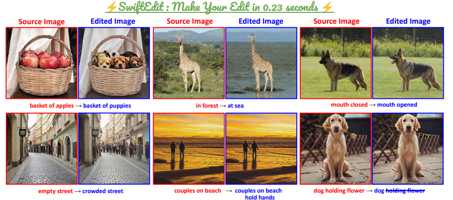
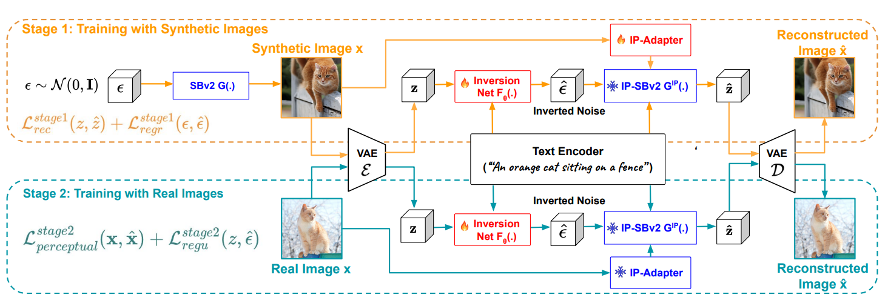
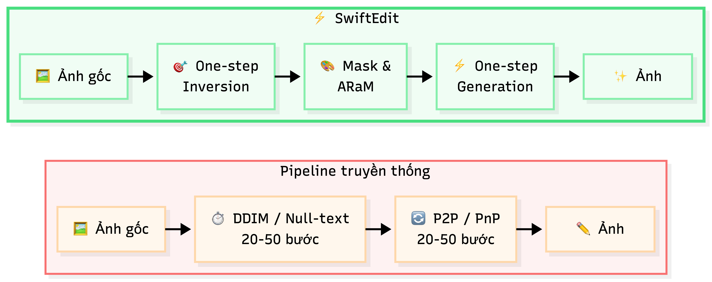

# Báo cáo tổng kết đồ án

> CS2309.CH201 — Chuyên đề nghiên cứu và ứng dụng về Thị giác máy tính  
> Tối ưu suy luận SwiftEdit trên phần cứng phổ thông (Mac M4 / Colab Tesla T4)

| | |
|---|---|
| **Môn học** | CS2309.CH201 |
| **Bài báo chính** | Nguyen, T.-T., Nguyen, Q., Nguyen, K., Tran, A., & Pham, C. (2025). *SwiftEdit: Lightning Fast Text-Guided Image Editing via One-Step Diffusion.* CVPR 2025, trang 21492–21501 |
| **Code gốc** | [Qualcomm-AI-research/SwiftEdit](https://github.com/Qualcomm-AI-research/SwiftEdit) |
| **Môi trường** | MacBook Air M4 24GB (MPS) · Google Colab Tesla T4 16GB |

Bản thảo Markdown; xuất PDF hoặc DOCX khi hoàn thiện. Bảng thành viên cần họ tên và MSSV.

---

## 1. Thông tin thành viên và mức độ hoàn thành

| STT | Họ và tên | MSSV | Phần việc chính | Mức hoàn thành |
|---:|---|---|---|---|
| 1 | *(điền)* | *(điền)* | Tái hiện pipeline, tối ưu inference, benchmark T4/Mac | *(điền, ví dụ 100%)* |
| 2 | *(điền)* | *(điền)* | *(điền)* | *(điền)* |

**Tóm tắt mức độ hoàn thành:**

| Hạng mục | Trạng thái |
|---|---|
| Hiểu paper (I/O, 1+1 bước, ARaM, Fig. 2) | Đã làm |
| Tái hiện checkpoint trên Mac + Colab T4 | Đã làm |
| Phương pháp tối ưu không train (FP16, cache, disk, xFormers) | Đã làm, có số liệu |
| Kết quả thực nghiệm (dataset, độ đo, bảng, hình) | Đã làm (n=600 T4; n=150 Mac) |
| Demo ứng dụng (Paper demo + ROI/mask) | Đã làm |
| LoRA day↔night | Spec + script; **chưa train** |

---

## 2. Lý do và tầm quan trọng của bài toán

Chỉnh sửa ảnh theo văn bản (text-guided image editing) đang trở thành nhu cầu phổ biến: đổi đối tượng, đổi thuộc tính, hoặc xóa vật thể chỉ bằng vài câu mô tả. Các pipeline diffusion đa bước (Prompt-to-Prompt, Null-text Inversion, MasaCtrl, Plug-and-Play) cho kết quả tốt nhưng **chậm** — thường khoảng **12–130+ giây/ảnh** — khó dùng cho ứng dụng tương tác trên máy phổ thông.

SwiftEdit (CVPR 2025) đề xuất **một bước inversion + một bước generation**. Trên NVIDIA A100 40GB, paper công bố khoảng **0.23 giây/ảnh**, nhanh hơn ít nhất **50 lần** so với nhiều phương pháp multi-step, chất lượng cạnh tranh trên PIE-Bench. Repository gốc khuyến nghị GPU khoảng **24GB VRAM**.

Hai lý do chọn đề tài:

1. Paper giải bài toán tốc độ rõ ràng, có code và checkpoint công khai — phù hợp chuyên đề.
2. Khoảng trống triển khai: trên **Colab T4 16GB** và **Mac M4**, SwiftEdit còn chạy được không, nhanh bao nhiêu, và tối ưu được tốc độ / VRAM / dung lượng checkpoint mà kết quả vẫn gần FP32 hay không.

**Câu hỏi trung tâm:** SwiftEdit đạt chỉnh sửa gần tức thời trên A100 bằng cách nào, và có thể tối ưu checkpoint công khai để chạy hiệu quả trên GPU phổ thông mà không làm thay đổi đáng kể kết quả hay không?


Hình 1. Minh họa bài toán: ảnh nguồn + edit prompt → ảnh đã sửa (demo checkpoint SwiftEdit trên Mac).

---

## 3. Phát biểu bài toán (Input / Output)

### 3.1. Bài toán của bài báo SwiftEdit

Đây là I/O của **paper**, không phải I/O do đề tài tự định nghĩa. Đề tài tái hiện và tối ưu inference trên checkpoint công khai.

**Input**

| Thành phần | Bắt buộc | Ý nghĩa |
|---|---|---|
| Ảnh nguồn | Có | Ảnh số cần sửa; pipeline nội bộ 512×512 |
| Source prompt | Tuỳ chọn | Chuỗi mô tả ảnh gốc (tiếng Anh); có thể để trống (paper Fig. 8) |
| Edit prompt | Có | Chuỗi mô tả nội dung mong muốn sau khi sửa |
| Editing mask | Không | Vùng được phép đổi; mặc định **self-guided** từ inverted noise |
| Hệ số ARaM | Không | `s_y` / `s_edit` / `s_non-edit` (trong code: `scale_ta`, `scale_edit`, `scale_non_edit`) |

**Output:** ảnh đã chỉnh theo edit prompt, đồng thời bảo toàn vùng ngoài mask.

Giới hạn prompt cứng: tokenizer CLIP/SD khoảng **77 token** (`truncation=True`); phần thừa bị cắt im lặng. IP-Adapter không chiếm 77 token text — 4 token ảnh ghép riêng.


Hình 2. Input (ảnh + prompt) và output chỉnh sửa theo paper-style.

### 3.2. Bài toán của đề tài (phần làm thêm)

| | |
|---|---|
| **Input** | Checkpoint SwiftEdit công khai + cùng bộ ảnh/prompt đánh giá |
| **Output** | Cấu hình chạy trên T4/Mac: thời gian, VRAM, disk, fidelity vs FP32, demo Gradio |
| **Ràng buộc** | **Không train lại** Stage 1/2 paper |

Demo **Paper (chỉ prompt):** ảnh + prompt → **1 kết quả** full-frame, self-guided mask, không tô cọ.

---

## 4. Thách thức tập trung giải quyết

Báo cáo không liệt kê mọi thách thức của image editing.

**Thách thức của paper**

1. Inversion và sampling đa bước quá chậm cho realtime / on-device.
2. Local edit dễ phá nền nếu không có mask / attention phù hợp.

**Thách thức của đề tài**

1. Checkpoint nghiêng A100 / ≥24GB — cần **fit** T4 16GB và Mac consumer.
2. Giảm **latency, VRAM, disk** mà output vẫn gần baseline FP32 (cùng job, cùng seed).
3. Tách rõ “chạy nhanh” với “edit đúng ý” — không lấy PSNR vs FP32 làm “chất lượng edit”.

Ba yêu cầu của bài toán chỉnh sửa: đúng ngữ nghĩa, giữ background, đủ nhanh cho tương tác.

---

## 5. Phương pháp giải quyết

### 5.1. Ý tưởng của bài báo (ngắn)

SwiftEdit dựa trên SwiftBrushv2 (SBv2, text-to-image **one-step**):

1. **One-step inversion `F_theta`** — dự đoán inverted noise từ latent ảnh và prompt trong một forward, thay DDIM 20–50 bước.
2. **One-step generation `G_IP`** — inverted noise + edit prompt + điều kiện ảnh IP-Adapter (`c_x`) → ảnh đã sửa trong một bước.
3. **Self-guided mask + ARaM** — mask từ `|eps_hat_source − eps_hat_edit|`; rescaling attention để sửa vùng edit và giữ nền.

```
Ảnh nguồn → VAE encode (z)
  → F_theta(z, source) và F_theta(z, edit) → mask M
  → input_sb = alpha * z + sigma * eps_hat_source
  → G_IP + ARaM(M) → VAE decode → ảnh sửa
```

**Training paper (Fig. 2, tuần tự, không song song):** Stage 1 warm-up `F_theta` + IP-Adapter trên synthetic SBv2 (~100k iter) → Stage 2 chỉ train `F_theta` trên ảnh thật CommonCanvas (~180k iter), IP freeze. Lửa = trainable, tuyết = frozen. Edit/ARaM **không** train — chỉ inference. Đề tài **chỉ dùng pretrained checkpoint**.



Hình 3. Teaser paper / README: input → prompt → ảnh đã sửa.



Hình 4. Fig. 2 (official): hai giai đoạn train inversion. Không phải flowchart inference edit từng module.

**Kết quả paper (PIE-Bench, Table 1 — trích):**

| Method | PSNR ↑ | MSE×10⁴ ↓ | CLIP-Whole ↑ | CLIP-Edited ↑ | Time (s) ↓ |
|---|---:|---:|---:|---:|---:|
| DDIM + P2P | 17.87 | 219.88 | 25.01 | 22.44 | 25.98 |
| NT-Inv + P2P | 27.03 | 35.86 | 24.75 | 21.86 | 134.06 |
| TurboEdit | 22.43 | 9.48 | 25.49 | 21.82 | 1.32 |
| **SwiftEdit** | **23.33** | **6.60** | **25.16** | **21.25** | **0.23** |

SwiftEdit không đứng đầu mọi metric chất lượng; điểm mạnh là **trade-off tốc độ–chất lượng**.



### 5.2. Phương pháp của đề tài — chuỗi thực nghiệm (nhật ký)

**Lý do làm thêm:** paper đã giải tốc độ trên A100; đề tài giải **chạy được và nhanh hơn trên máy phổ thông**, không retrain.


Chuỗi dưới đây theo nhật ký thực nghiệm của đề tài.

**Bước 1 — Tái hiện (2026-06-04)**

- Clone checkpoint; env Python 3.12 + PyTorch MPS / Colab CUDA.
- Demo README: woman → Taylor Swift trên Mac ~**91 s/ảnh** (FP32, máy nguội).
- Cùng preset dog→há miệng: Colab T4 ~**1.3 s**; Mac MPS ~**30 s** (sau đó còn chậm hơn khi FP32 throttle).

**Nhận định:** pipeline chạy đúng; khoảng cách Mac vs T4 vs A100 là vấn đề triển khai, không phải “code hỏng”.

**Bước 2 — Đo đúng bottleneck (2026-06-14, giai đoạn 3c)**

- `StageTimer` từng công đoạn; PieBench subset **20 mẫu** trên Mac MPS (chưa FP16+cache đầy đủ): trung bình ~**69 s/ảnh**.
- Inverse UNet + Generation UNet ~**43%**; IP image embeds ~**24%**; VAE decode ~**23%**; ước lượng mask ~**0.02%**.

**Nhận định:** không tối ưu mask trước. Muốn nhanh phải nhắm UNet, CLIP image embed, VAE.

**Bước 3 — Tối ưu không train (2026-06-14 → 2026-07-19)**

| Kỹ thuật | Nhật ký / bằng chứng | Tác động |
|---|---|---|
| Bỏ decode `noise_image` | 2026-06-05 | Bỏ VAE decode thừa; output edit không đổi |
| Vectorize mask trên GPU | 12.2 ms → 4.6 ms (~2.6×) | End-to-end gần **0%** (đúng dự đoán profile) |
| EditCache (latent + IP embed + source text) | Mac: tiết kiệm ~9.93 s ở stage phụ thuộc ảnh | Nhanh khi **cùng ảnh + cùng source**, đổi edit prompt |
| FP16 + `channels_last`; **VAE giữ FP32** | Mac ~3.3× (máy nguội) → ~7× (chạy liên tục) | Tránh NaN/ảnh đen; PSNR vs FP32 cao |
| Checkpoint FP16 trên disk | 9.79 → **4.94 GiB (−49.5%)** | Load nhẹ hơn; T4 16GB ổn định hơn |
| xFormers MEA (T4) | bundle `fp16_disk_xformers` | Thêm tốc độ trên nền FP16 |
| FP4 Linear bitsandbytes | PSNR vs FP32 ~22 dB | **Ablation âm** — dừng hướng chính |

Ép FP16 trên Tesla T4: PyTorch/CUDA dùng Tensor Core cho matmul/conv đủ điều kiện. Đề tài **không** bật tay `CUDNN_TENSOR_OP_MATH`. Kết quả gần FP32 nhưng không bit-identical (cuDNN).

**Bước 4 — Đánh giá công bằng**

- Bộ chính: **200 ảnh × 3 edit prompt = 600 job/config**, `data/jobs_june17.json`, seed **`250101049`**.
- Template prompt: (0) edit PIE-Bench; (1) `{src} at night`; (2) `{src} in winter`.
- Thư viện: **`torchmetrics`** (`PeakSignalNoiseRatio`, `StructuralSimilarityIndexMeasure`, `LearnedPerceptualImagePatchSimilarity`) + MSE.
- **Lớp A (fidelity precision):** output config ↔ output `baseline_fp32` **cùng job** — không so ảnh nguồn.
- **Lớp B (edit quality):** CLIP-Whole / CLIP-Edited và PSNR nền `(1 − mask)` vs source (subset 20).

**Bước 5 — Ứng dụng minh họa**

- Tab **Paper demo (chỉ prompt):** self-guided, **1 kết quả** / lần (Gradio Mac + T4).
- Tab **ROI / tô mask:** Hybrid giữ master full-res; chỉ blend vùng mask (5 lượt: PSNR ngoài mask Hybrid = ∞, Naive ~30 dB).
- **Xóa vật thể:** `user_mask` ghi đè self-guided; thăm dò 3–4 mẫu (headphones OK; xe đạp lớn còn ghost).

**Bước 6 — LoRA day↔night:** đã soạn spec và script train/eval. **Chưa train** trong chuyên đề.

---

## 6. Kết quả thực nghiệm

### 6.1. Dataset, lập trình, độ đo

| Mục | Giá trị |
|---|---|
| Dataset eval chính | PIE-Bench-auto200, `jobs_june17.json` |
| Phần cứng | Colab Tesla T4 16GB; MacBook Air M4 MPS |
| Code | `SwiftEdit/infer.py`, `scripts/app_gradio.py`, notebook quality/speed bench |
| Seed | `250101049` |
| Tốc độ | Miss / Hit / Overall × vs FP32; VRAM peak; disk GiB |
| Lớp A | PSNR, SSIM, LPIPS, MSE vs FP32 cùng job (`torchmetrics`) |
| Lớp B | CLIP-W, CLIP-E, PSNR nền vs source |

**Cách đọc độ đo lớp A**

- **MSE ↓** — sai số bình phương trung bình từng pixel. Càng nhỏ càng giống FP32.
- **PSNR ↑ (dB)** — đổi MSE ra thang log. Cao (~48) = gần trùng; thấp (~22) = lệch rõ.
- **SSIM ↑ (0–1)** — giống cấu trúc / tương phản cục bộ. Gần 1 = cấu trúc giữ tốt.
- **LPIPS ↓** — “nhìn có giống không” (mạng deep, Zhang CVPR 2018). Gần 0 = gần như không lệch mắt.

Chi tiết từng ảnh: [`ket_qua_chat_luong_tung_anh.xlsx`](ket_qua_chat_luong_tung_anh.xlsx) (cột path ảnh nguồn / FP32 / FP16, không nhúng ảnh).

### 6.2. Kết quả trên Tesla T4 (so FP32)

Nguồn: `experimental_data/quality_speed_bench_2026-06-17/` và bundle so sánh cuối. n=600. PSNR/SSIM/LPIPS/MSE so **output ↔ `baseline_fp32` cùng job**.

| Config | Miss (s) | Hit (s) | Overall vs FP32 | PSNR (dB) | SSIM | LPIPS | MSE | VRAM Peak |
|---|---|---|---|---|---|---|---|---|
| `baseline_fp32` | 2.45 | | 1.00× | | | | | 14 GB |
| `fp16 + cache` | 1.76 | 1.46 | 1.57× | **48.5 (35.0–56.7)** | **0.998 (0.989–0.999)** | **0.0008 (0.0001–0.006)** | **0.000020** | 8.1 GB |
| `fp16 + cache + disk` | 1.76 | 1.45 | 1.57× | **48.5 (35.0–56.7)** | **0.998 (0.989–0.999)** | **0.0008 (0.0001–0.006)** | **0.000020** | 8.1 GB |
| `fp16+cache+disk+xformers` | **1.64** | **1.35** | **1.69×** | **48.5 (35.0–56.7)** | **0.998 (0.989–0.999)** | **0.0008 (0.0001–0.006)** | **0.000020** | **8.1 GB** |
| `fp4 + cache` | 1.82 | 1.51 | 1.51× | **21–22 (16.6–29.4)** | 0.78 (0.48–0.96) | 0.15 (0.02–0.31) | 0.0076 | **7.3 GB** |

Disk FP32→FP16: 9.79 → **4.94 GiB (−49.5%)**.

**Khuyến nghị T4:** `fp16_disk_xformers`. **FP4** dừng (ablation âm).

**PSNR ~48.5 có “quá đẹp” không?** Không phải so ảnh gốc. Spot-check: FP16↔FP32 ~47 dB; edit↔nguồn ~**19 dB**. Công thức `PSNR ≈ 10 · log10(1 / MSE)` với `data_range=1` → MSE ~2e-5 cho ~47–48 dB.


Hình 5. Cùng ảnh và prompt: FP16 gần FP32; FP4 lệch rõ (PSNR ~22 dB).

**Cặp PSNR thấp / cao (vẫn SSIM cao):** job `111000000004_0` ~35 dB; `111000000006_0` ~57 dB.


Hình 6. PSNR thấp nhất trong 600 job (~35 dB): hai output vẫn gần như một ảnh.


Hình 7. PSNR cao (~57 dB): lệch precision rất nhỏ.

Đối chiếu độc lập (không dùng trong số liệu chính): cùng một cặp ảnh có thể đo PSNR/SSIM trên trình duyệt tại [Img2Go Compare Images](https://www.img2go.com/compare-image). Giá trị có thể lệch nhẹ so với `torchmetrics` (khác `data_range` 0–1 vs 0–255, cửa sổ SSIM). Số báo cáo lấy từ CSV / `torchmetrics`.

### 6.3. Kết quả trên Mac M4 (MPS)

Khác máy / quy mô so bảng T4. n=**150**, seed `250101049`.

| Config | n | s/edit | hit / miss | PSNR↔fp32 | peak alloc |
|---|---:|---:|---|---:|---|
| `baseline_fp32` | 150 | **52.14** | — | — | 12.4 GB |
| `fp16+cache` | 150 | **7.19** | 6.83 / 7.90 | **49.83 dB** | **6.5 GB** |

Overall **~7.25×**; peak memory ~−47%. FP32 trên MPS rất chậm; FP16+EditCache đưa về ~7 s/edit trên máy cá nhân.

### 6.4. Edit quality (lớp B) — PieBench subset 20

Mac MPS, 2026-06-14. **Không** trộn với PSNR 48.5.

| Metric | n | mean |
|---|---:|---:|
| CLIP-Whole ↑ | 20 | **23.02** |
| CLIP-Edited ↑ | 20 | **21.46** |
| PSNR nền `(1−mask)` ↑ | 9 | **14.01** |
| Runtime (s) | 20 | 69.0 (chưa tối ưu FP16+cache) |

CLIP-Whole: ảnh edited cả khung ↔ edit prompt. CLIP-Edited: vùng mask ↔ edit prompt.

### 6.5. Demo ứng dụng

| Tab | Input | Output |
|---|---|---|
| Paper demo | Ảnh · source (tuỳ chọn) · edit prompt | **1** ảnh full, self-guided |
| ROI / tô mask | + mask tay | 3 candidate blend master (mở rộng) |
| Xóa vật thể | + mask tay | Thăm dò; vật nhỏ/vừa khá; vật lớn kém |

Hybrid 5 lượt: Naive PSNR ngoài mask ~**30.09 dB**, SSIM 0.835; Hybrid PSNR ngoài mask **∞**, SSIM **0.959**, LPIPS 0.012 vs 0.058.

**Nhận định tổng kết kết quả:** trên T4, FP16+disk+xFormers+cache **vừa nhanh vừa gần FP32** trên bốn độ đo lớp A; Mac hưởng lợi tốc độ lớn hơn vì baseline FP32 chậm. FP4 không đủ fidelity. Lớp B cho thấy edit vẫn đổi nội dung so nguồn — không “copy gốc”.

---

## 7. Đánh giá ưu điểm và hạn chế

### Ưu điểm (đề tài)

- T4: ~**2.45 s → ~1.45 s** overall (**~1.69×**) với `fp16_disk_xformers`; VRAM ~14 → ~8.1 GB; disk −49.5%.
- Mac MPS: ~**52 s → ~7 s** (**~7.25×**, n=150).
- Fidelity lớp A: PSNR 48.56 (35–57), SSIM ~0.998, LPIPS ~0.0008 (n=600) — củng cố bằng nhiều độ đo, không chỉ một số mean.
- Có demo Gradio khớp paper (chỉ prompt) và demo ROI/Hybrid có số liệu ngoài mask.
- Ablation FP4 được báo **thành thật** (chạy được nhưng chất lượng kém).

### Hạn chế

- Chưa thay thuật toán / chưa train lại model; đóng góp chủ yếu là **cách chạy + demo**.
- Prompt pipeline gốc **tiếng Anh**; 77 token.
- Chưa benchmark cùng máy với TurboEdit.
- VRAM chưa xuống GPU 4–8 GB.
- LoRA day↔night chưa train.
- Paper demo: edit đổi identity mạnh (`a man`) dễ **under-edit** vì IP-Adapter giữ ảnh nguồn; case README (Taylor Swift) rõ hơn.
- Ứng dụng xóa vật: định tính vài mẫu, không phải benchmark inpainting.

Nén/FP16 **có nghĩa** trên T4/Mac (fit máy, latency, disk), không vì “card 24GB dư chỗ”. FP4 không khuyến nghị.

---

## 8. Hướng phát triển

1. **Nén có calibration / chỉnh pipeline** (TinyVAE, offload, quant nhiều module) nếu cần GPU yếu hơn — không chỉ đổi dtype.
2. **LoRA domain** (day↔night): dataset `huggan/night2day` + script sẵn; T4 đủ train rank 8. Chưa chạy trong chuyên đề.
3. **Luận văn:** không lấy full retrain SwiftEdit làm trục chính. Kế thừa ý tưởng one-step inversion + editing gần tức thời + tối ưu trên phần cứng phổ thông, chuyển backbone mới hơn/nhẹ hơn.

Chuyên đề **không** đặt mục tiêu luận văn trên chính checkpoint này.

---

## 9. Tài liệu tham khảo

1. Nguyen, T.-T., Nguyen, Q., Nguyen, K., Tran, A., & Pham, C. (2025). *SwiftEdit: Lightning Fast Text-Guided Image Editing via One-Step Diffusion.* CVPR 2025. [PDF](https://openaccess.thecvf.com/content/CVPR2025/papers/Nguyen_SwiftEdit_Lightning_Fast_Text-Guided_Image_Editing_via_One-Step_Diffusion_CVPR_2025_paper.pdf)
2. Qualcomm AI Research. *SwiftEdit* (code). [GitHub](https://github.com/Qualcomm-AI-research/SwiftEdit)
3. Ju, X., et al. (2024). *PnP Inversion* / PIE-Bench. ICLR 2024.
4. Ye, H., et al. (2023). *IP-Adapter: Text Compatible Image Prompt Adapter for Text-to-Image Diffusion Models.* arXiv:2308.06721.
5. Radford, A., et al. (2021). *Learning Transferable Visual Models From Natural Language Supervision* (CLIP).
6. Zhang, R., et al. (2018). *The Unreasonable Effectiveness of Deep Features as a Perceptual Metric* (LPIPS). CVPR 2018.
7. Wang, Z., et al. (2004). *Image Quality Assessment: From Error Visibility to Structural Similarity* (SSIM). IEEE TIP.
8. Mokady, R., et al. (2023). *Null-text Inversion for Editing Real Images using Guided Diffusion Models.* CVPR 2023.
9. Hertz, A., et al. (2022). *Prompt-to-Prompt Image Editing with Cross Attention Control.*
10. Lightning AI. *torchmetrics* — PeakSignalNoiseRatio, SSIM, LPIPS. [Docs](https://torchmetrics.readthedocs.io/)
11. NVIDIA. *Programming Tensor Cores in CUDA 9*; *cuDNN Core Concepts — Tensor Core Operations.*

### Nguồn số liệu trong repo

| Nội dung | Đường dẫn |
|---|---|
| Bench T4 600 job | `experimental_data/quality_speed_bench_2026-06-17/` |
| PieBench subset 20 | `experimental_data/piebench_subset20_2026-06-14/` |
| Disk FP16 | `experimental_data/precision_disk_vram_2026-07-19/` |
| Mac MPS n=150 | `experimental_data/precision_run_20260724-040029_baseline_fp32+improved_fp16_cache/` |
| Object removal | `experimental_data/object_removal_2026-06-14/` |
| Hybrid multi-turn | `experimental_data/multiturn_hybrid_2026-07-22_144313/` |

### Xuất bản thảo

```
pandoc report/REPORT.md -o report/REPORT.pdf --resource-path=report
```

Hoặc copy sang Word. Repo công khai (viewer, không cần request quyền).
