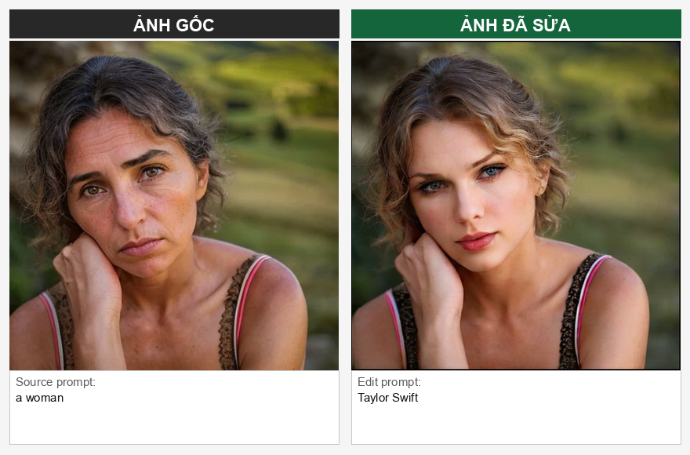
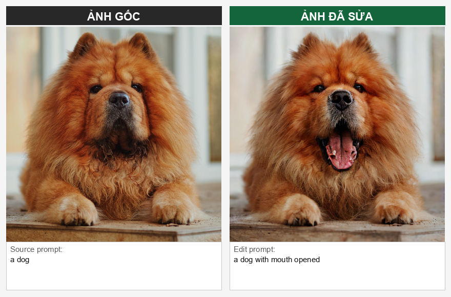
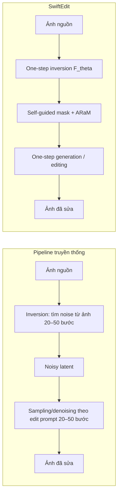
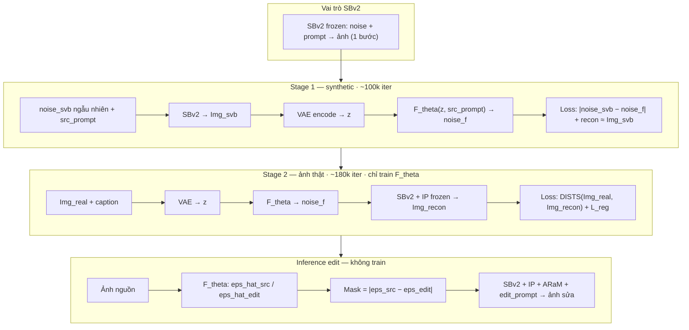
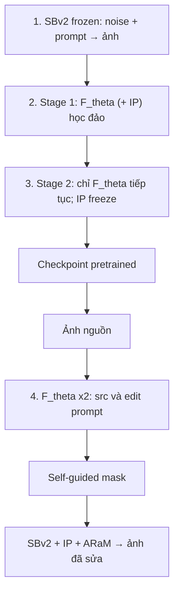
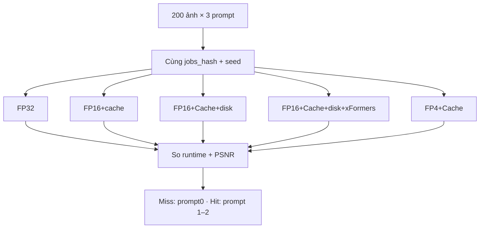
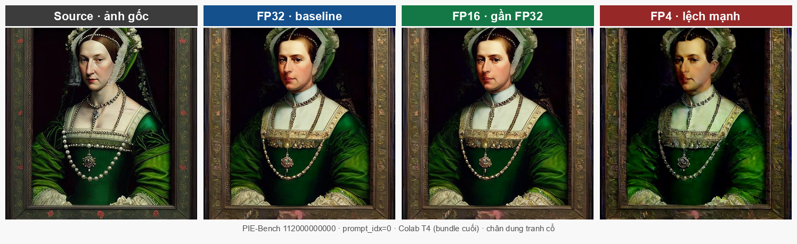
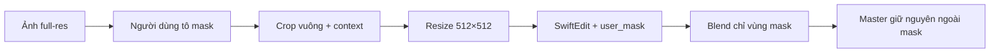

# SwiftEdit

### Lightning Fast Text-Guided Image Editing via One-Step Diffusion

**CS2309.CH201 — Chuyên đề Thị giác máy tính**

Nghiên cứu paper SwiftEdit (CVPR 2025)

- tối ưu inference trên GPU phổ thông

---

# Mục lục (= bố cục báo cáo)

| §    | Nội dung                                             |
| ---- | ---------------------------------------------------- |
| 1    | Mở đầu · lý do chọn                                  |
| 2    | Bài báo · bài toán I/O                               |
| 3a   | Pipeline cũ · ý tưởng (+ flowchart)                  |
| 3a+  | **Training trên SBv2** (vì sao + Stage 1→2)          |
| 3a++ | **Flowchart dễ hiểu** train SBv2 → infer edit        |
| 3a-fig | **Đọc Fig. 2 paper** (lửa/tuyết, ai train)         |
| 3b   | Kết quả paper (PIE-Bench)                            |
| 4–5  | Phương pháp · thực nghiệm (+ flowchart)              |
| 6–7  | Kết quả đề tài (T4 + Mac MPS) · FP32/16/4 · ứng dụng |
| 8–10 | Ưu/nhược · hướng phát triển · kết luận               |

---

# §1. Lý do chọn đề tài

**Bối cảnh:** edit ảnh bằng prompt hữu ích, nhưng diffusion đa bước thường **12–130+ s/ảnh**.\
**SwiftEdit:** **1 + 1 bước** → **\~0.23 s** trên A100.

**Vì sao chọn:** (1) đột phá tốc độ + code/checkpoint công khai · (2) paper nghiêng A100/≥24GB — trên **T4 / Mac M4** còn chạy tốt không?

> SwiftEdit nhanh trên A100 bằng cách nào, và tối ưu checkpoint trên GPU phổ thông mà ảnh vẫn gần FP32 được không?

---

# §2. Bài báo & bài toán (I/O của paper)

|               |                                                                              |
| ------------- | ---------------------------------------------------------------------------- |
| **Paper**     | *SwiftEdit: Lightning Fast Text-Guided Image Editing via One-Step Diffusion* |
| **Tác giả**   | Trong-Tung Nguyen, Quang Nguyen, Khoi Nguyen, Anh Tran, Cuong Pham           |
| **Nơi / năm** | **CVPR 2025**                                                                |

**Input (paper):** ảnh số · source/edit prompt (chuỗi) · mask & ARaM tùy chọn\
**Output (paper):** ảnh đã sửa theo edit prompt, giữ vùng không liên quan

**Thách thức:** Paper — multi-step chậm · local edit dễ phá nền. Đề tài — chạy T4/Mac · tối ưu tốc độ/VRAM/disk gần FP32.

---

# §3a. Pipeline cũ → ý tưởng SwiftEdit

| Thành phần                  | Vai trò                                                                                                           |
| --------------------------- | ----------------------------------------------------------------------------------------------------------------- |
| **Inversion (cũ)**          | Từ ảnh thật, chạy ngược nhiều bước (DDIM / Null-text) để ra **noisy latent** — thường **20–50 bước**              |
| **Sampling (cũ)**           | Từ noisy latent, **denoising dần** theo edit prompt (P2P / PnP…) — cũng **20–50 bước**; mỗi bước ≈ 1 forward UNet |
| `F_theta`                   | Thay inversion đa bước bằng **1 forward** dự đoán inverted noise                                                  |
| **SBv2 + IP-Adapter**       | Thay sampling đa bước bằng **1 bước** sinh/edit, bám ảnh nguồn                                                    |
| **Self-guided mask + ARaM** | Ước vùng sửa + rescale attention (`s_y`, `s_edit`, `s_non-edit`)                                                  |

→ Cũ: **20–50 + 20–50** bước. SwiftEdit: **1 + 1** bước.

---

# §3a+. Nguyên lý training SwiftEdit trên SBv2

**Vì sao gắn SBv2?** SwiftBrushv2 = **T2I one-step** (distill từ SD-Turbo). Biết **noise → ảnh** trong 1 bước → tạo được cặp `(noise, ảnh)` synthetic để dạy `F_theta` đảo ngược; lúc edit thì **cùng SBv2** (+ IP-Adapter) sinh lại ảnh trong 1 bước.

**Ai được train?** Theo Fig. 2 / Sec. 4.1 paper: **`F_theta`** (cả 2 stage). Nhánh **IP-Adapter** (`W^K_x`, `W^V_x`) train ở **Stage 1**, **đóng băng ở Stage 2**. **SBv2 backbone / VAE / CLIP = đóng băng**. Edit không được train.

| Stage | Dữ liệu | Mục tiêu train | Không làm gì |
| ----- | ------- | -------------- | ------------ |
| **1** | ~40k caption JourneyDB → ảnh **synthetic từ SBv2** | `F_theta` (+ IP-Adapter Stage 1) học đảo / recon | **Không** dùng edit prompt; SBv2 freeze |
| **2** | ~5k ảnh thật CommonCanvas | **Chỉ `F_theta`** tiếp tục (DISTS + L_reg); **IP freeze** | **Vẫn không** train hành vi “edit” |
| **Infer** | Checkpoint pretrained | — | Đổi `edit_prompt` + ARaM → edit lúc chạy |

→ Train = học **invert + tái tạo**; **edit** chỉ xuất hiện ở inference. Đề tài **không** train lại — dùng checkpoint. Chi tiết legend Fig. 2: slide **§3a-fig**.

---

# §3a++. Flowchart dễ hiểu — train SwiftEdit nhờ SBv2

**Giải thích ngắn**

1. **SBv2 đóng băng** — đã biết sinh ảnh 1 bước từ noise + prompt.
2. **Stage 1** — dùng SBv2 tạo ảnh giả → dạy `F_theta` (+ IP-Adapter) **đảo / tái tạo**.
3. **Stage 2** — ảnh thật → **chỉ tiếp tục train `F_theta`** (IP-Adapter **freeze**, paper Sec. 4.1); chưa dạy edit.
4. **Lúc chạy** — đổi edit prompt + mask/ARaM → mới thành **edit**.

→ Train = invert + tái tạo. Edit = chỉ lúc inference. Đề tài dùng checkpoint sẵn.

| Train | Đóng băng | Lúc train có edit? |
| ----- | --------- | ------------------ |
| `F_theta` (2 stage); IP-Adapter **chỉ Stage 1** | SBv2; IP ở Stage 2; VAE/CLIP | Không — edit chỉ lúc infer |

Checkpoint: `inverse_ckpt-120k` · `sbv2_0.5` · `ip_adapter_ckpt-90k`

---

# §3a-fig. Đọc Fig. 2 paper — minh chứng trước thầy

**Ưu tiên chiếu Figure 2 gốc** (SwiftEdit, arXiv 2412.04301 / CVPR 2025) — không thay bằng sơ đồ tự vẽ khi giải thích training. Mermaid ở §3a+ chỉ là tóm tắt đã đối chiếu.

**Caption paper (ý):** Stage 1 *warm up* inversion trên synthetic SBv2 → Stage 2 *shift / continue* trên ảnh thật — **tuần tự**, không song song.

### Legend ký hiệu (quy ước rộng trong CV/ML)

| Ký hiệu trên Fig. 2 | Nghĩa |
| ------------------- | ----- |
| Ngọn lửa (fire) | **Trainable** — nhận gradient, cập nhật trọng số |
| Bông tuyết (snowflake) | **Frozen** — chỉ forward, không cập nhật |

Không riêng SwiftEdit — cùng convention ControlNet / IP-Adapter / nhiều sơ đồ Diffusers.

### Ai lửa / ai tuyết theo paper Sec. 4.1

| Module | Stage 1 | Stage 2 | Inference |
| ------ | ------- | ------- | --------- |
| `F_theta` (inversion) | Lửa | Lửa (tiếp tục) | Tuyết (chỉ chạy) |
| SBv2 `G` backbone | Tuyết | Tuyết | Tuyết |
| IP-Adapter (`W^K_x`, `W^V_x`) | Lửa (paper: chỉ 2 ma trận này trong nhánh ảnh) | **Tuyết** — *train only the inversion network* | Tuyết (+ ARaM scales) |
| VAE / CLIP text / CLIP image | Tuyết | Tuyết | Tuyết |
| Edit / ARaM / self-guided mask | Không có trong train | Không có | Chỉ lúc infer |

**Vì sao freeze SBv2?** Giữ prior one-step đã distill; chỉ học đảo (`F_theta`), không phá generator.

**Vì sao Stage 2 freeze IP?** Giữ image prior đã học Stage 1; Stage 2 chủ yếu đóng domain gap ảnh thật (DISTS + L_reg trên noise).

**Cách trả lời thầy:** (1) chiếu Fig. 2 gốc + citation; (2) bảng lửa/tuyết ở trên; (3) trích caption *warm up → continue*.

---

# §3b. Kết quả paper (PIE-Bench)

Đánh giá paper: background PSNR/MSE · CLIP-Whole / CLIP-Edited · runtime sau khi model đã load.

| Method        | PSNR↑     | MSE×10⁴↓ | CLIP-Whole↑ | CLIP-Edited↑ | Time (s)↓ |
| ------------- | --------- | -------- | ----------- | ------------ | --------- |
| DDIM + P2P    | 17.87     | 219.88   | 25.01       | 22.44        | 25.98     |
| NT-Inv + P2P  | 27.03     | 35.86    | 24.75       | 21.86        | 134.06    |
| TurboEdit     | 22.43     | 9.48     | 25.49       | 21.82        | 1.32      |
| **SwiftEdit** | **23.33** | **6.60** | **25.16**   | **21.25**    | **0.23**  |

**Nhận định**

- Nhanh hơn multi-step **rất nhiều** (0.23 s vs 26–134 s trên A100)
- CLIP cạnh tranh; PSNR không luôn cao nhất (NT-Inv giữ nền tốt hơn nhưng cực chậm)
- Điểm mạnh paper = **trade-off tốc độ–chất lượng**, không phải “tốt nhất mọi metric”

---

# §4–5. Phương pháp & thiết kế thực nghiệm (đề tài)

**Không làm hướng chính:** train/fine-tune lại mạng

|               |                                                                                    |
| ------------- | ---------------------------------------------------------------------------------- |
| Máy           | Mac M4 (MPS) · Colab **T4 16GB**                                                   |
| Jobs          | **200 ảnh × 3 edit prompt** = 600 job · `data/jobs_june17.json` · seed `250101049` |
| So chất lượng | PSNR output vs **FP32** cùng job                                                   |

**3 prompt / ảnh là gì?** (cùng `src_prompt` từ PIE-Bench-auto200; đổi `edit_prompt`)

| `prompt_idx` | Template                           | Ý nghĩa                                                      |
| ------------ | ---------------------------------- | ------------------------------------------------------------ |
| 0            | `{edit}`                           | Edit gốc của PIE-Bench (semantic: đổi đối tượng/thuộc tính…) |
| 1            | `{src} at night, dark lighting`    | Cùng mô tả ảnh gốc + **ban đêm**                             |
| 2            | `{src} in winter, covered in snow` | Cùng mô tả ảnh gốc + **mùa đông / tuyết**                    |

→ `prompt_idx=0` dùng cho cold/fair; idx 1–2 tạo **cache hit** khi cùng ảnh + cùng source prompt.

---

# §4–5b. Luồng đánh giá công bằng

## `C1`…`C5` = `baseline_fp32` · `improved_fp16_cache` · `fp16_disk` · `fp16_disk_xformers` · `improved_fp4_cache`

# §6a. Kết quả đề tài — nguyên lý ngắn

**FP32 / FP16 / FP4** = số bit **mỗi** weight/activation (32 / 16 / 4), không phải của cả model.

**Ép FP16:** Inverse UNet · Gen UNet · IP-Adapter · CLIP text/image\
**Giữ FP32:** VAE (tránh NaN/đen)

**EditCache:** cùng ảnh + source prompt → tái dùng latent & embedding; chỉ tính lại phần edit prompt

**Disk FP16:** convert cây checkpoint SwiftEdit (`swiftedit_weights`: UNet đảo + SBv2/IP) → file nhẹ hơn; không chỉ `.to(fp16)` lúc chạy

### Độ đo là gì?

Hai nhóm: **tốc độ · bộ nhớ** (chạy nhanh–gọn thế nào) và **fidelity vs FP32** (output config có lệch FP32 không — **không** so ảnh gốc).

| Độ đo | Nghĩa | Đọc thế nào |
| ----- | ----- | ----------- |
| **Miss / cold (s)** | Thời gian 1 edit khi **chưa** có EditCache (thường `prompt_idx=0`) | Số nhỏ hơn = nhanh hơn |
| **Hit (s)** | Thời gian 1 edit khi **đã** cache (cùng ảnh + source; `prompt_idx=1–2`) | So với Miss → lợi cache |
| **Overall × vs FP32** | Trung bình **600 job** (200×3): `t_fp32 / t_config` | `1.69×` = nhanh hơn FP32 ~1.69 lần |
| **VRAM / peak** | Bộ nhớ GPU cao nhất lúc load / edit | Nhỏ hơn = chạy máy yếu ổn hơn |
| **Disk (GiB)** | Dung lượng cây `swiftedit_weights` trên ổ | FP32→FP16: 9.79 → 4.94 GiB |

**Fidelity vs FP32** (so output config ↔ `baseline_fp32` cùng job — **không** vs ảnh gốc):

- **MSE ↓** — Sai số bình phương trung bình từng pixel. Càng nhỏ càng giống FP32.
- **PSNR ↑ (dB)** — Đổi MSE ra thang log. Cao (~48) = gần trùng; thấp (~22) = lệch rõ.
- **SSIM ↑ (0–1)** — Giống cấu trúc / tương phản cục bộ. Gần 1 = cấu trúc giữ tốt.
- **LPIPS ↓** — “Nhìn có giống không” (mạng deep). Gần 0 = gần như không lệch mắt.

Báo PSNR/SSIM/LPIPS/MSE dạng **mean (min–max)**.

**Fidelity precision (không gọi là “chất lượng edit”):** PSNR + SSIM + LPIPS + MSE so **output ↔ FP32 cùng job**, kèm **min–max**. Nguồn: `quality_speed_bench_2026-06-17` (`improved_fp16_cache`, n=600). Audit: `report/AUDIT_PSNR_FIDELITY.md`. Excel từng ảnh: `report/ket_qua_chat_luong_tung_anh.xlsx`.

### Hai lớp độ đo (chỏi nhau có chủ đích)

| Lớp | Câu hỏi | Độ đo | So cái gì |
| --- | --- | --- | --- |
| **A. Fidelity tối ưu** | FP16 có lệch FP32 không? | PSNR/SSIM/LPIPS/MSE | edit_config ↔ edit_FP32 |
| **B. Edit quality** | Edit đúng prompt / giữ nền? | CLIP-Whole/Edited; PSNR nền | edited ↔ prompt; edited ↔ **source** `(1−mask)` |

PSNR lớp A ~48 dB **không** chứng minh edit giống ảnh gốc. Spot-check: FP16↔FP32 ~47 dB; edit↔source ~19 dB. Edit quality (PieBench subset 20): CLIP-W ~23.0 · CLIP-E ~21.5 · PSNR nền ~14.0 — xem `experimental_data/piebench_subset20_2026-06-14/EDIT_QUALITY_SUMMARY.md`.

---

# §6b. Kết quả đề tài — 5 bundle trên T4 (so FP32)

### Tốc độ & PSNR vs FP32

PSNR/SSIM/LPIPS/MSE so **output ↔ `baseline_fp32`** cùng job (n=600) — **không** vs ảnh nguồn. Báo **mean (min–max)**.

| Config | Miss (s) | Hit (s) | Overall vs FP32 | PSNR (dB) | SSIM | LPIPS | MSE | VRAM Peak |
| ------ | -------- | ------- | --------------- | --------- | ---- | ----- | --- | --------- |
| `baseline_fp32` | 2.45 | | 1.00× | | | | | 14 GB |
| `fp16 + cache` | 1.76 | 1.46 | 1.57× | **48.5 (35.0–56.7)** | **0.998 (0.989–0.999)** | **0.0008 (0.0001–0.006)** | **0.000020** | 8.1 GB |
| `fp16 + cache + disk` | 1.76 | 1.45 | 1.57× | **48.5 (35.0–56.7)** | **0.998 (0.989–0.999)** | **0.0008 (0.0001–0.006)** | **0.000020** | 8.1 GB |
| `fp16+cache+disk+xformers` | **1.64** | **1.35** | **1.69×** | **48.5 (35.0–56.7)** | **0.998 (0.989–0.999)** | **0.0008 (0.0001–0.006)** | **0.000020** | **8.1 GB** |
| `fp4 + cache` | 1.82 | 1.51 | 1.51× | **21–22 (16.6–29.4)** ❌ | 0.78 (0.48–0.96) | 0.15 (0.02–0.31) | 0.0076 | **7.3 GB** |

Hit tiết kiệm 17% so miss (các config có cache).\
**VRAM Peak** = `peak_alloc` sau warmup; FP16 −42% vs FP32 (14 → 8.1 GB).\
**Disk** FP32→FP16: 9.79 → **4.94 GiB (−49.5%)**.

**Khuyến nghị T4:** `fp16_disk_xformers`. **FP4** dừng (ablation âm).

---

# §6b-Mac. Kết quả trên Mac M4 (MPS) — FP32 vs FP16+cache

**Setup:** MacBook Air M4 · **MPS** · **150 jobs** · seed `250101049` · `jobs_hash=622489df40d10991` · PSNR vs `baseline_fp32`\
*(Tách khỏi bảng 5 bundle T4 — khác máy / quy mô / jobs\_hash. Bundle Mac hiện chỉ có PSNR mean — **chưa** tính SSIM/LPIPS trên Mac.)*

| Config          |   n |    s/edit |  hit / miss |    PSNR↔fp32 | peak alloc |
| --------------- | --: | --------: | ----------: | -----------: | ---------: |
| `baseline_fp32` | 150 | **52.14** |           — |            — |    12.4 GB |
| `fp16+cache`    | 150 |  **7.19** | 6.83 / 7.90 | **49.83 dB** | **6.5 GB** |

→ Overall **\~7.25×** nhanh hơn FP32; peak memory **\~−47%**; PSNR mean gần FP32 (đa độ đo đầy đủ xem bench T4 ở trên).

**Nhấn mạnh:** trên Mac, FP32 rất chậm (\~52 s/edit); FP16 + EditCache đưa về \~**7 s** mà PSNR \~50 dB — bằng chứng tối ưu inference trên máy cá nhân, không chỉ Colab T4.

Bundle: `test_data/swiftedit_bundle_macos_mps_baseline_fp32+improved_fp16_cache_20260724-040029.zip`

---

# §6b+. Vì sao thử FP4 — và vì sao vẫn chạy được?

**Vì sao nén / FP16? (trả lời “thùng 3L đựng 1L”)**

Analog card 24GB dư chỗ **đúng nếu** luôn có GPU lớn và không cần tốc độ. Đề tài cần nén vì:

1. **Fit máy phổ thông** — paper ~24GB; đề tài chạy **T4 16GB** / Mac (FP32 peak ~14.6GB dễ chật).
2. **Headroom** — VRAM trống → Gradio ổn định, giữ nhiều module cùng lúc.
3. **Latency** — FP16 đo được ~1.7× (T4) / ~7× (Mac), không chỉ “nhẹ hơn”.
4. **Disk** — FP16 trên disk −49.5% (9.79 → 4.94 GiB).
5. **Caveat** — FP4 giảm VRAM thêm nhưng fidelity ~21 dB → **không** khuyến nghị; chỉ giữ kỹ thuật vừa fit vừa giữ fidelity.

**Vì sao thử FP4**

- Mục tiêu: nén mạnh hơn FP16 (4 bit ≈ ⅛ FP32) để giảm VRAM trên T4 16GB.
- Nằm trong chuỗi precision: FP32 → FP16 → FP4 (weight-only).

**Đề tài đã làm gì (code** **`quantize_unet`** **trong** **`models.py`)**

1. Load UNet bình thường (FP32/FP16 trên disk).
2. **Đổi từng** **`nn.Linear`** **→** **`bitsandbytes.nn.Linear4bit`** (`quant_type="fp4"`).
3. `compute_dtype=fp16`: lúc tính, weight 4-bit được **dequant → FP16** rồi mới MatMul.
4. **Chỉ Linear** — Conv, VAE, CLIP **không** quant; VAE vẫn FP32.

**Vì sao T4 vẫn chạy được (dù không có native FP4 Tensor Core)**

- Không cần GPU “tính native FP4”.
- bitsandbytes chạy **đường mềm**: lưu 4-bit → giải nén sang FP16 trên CUDA Turing → nhân ma trận FP16.
- Vì vậy pipeline **chạy được**, nhưng: overhead dequant + sai số mạnh → **không nhanh hơn rõ FP16** và PSNR \~21 dB.

**Kết luận dùng FP4:** giữ trong báo cáo như **ablation âm**; không khuyến nghị triển khai trên T4.

---

# §6c. Minh họa cùng ảnh — FP32 · FP16 · FP4

|                   |                                                                           |
| ----------------- | ------------------------------------------------------------------------- |
| **Sample**        | PIE-Bench `112000000000` · chân dung tranh cổ · `prompt_idx=0` · Colab T4 |
| **Source prompt** | `a painting of a woman in green dress`                                    |
| **Edit prompt**   | `a painting of a man in green shirts`                                     |

**FP16** gần như trùng **FP32** (PSNR/SSIM/LPIPS cùng protocol); **FP4** lệch rõ (PSNR ~22 dB, SSIM ~0.78).

---

# §7. Demo ứng dụng

### Paper demo (khớp paper) — **chỉ prompt**

UI Gradio tab **「Paper demo (chỉ prompt)」**: upload ảnh · source/edit prompt · **Tạo 1 kết quả** full-frame.  
Self-guided mask tự sinh — **không** tô cọ. Source prompt có thể trống (paper Fig. 8).  
Code: `generate_paper_candidate_batch` trong `scripts/app_gradio.py` / `app_gradio_t4_xformers.py`.

### ROI / tô mask (mở rộng đề tài)

**Đã làm thêm:** tab **「ROI / tô mask」** — user tô mask; mask ghi đè self-guided. Hybrid giữ master full-res, chỉ sửa ROI rồi blend. Dùng cho object removal / multi-turn — **không** thay paper demo.

### Input / Output

|            | Paper demo | ROI / mask |
| ---------- | ---------- | ---------- |
| **Input**  | Ảnh · source (tuỳ chọn) · edit prompt | + **mask tô tay** · ARaM |
| **Output** | 1 ảnh full (letterbox→unletterbox) | 3 candidate blend vào master |

### Flow Paper demo

1. Upload ảnh
2. Nhập edit prompt (+ source tuỳ chọn)
3. **Tạo kết quả** → xem / Regen

### Flow ROI (mở rộng)

1. Upload ảnh → master full-res
2. Tô mask vùng cần sửa / xóa
3. Prompt → 3 candidate → chọn / Regen / Undo

### Giữ ratio & không làm “bể” ảnh gốc

| Vấn đề                                    | Cách đề tài xử lý                                                                                              |
| ----------------------------------------- | -------------------------------------------------------------------------------------------------------------- |
| Model chỉ nhận **512×512**                | **Letterbox** (scale theo cạnh dài + pad xám) hoặc **crop ROI vuông** — không stretch méo ảnh                  |
| Khôi phục kích thước gốc                  | **Unletterbox** / paste ROI đúng tọa độ → output cùng `W×H` master                                             |
| Ngoài vùng sửa bị suy giảm qua nhiều lượt | Chỉ **alpha-blend vùng mask**; pixel ngoài mask **không** encode/decode VAE lại → PSNR ngoài mask = ∞ (Hybrid) |
| Global edit (mask lớn)                    | Thay cả frame (có cảnh báo); chất lượng bị giới hạn bởi proxy 512                                              |

**Kiến trúc demo (FE / BE):**

| Lớp          | Là gì                                | Vai trò                                                                                    |
| ------------ | ------------------------------------ | ------------------------------------------------------------------------------------------ |
| **Frontend** | Giao diện web trong trình duyệt      | Upload ảnh, tô mask, nhập prompt, bấm chạy / xem kết quả                                   |
| **Backend**  | Python + PyTorch trên máy (MPS/CUDA) | Hybrid ROI (`hybrid_editing`) · SwiftEdit inference (`infer` / `models`) · blend về master |
| **Gradio**   | Chỉ là **khung nối** FE↔BE           | Sinh UI web + gọi hàm Python; **có thể thay** bằng FE khác + public **ngrok**              |

**Object removal (Mac MPS, định tính):** chỉ **\~3–4 mẫu** thăm dò — **không đi sâu**, mức **kiểm chứng**; **không** mang ý nghĩa kết luận chính thức.

| Ca                         | Kết quả                                       |
| -------------------------- | --------------------------------------------- |
| Headphones (\~18% khung)   | Xóa tốt, còn ít vệt                           |
| Xe đạp (\~39% khung)       | Sót / ghost — vật quá lớn, thiếu ngữ cảnh nền |
| Chữ trên banner / đè người | Không sạch · dễ artifact                      |

→ Gợi ý nhanh: SwiftEdit = editor ngữ nghĩa one-step, **không** phải inpainting chuyên dụng.

**Multi-turn Hybrid (5 lượt):** Naive PSNR ngoài mask \~30 dB; Hybrid **giữ nguyên pixel** ngoài mask (PSNR = ∞).

**Đánh giá:** semantic edit **không có GT pixel duy nhất** → case study định tính, chưa human study.

---

# §8. Ưu điểm & hạn chế (đề tài)

**Ưu điểm**

- **Tốc độ** trên T4: \~**2.45 s → 1.45 s**/edit (overall, `fp16_cache_disk_xformers`, **1.69×** vs FP32)
- **Tốc độ** trên Mac M4 (MPS): \~**52.1 s → 7.2 s**/edit (`improved_fp16_cache`, **\~7.25×**, n=150, PSNR \~49.8 dB)
- **VRAM** peak (T4, `peak_alloc` warmup): \~**14.0 GB → 8.1 GB** (−42%; FP4 ~7.3 GB nhưng PSNR kém)
- **Weight trên disk:** **9.79 → 4.94 GiB** (−49.5%)
- **Fidelity vs FP32** gần như không đổi: PSNR **48.56** (min **34.97** / max **56.73**), SSIM **0.9976**, LPIPS **0.0008** (T4, n=600); Mac PSNR mean ~49.8 dB — **không** phải PSNR vs ảnh nguồn (~19 dB trên mẫu)
- Tạo được **ứng dụng** minh họa: sửa ảnh cục bộ (FE web + BE SwiftEdit / Hybrid mask · multi-turn)

**Hạn chế**

- Nghiên cứu chưa đủ sâu → đóng góp chủ yếu ở **tối ưu inference / giao diện triển khai**, chưa đổi kiến trúc model
- Ứng dụng có tính thực dụng, nhưng **chất lượng đầu ra** chưa so được với công nghệ editing mới hơn hiện nay
- **Chưa** cải thiện hạn chế prompt **chỉ tiếng Anh** của pipeline gốc
- **VRAM đã xuống \~12GB** (so paper ≥24GB ) nhưng **chưa** xuống GPU rất yếu (4–8GB)
- **Chưa** benchmark cùng máy với pipeline như TurboEdit
- **FP4** mới dừng ở mức “chạy được” / Linear-only — **chưa đúng bản chất** quantization end-to-end

---

# §9. Hướng phát triển (đề tài)

1. **Nén model đúng cách** — tiếp tục quantization / giảm trọng số có calibration; có thể **sửa pipeline** để chạy được trên GPU yếu mà vẫn nhanh (không chỉ đổi dtype).
2. **Training LoRA** phục vụ bài toán cụ thể: xóa vật thể · ngày → đêm · flare / hào quang sau tóc · khử mụn / làm đẹp da tự động · …
3. **Dài hạn / luận văn** — **không** tiếp tục bám SwiftEdit; **kế thừa ý tưởng** one-step / inversion nhẹ của SwiftEdit trên **mô hình mới hơn, tối ưu hơn, nhẹ hơn**.

---

# §10. Kết luận

1. **Hiểu & tái hiện** SwiftEdit: 1+1 bước, chạy được Mac M4 + Colab T4
2. **Tối ưu inference:** T4 — `fp16_disk_xformers` **1.69×**; Mac MPS — FP16+cache **\~7.25×** (52 s → 7 s, n=150); disk FP16 −50%; chất lượng FP16 vs FP32: PSNR 48.6 (35–57) + SSIM ~0.998 + LPIPS ~0.0008; FP4 không phù hợp
3. **Demo** minh họa use-case và giới hạn rõ

**Một câu:** Paper đưa editing gần tức thời trên A100; đề tài cho thấy trên T4 cấu hình `fp16_disk_xformers` thực dụng nhất (\~1.69×), còn trên Mac M4 (MPS) FP16+EditCache đạt \~**7.25×** so FP32 với chất lượng gần như không đổi.

---

# Cảm ơn / QA

- Paper vs đề tài? → paper = thuật toán; đề tài = nghiên cứu paper + tối ưu cách chạy
- Train SwiftEdit trên SBv2 thế nào? → Stage 1→2 **tuần tự**; lửa/tuyết = train/freeze; Stage 2 **chỉ `F_theta`** (IP freeze) — xem **§3a-fig** + Fig. 2 paper
- Vì sao không LoRA làm chính? → không giải trực tiếp tốc độ inference
- VAE vẫn FP32? → FP16 dễ NaN/đen
- PSNR 48.5 dB? → **fidelity** so **output FP16 ↔ output FP32** (không vs ảnh nguồn); kèm SSIM ~0.998, LPIPS ~0.0008; min–max **35.0–56.7**. Edit quality dùng CLIP + PSNR nền vs source (PieBench) — xem audit `report/AUDIT_PSNR_FIDELITY.md`

Chi tiết: `report/BAO_CAO_SwiftEdit.md`
